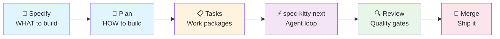
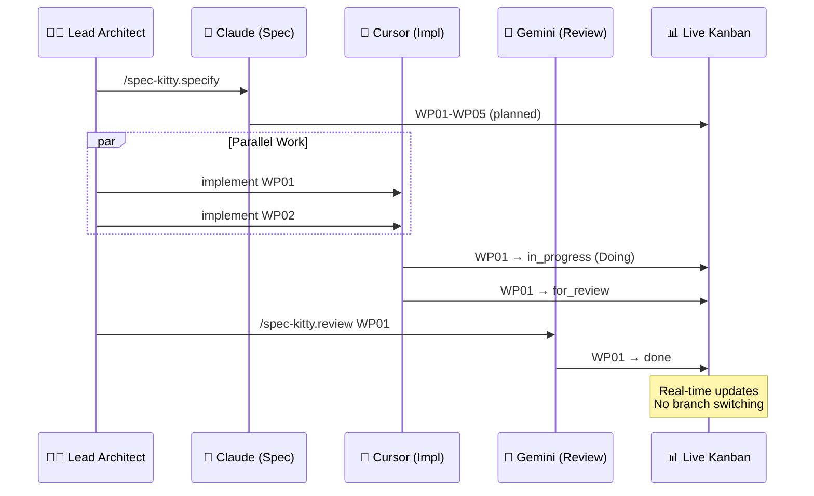
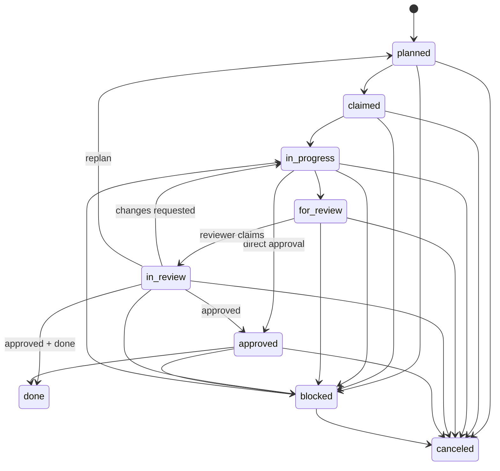
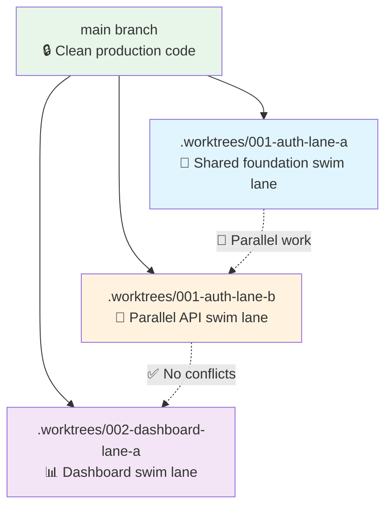

<div align="center">
    
    <h1>Spec Kitty</h1>
    <h2>Spec-Driven Development for AI coding agents</h2>
</div>

Spec Kitty is an open-source CLI workflow for **spec-driven development** with AI coding agents.
It helps teams turn product intent into implementation with a repeatable path:
`spec` -> `plan` -> `tasks` -> `spec-kitty next` (agent loop) -> `review` -> `merge`.

<!-- ALL-CONTRIBUTORS-BADGE:START - Do not remove or modify this section -->
[](#contributors-)
<!-- ALL-CONTRIBUTORS-BADGE:END -->

### Why teams use it

AI coding workflows often break down on larger features:
- Requirements and design decisions drift over long agent sessions
- Parallel work is hard to coordinate across branches
- Review and acceptance criteria become inconsistent from one feature to the next

Spec Kitty addresses this with repository-native artifacts, work package workflows, and lane-aware git worktree isolation.

### Who it's for

- [Project Owners](architecture/audience/external/project-owner.md) who need explicit approval boundaries and outcome accountability
- [External Tech Lead Evaluators](architecture/audience/external/tech-lead-evaluator.md) assessing delivery predictability and adoption fit
- [External Architect Evaluators](architecture/audience/external/architect-evaluator.md) evaluating governance durability and boundary clarity
- [External Product Manager Evaluators](architecture/audience/external/product-manager-evaluator.md) validating intent-to-delivery traceability
- [Lead Developers](architecture/audience/internal/lead-developer.md) coordinating implementation quality and handoffs
- [Maintainers](architecture/audience/internal/maintainer.md) preserving operational consistency across features and agents

### Stakeholder Value Proposition

| Stakeholder Persona | Value Proposition |
|---|---|
| [Project Owner](architecture/audience/external/project-owner.md) | Faster onboarding with explicit governance checkpoints and acceptance accountability |
| [External Tech Lead Evaluator](architecture/audience/external/tech-lead-evaluator.md) | Deterministic, auditable multi-agent workflow with clear lifecycle guardrails |
| [External Architect Evaluator](architecture/audience/external/architect-evaluator.md) | C4 + ADR traceability with explicit host authority and integration boundaries |
| [External Product Manager Evaluator](architecture/audience/external/product-manager-evaluator.md) | Clear intent-to-artifact mapping and lower handoff ambiguity between product and engineering |
| [Lead Developer](architecture/audience/internal/lead-developer.md) | Structured work package flow, quality gates, and review-ready evidence trails |
| [Maintainer](architecture/audience/internal/maintainer.md) | Stable operational model with bounded external integrations and trackable state transitions |

**Try it now:** `pip install spec-kitty-cli && spec-kitty init my-project --ai claude`

---

## 🚀 What You Get on `main` (`3.2.0a4`)

| Capability | What Spec Kitty provides |
|------------|--------------------------|
| **Spec-driven artifacts** | Generates and maintains mission briefs, ticket context, `spec.md`, `plan.md`, `wps.yaml`, and `tasks.md` in repository-native locations |
| **Ticket and brief intake** | Seeds `/spec-kitty.specify` from `spec-kitty intake` or `spec-kitty mission create --from-ticket <provider:KEY>` |
| **Work package execution** | Uses canonical lifecycle lanes (`planned`, `claimed`, `in_progress`, `for_review`, `in_review`, `approved`, `done`, `blocked`, `canceled`) with `doing` as UI alias for `in_progress` |
| **Parallel implementation model** | Creates isolated git worktrees under `.worktrees/`; every mission executes through swim-lane worktrees, with exactly one worktree per computed swim lane |
| **Governed operator workflows** | Routes operator requests through `spec-kitty do`, `advise`, and `ask`, with durable invocation records and local audit queries via `invocations list` |
| **Live project visibility** | Local dashboard for kanban and mission progress (`spec-kitty dashboard`) |
| **Hosted sync and Teamspace routing** | Browser auth, provider-aware tracker reads, checkout routing diagnostics, repository sharing, and Private Teamspace-aware sync controls |
| **Charter and compatibility governance** | Harness-owned charter synthesis, provenance reporting, `charter bundle validate`, `charter resynthesize --list-topics`, and `doctor shim-registry` |
| **Review resilience** | Persisted versioned review artifacts, focused fix prompts, dirty-state classification, and arbiter checklists |
| **Execution resilience** | Interrupted merge recovery (`merge --resume`), crash recovery (`implement --recover`), stale-claim diagnostics, sparse-checkout repair, and stricter release validation |
| **Multi-agent support** | 15 AI integrations: 13 user-global slash/prompt surfaces plus Codex CLI and Mistral Vibe via shared Agent Skills |

<p align="center">
    <a href="#-getting-started-complete-workflow">Quick Start</a> •
    <a href="docs/tutorials/claude-code-integration.md"><strong>Claude Code Guide</strong></a> •
    <a href="#-real-time-dashboard">Live Dashboard</a> •
    <a href="#-supported-ai-tools">15 AI Integrations</a> •
    <a href="https://github.com/Priivacy-ai/spec-kitty/blob/main/spec-driven.md">Full Docs</a>
</p>

### From Idea to Production in 6 Automated Steps



---

## 📊 Project Snapshot

<div align="center">

[](https://github.com/Priivacy-ai/spec-kitty/stargazers)
[](https://pypi.org/project/spec-kitty-cli/)
[](https://pypi.org/project/spec-kitty-cli/)
[](https://opensource.org/licenses/MIT)
[](https://www.python.org/downloads/)

[](#-supported-ai-tools)
[](#-real-time-dashboard)
[](#-getting-started-complete-workflow)

</div>

**Current stable release line:** `v3.1.x` (current stable release: `3.1.6` on GitHub Releases and PyPI)

**Current `main` development version:** `3.2.0a4`

**Current `main` highlights:**
- **Brief-first and ticket-first intake** — `spec-kitty intake` ingests external plans into `.kittify/mission-brief.md`, and `spec-kitty mission create --from-ticket <provider:KEY>` seeds tracker context before `/spec-kitty.specify`
- **Governed profile routing with durable audit trails** — `spec-kitty do`, `advise`, and `ask` open invocation records, `profile-invocation complete` closes them, and `invocations list` exposes the local audit log
- **Hosted tracker reads and Teamspace-aware sync** — `issue-search`, `tracker discover` / `tracker list-tickets`, encrypted local auth sessions, `sync routes`, repository sharing, and Private Teamspace routing tighten the SaaS workflow
- **Charter synthesis is harness-owned and inspectable** — generated-artifact adapters, `charter status --provenance`, `charter resynthesize --list-topics`, bundle validation, and stronger neutrality rules make synthesis auditable
- **Compatibility and release governance are stricter** — `doctor shim-registry`, mutation-testing guidance, shared-package drift checks, SBOM-attached prereleases, and safer publish validation harden upgrades and releases
- **Review and runtime recovery keep improving** — sparse-checkout defenses, offline/auth refresh fixes, provider-aware tracker readiness, action-routing hardening, and post-merge fixes to the profile-invocation flow reduce recovery work
- **15 AI integrations are supported** — 13 user-global slash/prompt surfaces plus Codex CLI and Mistral Vibe via shared Agent Skills, with Kiro fully documented and legacy `q` retained for compatibility

**Jump to:**
[Getting Started](#-getting-started-complete-workflow) •
[Examples](#-examples) •
[15 AI Integrations](#-supported-ai-tools) •
[CLI Reference](#-spec-kitty-cli-reference) •
[Worktrees](#-worktree-strategy) •
[Troubleshooting](#-troubleshooting)

---

## 📌 Release Channels

Spec Kitty currently ships stable `3.1.x` releases while `main` carries the active `3.2.0a4` prerelease/dev line.
The former `1.x` line is deprecated and lives on `1.x-maintenance` for maintenance-only fixes.

| Source | Version | Status | Install |
|--------|---------|--------|---------|
| **PyPI / GitHub Releases** | **3.1.6** | Current stable line | `pip install spec-kitty-cli` |
| **main** | **3.2.0a4** | Active prerelease / development line | Install from a source checkout or a published prerelease tag |
| **1.x-maintenance** | **1.x** | Deprecated, maintenance-only | Install from a pinned maintenance tag or source checkout |

**For users:** install the stable line from PyPI with `pip install spec-kitty-cli`.
**For testers following `main`:** use a source checkout or published prerelease builds to get the intake, profile-invocation, hosted tracker-read, and Teamspace-routing work that is newer than stable `3.1.x`.
**For existing 3.0.x users:** upgrade to `3.1.x` and run `spec-kitty upgrade` in each project — the charter rename, mission identity, and prompt-neutrality migrations remain automatic.
**For existing 1.x or 2.x users:** migrate to `3.1.x`; `1.x-maintenance` is maintenance-only and will no longer publish new PyPI releases.

---

## 🤝 Multi-Agent Coordination for AI Coding

Run multi-agent delivery with an external orchestrator while keeping workflow state and guardrails in `spec-kitty`. Core CLI orchestration is exposed as `spec-kitty orchestrator-api`; there is no in-core `spec-kitty orchestrate` shim.

Terminology note:
- `Mission Type` = reusable blueprint
- `Mission` = concrete tracked item
- `Mission Run` = runtime/session instance
- `--mission` is the canonical flag in 3.1.x; `--feature` is retained only as a hidden deprecated alias

```bash
# Verify host contract
spec-kitty orchestrator-api contract-version --json

# Use the reference external orchestrator
spec-kitty-orchestrator orchestrate --mission 034-my-mission --dry-run
spec-kitty-orchestrator orchestrate --mission 034-my-mission
```

Docs:
- External provider runbook: [`docs/how-to/run-external-orchestrator.md`](docs/how-to/run-external-orchestrator.md)
- Custom provider guide: [`docs/how-to/build-custom-orchestrator.md`](docs/how-to/build-custom-orchestrator.md)



**Key Benefits:**
- 🔀 **Parallel execution** - Multiple WPs simultaneously
- 🌳 **Worktree isolation** - Each swim lane gets one worktree, and sequential WPs in the same swim lane reuse it
- 👀 **Full visibility** - Dashboard shows who's doing what
- 🔒 **Security boundary** - Orchestration policy and transitions are validated at the host API boundary

---

## Governance layer

Spec Kitty routes, records, and projects every profile-governed invocation. Host LLMs call `spec-kitty advise`, `spec-kitty ask <profile>`, or `spec-kitty do` to open a governed invocation; Spec Kitty assembles governance context, writes a local JSONL audit trail, and additively projects to SaaS when sync is enabled. See:

- [docs/trail-model.md](docs/trail-model.md) — the shipped trail contract (modes of work, trail tiers, correlation links, SaaS read-model policy).
- [docs/host-surface-parity.md](docs/host-surface-parity.md) — parity matrix for the 15 supported host surfaces.

---

## 📊 Real-Time Dashboard

Spec Kitty includes a **live dashboard** that automatically tracks your feature development progress. View your kanban board, monitor work package status, and see which agents are working on what—all updating in real-time as you work.

<div align="center">
  
  <p><em>Kanban board showing work packages across all lanes with agent assignments</em></p>
</div>

<div align="center">
  
  <p><em>Feature overview with completion metrics and available artifacts</em></p>
</div>

Start the dashboard when you want it with `/spec-kitty.dashboard` or `spec-kitty dashboard`. The CLI starts the correct project dashboard if it is not already running, lets you request a specific port with `--port <PORT>` (defaults to auto-select from `3000-5000`), can open the browser for you with `--open`, and stops the instance cleanly with `--kill`.

**Key Features:**
- 📋 **Kanban Board**: Visual workflow across canonical lifecycle lanes (including `blocked` and `canceled`) with `Doing` rendered as `in_progress`
- 📈 **Progress Tracking**: Real-time completion percentages and task counts
- 👥 **Multi-Agent Support**: See which AI agents are working on which tasks
- 📦 **Artifact Status**: Track specification, plan, tasks, and other deliverables
- 🔄 **Live Updates**: Dashboard refreshes automatically as you work

### Kanban Workflow Automation

Work packages flow through automated quality gates using the canonical 2.x lifecycle FSM. Agents move tasks between lanes, and the dashboard tracks state transitions in real-time.



**Key Lane Transitions & CLI Commands:**
- `planned → in_progress`: `/spec-kitty.implement` or `spec-kitty implement WP##`
- `in_progress → for_review`: Automatic on completion, or manual via `/spec-kitty.finalize WP##`
- `for_review → in_review`: Automated by reviewer claim
- `in_review → approved`: `/spec-kitty.review --approve WP##`
- `in_review → done`: `/spec-kitty.review --approve --done WP##`
- `in_progress → approved`: Direct approval (bypasses review), see [`docs/how-to/direct-approval.md`](docs/how-to/direct-approval.md)

Lane terminology follows the glossary: see
[`glossary/contexts/orchestration.md#lane`](glossary/contexts/orchestration.md#lane).

---

## 🚀 Getting Started: Complete Workflow

**New to Spec Kitty?** Here's the complete lifecycle from zero to shipping features:

### Phase 1: Install & Initialize (Terminal)

```bash
# 1. Install the CLI
pip install spec-kitty-cli
# or
uv tool install spec-kitty-cli
# spec-kitty-cli ships its own runtime; no separate spec-kitty-runtime
# install is required (see ADR 2026-04-25-1).

# 2. Initialize your project
spec-kitty init my-project --ai claude

# 3. Verify setup (optional)
cd my-project
spec-kitty verify-setup  # Checks that everything is configured correctly

# 4. View your dashboard
spec-kitty dashboard  # Opens http://localhost:3000-5000
```

**What just happened:**
- ✅ Registered selected integrations; slash/prompt commands are installed globally, while Codex / Vibe use shared Agent Skills under `.agents/skills/`
- ✅ Created `.kittify/` with templates, scripts, and mission scaffolding
- ✅ Prepared the project for verification, mission creation, and on-demand dashboard use
- ✅ Wrote project files only — `spec-kitty init` does not initialize Git for you

---

<details>
<summary><h2>🔄 Upgrading Existing Projects</h2></summary>

> **Important:** If you've upgraded `spec-kitty-cli` via pip/uv, run `spec-kitty upgrade` in each of your projects to apply structural migrations.

### Quick Upgrade

```bash
cd your-project
spec-kitty upgrade              # Upgrade to current version
```

### What Gets Upgraded

The upgrade command automatically migrates your project structure across versions:

| Version | Migration                                                           |
|---------|---------------------------------------------------------------------|
| **0.10.9** | Repair broken templates with bash script references (#62, #63, #64) |
| **0.10.8** | Move memory/ and AGENTS.md to .kittify/                             |
| **0.10.6** | Simplify implement/review templates to use workflow commands        |
| **0.10.2** | Update slash commands to Python CLI and flat structure              |
| **0.10.0** | **Remove bash scripts, migrate to Python CLI**                      |
| **0.9.1** | Complete lane migration + normalize frontmatter                     |
| **0.9.0** | Flatten task lanes to frontmatter-only (no directory-based lanes)   |
| **0.8.0** | Remove active-mission (missions now per-feature)                    |
| **0.7.3** | Update scripts for worktree feature numbering                       |
| **0.6.7** | Ensure software-dev and research missions present                   |
| **0.6.5** | Rename commands/ → command-templates/                               |
| **0.5.0** | Install encoding validation git hooks                               |
| **0.4.8** | Add supported agent tooling directories to `.gitignore`             |
| **0.2.0** | Rename .specify/ → .kittify/ and /specs/ → /kitty-specs/            |

> Run `spec-kitty upgrade --verbose` to see which migrations apply to your project.

### Upgrade Options

```bash
# Preview changes without applying
spec-kitty upgrade --dry-run

# Show detailed migration information
spec-kitty upgrade --verbose

# Upgrade to specific version
spec-kitty upgrade --target 0.6.5

# Skip worktree upgrades (main project only)
spec-kitty upgrade --no-worktrees

# JSON output for CI/CD integration
spec-kitty upgrade --json
```

### When to Upgrade

Run `spec-kitty upgrade` after:
- Installing a new version of `spec-kitty-cli`
- Cloning a project that was created with an older version
- Seeing "Unknown mission" or missing slash commands

The upgrade command is **idempotent** - safe to run multiple times. It automatically detects your project's version and applies only the necessary migrations.

</details>

---

### Phase 2: Start Your AI Agent (Terminal)

```bash
# Launch your chosen AI coding agent
claude   # For Claude Code
# or
gemini   # For Gemini CLI
# or
code     # For GitHub Copilot / Cursor
```

**Verify slash commands loaded:**
Type `/spec-kitty` and you should see autocomplete with all 13 commands.

### Phase 3: Establish Project Principles (In Agent)

**Still in the repository root checkout** - Start with your project's governing principles:

```text
/spec-kitty.charter

Create principles focused on code quality, testing standards,
user experience consistency, and performance requirements.
```

**What this creates:**
- `.kittify/memory/charter.md` - Your project's architectural DNA
- These principles will guide all subsequent development
- Missions do not have separate charters; the project charter is the single source of truth

### Phase 4: Create Your First Feature (In Agent)

Now begin the feature development cycle:

**Optional before `/spec-kitty.specify`:**
- Ingest an external planning document with `spec-kitty intake path/to/plan.md` or `spec-kitty intake --auto`
- Seed the workflow from a tracker ticket with `spec-kitty mission create --from-ticket linear:PRI-42`

#### 4a. Define WHAT to Build

```text
/spec-kitty.specify

Build a user authentication system with email/password login,
password reset, and session management. Users should be able to
register, login, logout, and recover forgotten passwords.
```

**What this does:**
- Creates `kitty-specs/auth-system/spec.md` with user stories and mints a canonical `mission_id` (ULID) in `meta.json`
- **Enters discovery interview** - Answer questions before continuing!
- All planning happens in the repository root checkout (worktrees created later during implementation)
- The mission target branch defaults to your current branch unless you explicitly choose another one

> **Note:** Mission identity is a ULID (`mission_id` in `meta.json`). The three-digit numeric prefix (e.g. `001-auth-system`) is display-only and is only assigned at merge time. Branches and worktrees use the mission's `mid8` (first 8 chars of the ULID) for collision-free naming. See the [mission identity migration runbook](docs/migration/mission-id-canonical-identity.md).

**⚠️ Important:** Continue in the same session - no need to change directories!

#### 4b. Define HOW to Build (In the Repository Root Checkout)

```text
/spec-kitty.plan

Use Python FastAPI for backend, PostgreSQL for database,
JWT tokens for sessions, bcrypt for password hashing,
SendGrid for email delivery.
```

**What this creates:**
- `kitty-specs/001-auth-system/plan.md` - Technical architecture
- `kitty-specs/001-auth-system/data-model.md` - Database schema
- `kitty-specs/001-auth-system/contracts/` - API specifications
- **Enters planning interview** - Answer architecture questions!

#### 4c. Optional: Research Phase

```text
/spec-kitty.research

Investigate best practices for password reset token expiration,
JWT refresh token rotation, and rate limiting for auth endpoints.
```

**What this creates:**
- `kitty-specs/001-auth-system/research.md` - Research findings
- Evidence logs for decisions made

#### 4d. Break Down Into Tasks

```text
/spec-kitty.tasks
```

**What this creates:**
- `kitty-specs/001-auth-system/tasks.md` - Kanban checklist
- `kitty-specs/001-auth-system/tasks/WP01.md` - Work package prompts (flat structure)
- Up to 10 work packages ready for implementation

**Check your dashboard:** You'll now see tasks in the `planned` lane.

### Phase 5: Implement Features (Agent Loop)

#### 5a. Execute Implementation

```text
spec-kitty next --agent <agent> --mission <slug>
```

**What this does:**
- Returns the next action for the mission (implement, review, decide) based on current WP states
- Your agent invokes `spec-kitty agent action implement <WP> --agent <name>` per the returned action
- Each call advances the WP through `planned → in_progress → for_review → approved`
- Repeat until all work packages reach `approved`, then merge

**Repeat** until all work packages are done!

#### 5b. Review Completed Work

```text
/spec-kitty.review
```

**What this does:**
- Auto-detects first WP with `lane: "for_review"` (or specify WP ID)
- Moves review execution to `lane: "in_progress"` (displayed as "Doing") and shows the prompt
- Agent reviews code and provides feedback or approval
- Shows commands to move to `lane: "done"` (passed) or `lane: "planned"` (changes needed)

### Phase 6: Accept & Merge

#### 6a. Validate Feature Complete

```text
/spec-kitty.accept
```

**What this does:**
- Verifies all WPs have `lane: "done"`
- Checks metadata and activity logs
- Confirms no `NEEDS CLARIFICATION` markers remain
- Records acceptance timestamp

#### 6b. Merge to the Target Branch

```text
/spec-kitty.merge --push
```

**What this does:**
- Switches to the mission's target branch
- Merges feature branch
- Pushes to remote (if `--push` specified)
- Cleans up worktree
- Deletes feature branch

**🎉 Feature complete!** Return to the repository root checkout and start your next feature with `/spec-kitty.specify`

---

## 📋 Quick Reference: Command Order

### Required Workflow (Once per project)

```
1️⃣  /spec-kitty.charter     → In repository root checkout (sets project principles)
```

### Required Workflow (Each feature)

```
2️⃣  /spec-kitty.specify          → Create spec (in repository root checkout)
3️⃣  /spec-kitty.plan             → Define technical approach (in repository root checkout)
4️⃣  /spec-kitty.tasks            → Generate work packages (in repository root checkout)
5️⃣  spec-kitty next --agent <agent> --mission <slug>  → Agent loop: implement & review each WP
    spec-kitty agent action implement <WP> --agent <name>  → (per-WP: build the work package)
6️⃣  /spec-kitty.review           → Review completed work
7️⃣  /spec-kitty.accept           → Validate feature ready
8️⃣  /spec-kitty.merge            → Merge to the mission target branch + cleanup
```

### Optional Enhancement Commands

```
/spec-kitty.research   → After /plan: Investigate technical decisions
/spec-kitty.analyze    → After /tasks: Cross-artifact consistency check
/spec-kitty.checklist  → Anytime: Generate custom quality checklists
/spec-kitty.dashboard  → Anytime: Open/restart the kanban dashboard
```

---

## 🔒 Agent Directory Best Practices

**Important**: Agent directories (`.claude/`, `.codex/`, `.gemini/`, etc.) should **NEVER** be committed to git.

### Why?

These directories may contain:
- Authentication tokens and API keys
- User-specific credentials (auth.json)
- Session data and conversation history

### Automatic Protection

Spec Kitty automatically protects you with multiple layers:

**During `spec-kitty init`:**
- ✅ Adds supported agent directories to `.gitignore`
- ✅ Creates `.claudeignore` to optimize AI scanning (excludes `.kittify/` templates)

**Worktree Charter Sharing:**
When creating execution workspaces, Spec Kitty uses symlinks to share the charter:
```
.worktrees/my-feature-01J6XW9K-lane-a/.kittify/memory -> ../../../../.kittify/memory
```
This ensures all work packages follow the same project principles.

### What Gets Committed?

✅ **DO commit:**
- `.kittify/templates/` - Command templates (source)
- `.kittify/missions/` - Mission workflows
- `.kittify/memory/charter.md` - Project principles
- `.gitignore` - Protection rules

❌ **NEVER commit:**
- `.claude/`, `.gemini/`, `.cursor/`, etc. - Agent runtime directories
- Any `auth.json` or credentials files

See [AGENTS.md](.kittify/AGENTS.md) for complete guidelines.

---

<details>
<summary><h2>📚 Terminology</h2></summary>

Spec Kitty differentiates between the **project** that holds your entire codebase, the **features** you build within that project, and the **mission** that defines your workflow. Use these definitions whenever you write docs, prompts, or help text.

For glossary-first terminology (including semantic-integrity rules), see [`glossary/README.md`](glossary/README.md).

### Project

**Definition**: The entire codebase (one Git repository) that contains all missions, features, and `.kittify/` automation.

**Examples**:
- "spec-kitty project" (this repository)
- "priivacy_rust project"
- "my-agency-portal project"

**Usage**: Projects are initialized once with `spec-kitty init`. A project contains:
- One active mission at a time
- Multiple features (each with its own spec/plan/tasks)
- Shared automation under `.kittify/`

**Commands**: Initialize with `spec-kitty init` for the current directory by default (or pass `spec-kitty init my-project` to create a project directory).

---

### Feature

**Definition**: A single unit of work tracked by Spec Kitty. Every feature has its own spec, plan, tasks, and one or more swim-lane worktrees.

> **Mission identity (as of mission 083):** A mission's canonical machine identity is `mission_id` — a ULID minted at creation and immutable for the lifetime of the mission. The three-digit `mission_number` prefix shown in directory names is **display-only metadata** and is assigned at merge time. Selectors use `mission_id`, `mid8` (first 8 chars of the ULID), or `mission_slug`; ambiguous handles return a structured error. See the [mission identity migration runbook](docs/migration/mission-id-canonical-identity.md).

**Examples**:
- "001-auth-system feature"
- "005-refactor-mission-system feature" (this document)
- "042-dashboard-refresh feature"

**Structure**:
- Specification: `/kitty-specs/<human-slug>/spec.md` (directory listing shows `NNN-<human-slug>` once `mission_number` is assigned at merge)
- Plan: `/kitty-specs/<human-slug>/plan.md`
- Tasks: `/kitty-specs/<human-slug>/tasks.md`
- Implementation: swim-lane worktrees such as `.worktrees/<human-slug>-<mid8>-lane-a/`, `.worktrees/<human-slug>-<mid8>-lane-b/`, and so on (e.g. `.worktrees/my-feature-01J6XW9K-lane-a/`)

**Lifecycle**:
1. `/spec-kitty.specify` – Create the feature and its branch
2. `/spec-kitty.plan` – Document the technical design
3. `/spec-kitty.tasks` – Break work into packages
4. `spec-kitty next` – Drive the agent loop; your agent calls `spec-kitty agent action implement` per WP
5. `/spec-kitty.review` – Peer review
6. `/spec-kitty.accept` – Validate according to gates
7. `/spec-kitty.merge` – Merge and clean up

**Commands**: Always create features with `/spec-kitty.specify`.

**Compatibility note**: In current 2.x, feature slugs remain the practical artifact key for `kitty-specs/` and worktrees.

---

### Mission

**Definition**: A domain adapter that configures Spec Kitty (workflows, templates, validation). Missions are project-wide; all features in a project share the same active mission.

**Examples**:
- "software-dev mission" (ship software with TDD)
- "research mission" (conduct systematic investigations)
- "writing mission" (future workflow)

**What missions define**:
- Workflow phases (e.g., design → implement vs. question → gather findings)
- Templates (spec, plan, tasks, prompts)
- Validation rules (tests pass vs. citations documented)
- Path conventions (e.g., `src/` vs. `research/`)

**Scope**: Entire project. In current 2.x, mission is selected at init and remains fixed for the project lifecycle.

**Runtime note**: Mission-run identity (`mission_id` / `mission_run_id`) is the preferred runtime collaboration scope when available.

**Commands**:
- Select at init: `spec-kitty init my-project --mission research`
- Inspect: `spec-kitty mission current` / `spec-kitty mission list`

---

### Quick Reference

| Term | Scope | Example | Key Command |
|------|-------|---------|-------------|
| **Project** | Entire codebase | "spec-kitty project" | `spec-kitty init my-project` |
| **Feature** | Unit of work | "001-auth-system feature" | `/spec-kitty.specify "auth system"` |
| **Mission** | Workflow adapter | "research mission" | `spec-kitty init --mission research` |

### Common Questions

**Q: What's the difference between a project and a feature?**  
A project is your entire git repository. A feature is one unit of work inside that project with its own spec/plan/tasks.

**Q: Can I have multiple missions in one project?**  
Only one mission is active at a time in current 2.x. Select it during `spec-kitty init`.

**Q: Should I create a new project for every feature?**  
No. Initialize a project once, then create as many features as you need with `/spec-kitty.specify`.

**Q: What's a task?**
Tasks (T001, T002, etc.) are subtasks within a feature's work packages. They are **not** separate features or projects.

</details>

---

## 📦 Examples

Learn from real-world workflows used by teams building production software with AI agents. Each playbook demonstrates specific coordination patterns and best practices:

### Featured Workflows

- **[Multi-Agent Feature Development](https://github.com/Priivacy-ai/spec-kitty/blob/main/examples/multi-agent-feature-development.md)**
  *Coordinate 3-5 AI agents on a single large feature using an external orchestrator plus host API*

- **[Parallel Implementation Tracking](https://github.com/Priivacy-ai/spec-kitty/blob/main/examples/parallel-implementation-tracking.md)**
  *Monitor multiple teams/agents delivering features simultaneously with dashboard metrics*

- **[Dashboard-Driven Development](https://github.com/Priivacy-ai/spec-kitty/blob/main/examples/dashboard-driven-development.md)**
  *Product trio workflow: PM + Designer + Engineers using live kanban visibility*

- **[Claude + Cursor Collaboration](https://github.com/Priivacy-ai/spec-kitty/blob/main/examples/claude-cursor-collaboration.md)**
  *Blend different AI agents within a single spec-driven workflow*

### More Examples

Browse our [examples directory](https://github.com/Priivacy-ai/spec-kitty/tree/main/examples) for additional workflows including:
- Agency client transparency workflows
- Solo developer productivity patterns
- Enterprise parallel development
- Research mission templates

## 🤖 Supported AI Tools

Spec Kitty integrates with 15 AI tools. Thirteen tools receive user-global **slash commands or prompt files** written to an agent-specific directory (for example `~/.claude/commands/` or `~/.kiro/prompts/`). Two tools — Codex CLI and Mistral Vibe — use the **Agent Skills** pipeline: Spec Kitty installs shared skills under `.agents/skills/spec-kitty.<command>/`, and Vibe also registers that shared root through project-local `.vibe/config.toml` `skill_paths`.

| Tool                                                      | Support | Notes                                             |
|-----------------------------------------------------------|---------|---------------------------------------------------|
| [Claude Code](https://www.anthropic.com/claude-code)      | ✅ |                                                   |
| [GitHub Copilot](https://code.visualstudio.com/)          | ✅ |                                                   |
| [Gemini CLI](https://github.com/google-gemini/gemini-cli) | ✅ |                                                   |
| [Cursor](https://cursor.sh/)                              | ✅ |                                                   |
| [Qwen Code](https://github.com/QwenLM/qwen-code)          | ✅ |                                                   |
| [opencode](https://opencode.ai/)                          | ✅ |                                                   |
| [Windsurf](https://windsurf.com/)                         | ✅ |                                                   |
| [Google Antigravity](https://github.com/google-deepmind/antigravity) | ✅ | Project-local workflows under `.agent/workflows/`. |
| [Kilo Code](https://github.com/Kilo-Org/kilocode)         | ✅ |                                                   |
| [Auggie CLI](https://docs.augmentcode.com/cli/overview)   | ✅ |                                                   |
| [Roo Code](https://roocode.com/)                          | ✅ |                                                   |
| [Codex CLI](https://github.com/openai/codex)              | ✅ | Agent Skills under `.agents/skills/`; Spec Kitty no longer seeds project-local `.codex/prompts/` command files on `3.2.x`. |
| [Mistral Vibe](https://github.com/mistralai/mistral-vibe) | ✅ | Agent Skills under `.agents/skills/`, registered through `.vibe/config.toml` `skill_paths`. |
| [Kiro CLI](https://kiro.dev/docs/cli/) (formerly Amazon Q Developer CLI) | ✅ | Saved-prompt arguments work via `$ARGUMENTS`, but the full invocation must be shell-quoted (e.g. `kiro '@speckit.specify my description'`). See [kirodotdev/Kiro#4141](https://github.com/kirodotdev/Kiro/issues/4141). |
| [Amazon Q Developer CLI](https://aws.amazon.com/developer/learning/q-developer-cli/) (legacy) | ⚠️ | Legacy surface retained as `q`; rebranded to Kiro CLI, and custom arguments are still unsupported. |

<details>
<summary><h2>🔧 Spec Kitty CLI Reference</h2></summary>

The `spec-kitty` command now spans core workflow commands, hosted tracker/sync workflows, and profile-governed audit surfaces. Planning commands begin with guided interviews, so be prepared to answer follow-up questions before files are touched.

### Core Workflow

| Command | Description |
|---------|-------------|
| `init` | Initialize a new Spec Kitty project scaffold |
| `intake` | Ingest an external plan document into `.kittify/mission-brief.md` |
| `specify` | Create a mission scaffold under `kitty-specs/` |
| `plan` | Scaffold `plan.md` for a mission |
| `tasks` | Finalize work-package metadata after task planning |
| `next` | Decide and emit the next runtime action for an agent |
| `implement` | Create a worktree for a work package |
| `accept` | Validate mission readiness before merging |
| `merge` | Merge a completed mission and clean up lane worktrees |
| `dashboard` | Start, inspect, or stop the Spec Kitty dashboard |

### Governance, Profiles, and Audit Trails

| Command | Description |
|---------|-------------|
| `charter` | Manage charter generation, synthesis, sync, and validation |
| `profiles` | List available agent profiles |
| `advise` | Open a profile-governed invocation for a request |
| `ask` | Invoke a specific profile directly |
| `do` | Route a request to the best-matching profile |
| `profile-invocation` | Close invocation records and attach outcomes / evidence |
| `invocations` | Query local invocation audit records |

### Hosted Sync and Tracker Workflows

| Command | Description |
|---------|-------------|
| `auth` | Authenticate against the hosted Spec Kitty surface |
| `sync` | Manage checkout sync, Teamspace routing, and repository sharing |
| `issue-search` | Search tracker issues via the hosted read path |
| `tracker` | Discover, bind, query, map, and sync tracker resources |

### Project Maintenance and Diagnostics

| Command | Description |
|---------|-------------|
| `config` | Display project configuration and asset resolution info |
| `context` | Query workspace context information |
| `doctor` | Run health diagnostics and recovery checks |
| `glossary` | Manage glossary terms and reconciliation |
| `mission` | List mission types, inspect them, or seed a mission from a tracker ticket |
| `mission-type` | Alternate entry point for mission-type discovery and creation |
| `migrate` | Migrate project `.kittify/` state to newer models |
| `ops` | Show operation history / reflog helpers |
| `orchestrator-api` | Host contract for external orchestrators |
| `repair` | Repair broken templates or worktree scaffolding |
| `research` | Scaffold Phase 0 research artifacts |
| `upgrade` | Upgrade a project to the current CLI/project contract |
| `verify-setup` | Verify tooling, mission files, and environment health |

### Advanced / Low-Level

| Command | Description |
|---------|-------------|
| `agent` | Programmatic agent and automation surfaces |
| `materialize` | Rebuild materialized state from recorded events |
| `validate-encoding` | Check and optionally repair artifact encoding issues |
| `validate-tasks` | Validate and optionally repair task metadata inconsistencies |

### `spec-kitty init` Arguments & Options

| Argument/Option | Type | Description |
|-----------------|------|-------------|
| `<project-name>` | Argument | Name for your new project directory. Omit it, or pass `.`, to initialize the current directory. |
| `--ai` | Option | Comma-separated AI assistant keys. Current examples include `claude`, `codex`, `gemini`, `cursor`, `qwen`, `opencode`, `windsurf`, `kilocode`, `auggie`, `roo`, `copilot`, `q`, `kiro`, `antigravity`, and `vibe`. |
| `--non-interactive`, `--yes` | Flag | Run without prompts. Suitable for CI/CD and automation; `--ai` is required in this mode. |

`spec-kitty init` creates project files only. It does not initialize Git, does not create commits, and missions are selected later during `/spec-kitty.specify`.

### Examples

```bash
# Basic initialization in current directory (default)
spec-kitty init --ai claude

# Basic project initialization in a new directory
spec-kitty init my-project

# Initialize with specific AI assistant
spec-kitty init my-project --ai claude

# Initialize with Cursor support
spec-kitty init my-project --ai cursor

# Initialize with Windsurf support
spec-kitty init my-project --ai windsurf

# Initialize in current directory
spec-kitty init . --ai copilot

# Initialize multiple agents in one pass
spec-kitty init my-project --ai claude,codex

# Non-interactive setup for automation
spec-kitty init my-project --ai gemini --non-interactive

# Use a local template checkout during Spec Kitty development
SPEC_KITTY_TEMPLATE_ROOT=/path/to/spec-kitty spec-kitty init my-project --ai claude

# Check system requirements
spec-kitty verify-setup --diagnostics
```

### `spec-kitty upgrade` Options

| Option | Description |
|--------|-------------|
| `--dry-run` | Preview changes without applying them |
| `--force` | Skip confirmation prompts |
| `--target <version>` | Target version to upgrade to (defaults to current CLI version) |
| `--json` | Output results as JSON (for CI/CD integration) |
| `--verbose`, `-v` | Show detailed migration information |
| `--no-worktrees` | Skip upgrading worktrees (main project only) |

**Examples:**
```bash
# Upgrade to current version
spec-kitty upgrade

# Preview what would be changed
spec-kitty upgrade --dry-run

# Upgrade with detailed output
spec-kitty upgrade --verbose

# Upgrade to specific version
spec-kitty upgrade --target 0.6.5

# JSON output for scripting
spec-kitty upgrade --json

# Skip worktree upgrades
spec-kitty upgrade --no-worktrees
```

### `spec-kitty agent` Commands

The `spec-kitty agent` namespace provides programmatic access to all workflow automation commands. All commands support `--json` output for agent consumption.

**Feature Management:**
- `spec-kitty agent mission create <name>` – Create a new mission with worktree support
- `spec-kitty agent mission check-prerequisites` – Validate project setup and mission context
- `spec-kitty agent mission setup-plan` – Initialize the plan template for a mission
- `spec-kitty agent context update` – Update agent context files
- `spec-kitty agent mission accept` – Run acceptance workflow
- `spec-kitty agent mission merge` – Merge the mission branch and clean up

**Task Workflow:**
- `spec-kitty agent action implement <id> --agent __AGENT__` – Advance planned/claimed → in_progress → for_review automatically
- `spec-kitty agent action review <id> --agent __AGENT__` – Advance for_review → in_progress → planned/done automatically
- `spec-kitty agent tasks list-tasks` – List all tasks grouped by lane
- `spec-kitty agent tasks mark-status <id> --status <status>` – Mark task status
- `spec-kitty agent tasks add-history <id> --note <message>` – Add activity log entry
- `spec-kitty agent tasks validate-workflow <id>` – Validate task metadata

**Workflow Commands:**
- `spec-kitty agent action implement [WP_ID] --agent __AGENT__` – Display WP prompt and auto-move to `in_progress` ("Doing")
- `spec-kitty agent action review [WP_ID] --agent __AGENT__` – Display WP prompt for review and auto-move to `in_progress` ("Doing")

**Note:** In generated agent command files, `__AGENT__` is replaced at init time with the agent key (e.g., `codex`, `claude`). If you run commands manually, replace `__AGENT__` with your agent name.

**Example Usage:**
```bash
# Create mission (agent-friendly)
spec-kitty agent mission create "Payment Flow" --json

# Display WP prompt and auto-move to in_progress ("Doing")
spec-kitty agent action implement WP01 --agent __AGENT__

# Run workflow to advance lanes
spec-kitty agent action implement WP01 --agent __AGENT__

# Validate workflow
spec-kitty agent tasks validate-workflow WP01 --json

# Accept mission
spec-kitty agent mission accept --json
```

### `spec-kitty dashboard` Options

| Option | Description |
|--------|-------------|
| `--port <number>` | Preferred port for the dashboard (falls back to first available port) |
| `--kill` | Stop the running dashboard for this project and clear its metadata |

**Examples:**
```bash
# Open dashboard (auto-detects port)
spec-kitty dashboard

# Open on specific port
spec-kitty dashboard --port 4000

# Stop dashboard
spec-kitty dashboard --kill
```

### `spec-kitty accept` Options

| Option | Description |
|--------|-------------|
| `--mission <slug>` | Mission slug to accept |
| `--mode <mode>` | Acceptance mode: `auto`, `pr`, `local`, or `checklist` (default: `auto`) |
| `--actor <name>` | Name to record as the acceptance actor |
| `--test <command>` | Validation command to execute (repeatable) |
| `--json` | Emit JSON instead of formatted text |
| `--lenient` | Skip strict metadata validation |
| `--no-commit` | Skip auto-commit; report only |
| `--allow-fail` | Return checklist even when issues remain |

**Examples:**
```bash
# Validate feature (auto-detect)
spec-kitty accept

# Validate specific mission
spec-kitty accept --mission 001-auth-system

# Get checklist only (no commit)
spec-kitty accept --mode checklist

# Accept with custom test validation
spec-kitty accept --test "pytest tests/" --test "npm run lint"

# JSON output for CI integration
spec-kitty accept --json
```

### `spec-kitty merge` Options

| Option | Description |
|--------|-------------|
| `--strategy <type>` | Merge strategy: `merge`, `squash`, or `rebase` (default: `merge`) |
| `--delete-branch` / `--keep-branch` | Delete or keep feature branch after merge (default: delete) |
| `--remove-worktree` / `--keep-worktree` | Remove or keep resolved swim-lane worktrees after merge (default: remove) |
| `--push` | Push to origin after merge |
| `--target <branch>` | Target branch to merge into (default: `main`) |
| `--dry-run` | Show what would be done without executing |

**Examples:**
```bash
# Standard merge and push
spec-kitty merge --push

# Squash commits into one
spec-kitty merge --strategy squash --push

# Keep branch for reference
spec-kitty merge --keep-branch --push

# Preview merge without executing
spec-kitty merge --dry-run

# Merge to different target
spec-kitty merge --target develop --push
```

### `spec-kitty verify-setup`

Verifies that the current environment matches Spec Kitty expectations:
- Checks for `.kittify/` directory structure
- Validates agent command files exist
- Confirms dashboard can start
- Reports any configuration issues

**Example:**
```bash
cd my-project
spec-kitty verify-setup
```

### `spec-kitty diagnostics`

Shows project health and diagnostics information:
- Active mission
- Available features
- Dashboard status
- Git configuration
- Agent command availability

**Example:**
```bash
spec-kitty diagnostics
```

### Available Slash Commands

After running `spec-kitty init`, your AI coding agent will have access to these slash commands for structured development.

> **📋 Quick Reference:** See the [command order flowchart above](#-quick-reference-command-order) for a visual workflow guide.

#### Core Commands (In Recommended Order)

**Workflow sequence for spec-driven development:**

| # | Command                  | Description                                                           |
|---|--------------------------|-----------------------------------------------------------------------|
| 1 | `/spec-kitty.charter`  | (**First in repository root checkout**) Create or update project governing principles and development guidelines |
| 2 | `/spec-kitty.specify`       | Define what you want to build (requirements and user stories; creates planning artifacts in the repository root checkout) |
| 3 | `/spec-kitty.plan`          | Create technical implementation plans with your chosen tech stack     |
| 4 | `/spec-kitty.research`      | Run Phase 0 research scaffolding to populate research.md, data-model.md, and evidence logs |
| 5 | `/spec-kitty.tasks`         | Generate actionable task lists and work package prompts in flat tasks/ directory |
| 6 | `spec-kitty next`           | Drive the agent loop: returns the next action (implement, review, decide) per WP based on mission state |
| 7 | `/spec-kitty.review`        | Display WP prompt for review, auto-move to `in_progress` ("Doing"), show next steps |
| 8 | `/spec-kitty.accept`        | Run final acceptance checks, record metadata, and verify feature complete |
| 9 | `/spec-kitty.merge`         | Merge feature into main branch and clean up worktree                  |

#### Quality Gates & Development Tools

**Optional commands for enhanced quality and development:**

| Command              | When to Use                                                           |
|----------------------|-----------------------------------------------------------------------|
| `/spec-kitty.analyze`   | **Optional, after `/spec-kitty.tasks`, before starting the `spec-kitty next` loop**: Cross-artifact consistency & coverage analysis |
| `/spec-kitty.checklist` | **Optional, anytime after `/spec-kitty.plan`**: Generate custom quality checklists that validate requirements completeness, clarity, and consistency |
| `/spec-kitty.dashboard` | **Anytime (runs in background)**: Open the real-time kanban dashboard in your browser. Automatically starts with `spec-kitty init` and updates as you work. |

</details>

## 🌳 Worktree Strategy

> **📖 Quick Start:** See the [Getting Started guide](#-getting-started-complete-workflow) for practical examples of worktree usage in context.

Spec Kitty uses an **opinionated swim-lane worktree model** for parallel feature development.
Think of each computed lane as a swim lane on the board: that swim lane owns one long-lived branch and one long-lived worktree, and sequential WPs stay in that swim lane instead of creating a fresh worktree per WP.

### Parallel Development Without Branch Switching



**Why this works:**
- Planning stays in the main checkout, so artifacts remain visible and auditable
- Sequential WPs in the same swim lane reuse the same worktree instead of spinning up a new one
- Independent swim lanes still run in parallel in separate directories with separate branches
- If task finalization computes one swim lane, the feature uses one worktree
- Main branch stays clean without manual `git checkout` juggling

### The Pattern

```
my-project/                    # Main repo (main branch)
├── .worktrees/
│   ├── 001-auth-system-lane-a/  # Feature 1 swim lane A (shared by sequential WPs)
│   ├── 001-auth-system-lane-b/  # Feature 1 swim lane B (parallel work)
│   └── 002-dashboard-lane-a/    # Single-swim-lane feature
├── .kittify/
├── kitty-specs/
└── ... (main branch files)
```

### The Rules

1. **Planning commands** run in the primary repo root
2. **Implementation branches** live under `.worktrees/`
3. **Trust the path printed by Spec Kitty** instead of guessing the worktree name
4. **Swim-lane features** reuse `.worktrees/<feature>-lane-<id>` when multiple WPs share a swim lane
5. **One computed swim lane means one worktree** for the whole feature
6. **Automatic cleanup** removes swim-lane worktrees after merge

### The Complete Workflow

```bash
# ========== IN MAIN REPO ==========
/spec-kitty.charter     # Step 1: Establish project governance (one time per project)

# ========== PLAN IN MAIN REPO ==========
/spec-kitty.specify          # Step 2: Create the feature artifacts
/spec-kitty.plan             # Step 3: Design technical implementation
/spec-kitty.research         # Step 4 (as needed): Research technologies, patterns, etc.
/spec-kitty.tasks            # Step 5: Break plan into actionable tasks
/spec-kitty.analyze          # Step 6 (optional): Check cross-artifact consistency

# ========== RUN AGENT LOOP (implement + review each WP) ==========
spec-kitty next --agent <agent> --mission <slug>  # Step 7: Start the agent loop
# Your agent calls: spec-kitty agent action implement WP01 --agent <name>
# Then:            spec-kitty agent action review WP01 --agent <name>
# Repeat for each WP until all are done.

# ========== IN EXECUTION WORKSPACE ==========
# spec-kitty next handles dispatch to agent action implement/review for each WP
/spec-kitty.review           # Step 9: Review and refine completed work
/spec-kitty.accept           # Step 10: Acceptance checks & final metadata
/spec-kitty.merge --push     # Step 11: Merge to the mission target branch + cleanup swim-lane worktrees

# ========== BACK IN REPOSITORY ROOT CHECKOUT ==========
# Ready for next feature!
```

## 🧭 Mission System

Spec Kitty supports **missions**: curated bundles of templates, commands, and guardrails for different domains. Two missions ship out of the box:

- **Software Dev Kitty** – the original Spec-Driven Development workflow for shipping application features (default).
- **Deep Research Kitty** – a methodology-focused workflow for evidence gathering, analysis, and synthesis.

Each mission lives under `.kittify/missions/<mission-key>/` and provides:

- Mission-specific templates (`spec-template.md`, `plan-template.md`, `tasks-template.md`, etc.)
- Command guidance tuned to the domain (`specify`, `plan`, `tasks`, `implement`, `review`, `accept`)
- Optional charters to bias the agent toward best practices

### Selecting a Mission

Mission types are selected per mission run during `/spec-kitty.specify`, not during `init`:

```bash
# Inspect available mission types
spec-kitty mission list

# Inspect one mission type in detail
spec-kitty mission info software-dev

# Seed a new mission from a tracker ticket before /spec-kitty.specify
spec-kitty mission create --from-ticket linear:PRI-42
```

### Mission Configuration

After you create a mission with `/spec-kitty.specify`, the selected mission type is recorded in that mission's metadata:

```bash
# View the mission type for one mission
spec-kitty mission current --mission 001-my-feature

# Mission metadata
cat kitty-specs/001-my-feature/meta.json
```

**Note:** `init` only installs project scaffolding. Mission type selection happens later, per mission, during `/spec-kitty.specify`.

### Environment Variables

| Variable         | Description                                                                                    |
|------------------|------------------------------------------------------------------------------------------------|
| `SPEC_KITTY_TEMPLATE_ROOT` | Optional. Point to a local checkout whose `templates/`, `scripts/`, and `memory/` directories should seed new projects (handy while developing Spec Kitty itself). |
| `SPECIFY_TEMPLATE_REPO` | Optional. Override the GitHub repository slug (`owner/name`) to fetch templates from when you explicitly want a remote source. |
| `SPEC_KITTY_NON_INTERACTIVE` | Force non-interactive init behavior. Equivalent to passing `--non-interactive` / `--yes`. |
| `SPEC_KITTY_ENABLE_SAAS_SYNC` | Opt in to hosted auth, tracker, and sync flows. Leave unset for local-only workflows. |
| `SPEC_KITTY_SAAS_URL` | Override the SaaS base URL used by `spec-kitty auth`, tracker discovery, and hosted sync flows. |

## 🔧 Prerequisites

- **Linux/macOS** (or WSL2 on Windows)
- A supported AI coding agent from the [Supported AI Tools](#-supported-ai-tools) section above
- [uv](https://docs.astral.sh/uv/) for package management
- [Python 3.11+](https://www.python.org/downloads/)
- [Git](https://git-scm.com/downloads)

If you encounter issues with an agent, please open an issue so we can refine the integration.

<details>
<summary><h2>🚀 Releasing Stable Versions on GitHub and PyPI (Maintainers)</h2></summary>

The stable `3.x` line now lives on `main` and publishes from semantic tags in the form `vX.Y.Z`.
Prerelease testing builds can also publish from `main` using tags such as `vX.Y.ZaN`.
The release workflow publishes both GitHub release artifacts and the PyPI package.

### 0. One-Time Setup

- Configure PyPI Trusted Publishing for `spec-kitty-cli` against `.github/workflows/release.yml`.
- Keep `1.x-maintenance` maintenance-only; do not use it for new PyPI releases.

### 1. Prepare Release Branch

```bash
git checkout main
git pull origin main
git checkout -b release/vX.Y.Z

# Update pyproject.toml to a release version (example: X.Y.Z or X.Y.ZaN)
# Add CHANGELOG.md entry under: ## [X.Y.Z] - YYYY-MM-DD (or prerelease ## [X.Y.ZaN] - YYYY-MM-DD)
```

### 2. Validate Locally

```bash
python scripts/release/validate_release.py --mode branch --tag-pattern "v*.*.*"
python -m pytest
python -m build
twine check dist/*
rm -rf dist/ build/
```

### 3. Open and Merge PR to `main`

```bash
git add pyproject.toml CHANGELOG.md
git commit -m "chore(release): prepare X.Y.Z"
git push origin release/vX.Y.Z
```

After review, merge into `main` with a linear-history strategy (`rebase`).

### 4. Tag and Push

```bash
git checkout main
git pull origin main
git tag vX.Y.Z -m "Release vX.Y.Z"
git push origin vX.Y.Z
```

For prereleases, use the exact prerelease tag instead:

```bash
git tag vX.Y.ZaN -m "Release vX.Y.ZaN"
git push origin vX.Y.ZaN
```

This triggers `.github/workflows/release.yml`.

### 5. Verify GitHub Release and PyPI Publication

```bash
gh release view vX.Y.Z
python -m pip index versions spec-kitty-cli
```

### Guardrails

- `release-readiness.yml`: runs on PRs to `main` (and `2.x` if the maintenance branch is still active) to validate version/changelog/tests.
- `release.yml`: runs on stable and prerelease `v*.*.*` tags and performs:
  - test execution
  - release metadata validation
  - artifact build and checksums
  - PyPI publication via Trusted Publishing
  - GitHub Release creation with changelog notes, marked as prerelease when the tag is a prerelease

### Troubleshooting

**Validation fails**: "Version does not advance beyond latest tag"
- Check latest tag: `git tag --list 'v*.*.*' --sort=-version:refname | head -1`
- Bump `pyproject.toml` to a higher semantic version

**Validation fails**: "CHANGELOG.md lacks a populated section"
- Add `## [X.Y.Z]` with release notes in `CHANGELOG.md`

**Tag already exists**:
```bash
git tag -d vX.Y.Z
git push origin :refs/tags/vX.Y.Z
git tag vX.Y.Z -m "Release vX.Y.Z"
git push origin vX.Y.Z
```

**Installing a prerelease from PyPI**:
- `python -m pip install --upgrade --pre spec-kitty-cli`
- `python -m pip install --upgrade "spec-kitty-cli==X.Y.ZaN"`

### References

- `RELEASE_CHECKLIST.md`
- `docs/how-to/2-1-main-cutover-checklist.md`
- `scripts/release/README.md`
- `.github/workflows/release.yml`

</details>

## 📖 Learn more

- **[Complete Spec-Driven Development Methodology](https://github.com/Priivacy-ai/spec-kitty/blob/main/spec-driven.md)** - Deep dive into the full process
- **[Getting Started Guide](#-getting-started-complete-workflow)** - Step-by-step walkthrough from installation to feature completion

---

## 🛠️ Development Setup

If you're contributing to Spec Kitty or working with the source code directly, you'll need to install it in development mode:

### From Local Checkout

```bash
# Clone the repository
git clone https://github.com/Priivacy-ai/spec-kitty.git
cd spec-kitty

# Install in editable mode with development dependencies
pip install -e ".[test]"

# When running spec-kitty init, set the template root to your local checkout:
export SPEC_KITTY_TEMPLATE_ROOT=$(pwd)
spec-kitty init <PROJECT_NAME> --ai=claude

# Or use the --template-root flag directly (no env var needed):
spec-kitty init <PROJECT_NAME> --ai=claude --template-root=/path/to/spec-kitty
```

### Template Discovery Priority

The CLI searches for templates in this order:
1. **Packaged resources**: Built-in templates from the installed `spec-kitty-cli`
2. **Environment override**: `SPEC_KITTY_TEMPLATE_ROOT` for local development or source checkouts
3. **Remote repository**: `SPECIFY_TEMPLATE_REPO` when you explicitly want a remote template source

For development installs from source, set `SPEC_KITTY_TEMPLATE_ROOT` to your checkout before running `spec-kitty init`.

---

<details>
<summary><h2>🔍 Troubleshooting</h2></summary>

### Template Discovery Issues

#### Error: "Templates could not be found in any of the expected locations"

This error occurs when `spec-kitty init` cannot locate the template files. Here's how to diagnose and fix it:

**For PyPI installations:**
```bash
# Reinstall the package
pip install --upgrade spec-kitty-cli

# Verify templates are bundled
python -c "from importlib.resources import files; print(files('specify_cli').joinpath('templates'))"
```

**For development installations:**
```bash
# Make sure you installed in editable mode from the repo root
cd /path/to/spec-kitty
pip install -e .

# Option 1: Use environment variable
export SPEC_KITTY_TEMPLATE_ROOT=$(pwd)
spec-kitty init my-project --ai=claude

# Option 2: Use --template-root flag (no env var needed)
spec-kitty init my-project --ai=claude --template-root=$(pwd)

# Option 3: Verify the path exists
ls -la ./templates/commands
```

**For moved repositories:**
If you cloned the spec-kitty repo and moved the directory, update the environment variable:
```bash
export SPEC_KITTY_TEMPLATE_ROOT=/new/path/to/spec-kitty
spec-kitty init my-project --ai=claude
```

**Debugging with verbose output:**
```bash
# Use --debug flag to see which paths were checked
spec-kitty init my-project --ai=claude --debug --template-root=/path/to/spec-kitty
```

### Git Credential Manager on Linux

If you're having issues with Git authentication on Linux, you can install Git Credential Manager:

```bash
#!/usr/bin/env bash
set -e
echo "Downloading Git Credential Manager v2.6.1..."
wget https://github.com/git-ecosystem/git-credential-manager/releases/download/v2.6.1/gcm-linux_amd64.2.6.1.deb
echo "Installing Git Credential Manager..."
sudo dpkg -i gcm-linux_amd64.2.6.1.deb
echo "Configuring Git to use GCM..."
git config --global credential.helper manager
echo "Cleaning up..."
rm gcm-linux_amd64.2.6.1.deb
```

</details>

## Contributors

<!-- ALL-CONTRIBUTORS-LIST:START - Do not remove or modify this section -->
<!-- prettier-ignore-start -->
<!-- markdownlint-disable -->
<table>
  <tbody>
    <tr>
      <td align="center" valign="top" width="14.28%"><a href="https://github.com/caffbit"><br /><sub><b>0xCA11</b></sub></a><br /><a href="https://github.com/Priivacy-ai/spec-kitty/commits?author=caffbit" title="Code">💻</a></td>
      <td align="center" valign="top" width="14.28%"><a href="http://www.adampaterson.co.uk/"><br /><sub><b>Adam Paterson</b></sub></a><br /><a href="https://github.com/Priivacy-ai/spec-kitty/commits?author=adam-paterson" title="Code">💻</a></td>
      <td align="center" valign="top" width="14.28%"><a href="https://github.com/ahmet-cetinkaya"><br /><sub><b>Ahmet Çetinkaya</b></sub></a><br /><a href="https://github.com/Priivacy-ai/spec-kitty/commits?author=ahmet-cetinkaya" title="Code">💻</a></td>
      <td align="center" valign="top" width="14.28%"><a href="https://arka.web.id/"><br /><sub><b>Arifia Kasastra R</b></sub></a><br /><a href="https://github.com/Priivacy-ai/spec-kitty/commits?author=TheArKaID" title="Code">💻</a></td>
      <td align="center" valign="top" width="14.28%"><a href="https://pages.azumax.work/"><br /><sub><b>azuma</b></sub></a><br /><a href="https://github.com/Priivacy-ai/spec-kitty/commits?author=azuma317" title="Code">💻</a></td>
      <td align="center" valign="top" width="14.28%"><a href="https://github.com/paullen"><br /><sub><b>Bitan Paul</b></sub></a><br /><a href="https://github.com/Priivacy-ai/spec-kitty/commits?author=paullen" title="Code">💻</a></td>
      <td align="center" valign="top" width="14.28%"><a href="https://briananderson.xyz/"><br /><sub><b>Brian Anderson</b></sub></a><br /><a href="https://github.com/Priivacy-ai/spec-kitty/commits?author=briananderson1222" title="Code">💻</a></td>
    </tr>
    <tr>
      <td align="center" valign="top" width="14.28%"><a href="http://brunoborges.io/"><br /><sub><b>Bruno Borges</b></sub></a><br /><a href="https://github.com/Priivacy-ai/spec-kitty/commits?author=brunoborges" title="Code">💻</a></td>
      <td align="center" valign="top" width="14.28%"><a href="https://github.com/danwashusen"><br /><sub><b>Dan Washusen</b></sub></a><br /><a href="https://github.com/Priivacy-ai/spec-kitty/commits?author=danwashusen" title="Code">💻</a></td>
      <td align="center" valign="top" width="14.28%"><a href="https://github.com/danyow"><br /><sub><b>danyow</b></sub></a><br /><a href="https://github.com/Priivacy-ai/spec-kitty/commits?author=danyow" title="Code">💻</a></td>
      <td align="center" valign="top" width="14.28%"><a href="https://den.dev/"><br /><sub><b>Den Delimarsky</b></sub></a><br /><a href="https://github.com/Priivacy-ai/spec-kitty/commits?author=localden" title="Code">💻</a></td>
      <td align="center" valign="top" width="14.28%"><a href="https://emanuelturis.com/"><br /><sub><b>Emanuel Turis</b></sub></a><br /><a href="https://github.com/Priivacy-ai/spec-kitty/commits?author=emanuelturis" title="Code">💻</a></td>
      <td align="center" valign="top" width="14.28%"><a href="https://github.com/aemr3"><br /><sub><b>Emre</b></sub></a><br /><a href="https://github.com/Priivacy-ai/spec-kitty/commits?author=aemr3" title="Code">💻</a></td>
      <td align="center" valign="top" width="14.28%"><a href="https://github.com/LoneWolf36"><br /><sub><b>Faizan Khan</b></sub></a><br /><a href="https://github.com/Priivacy-ai/spec-kitty/commits?author=LoneWolf36" title="Code">💻</a></td>
    </tr>
    <tr>
      <td align="center" valign="top" width="14.28%"><a href="https://github.com/gaatjeniksaan"><br /><sub><b>gaatjeniksaan</b></sub></a><br /><a href="https://github.com/Priivacy-ai/spec-kitty/commits?author=gaatjeniksaan" title="Code">💻</a></td>
      <td align="center" valign="top" width="14.28%"><a href="https://github.com/thegovind"><br /><sub><b>Govind Kamtamneni</b></sub></a><br /><a href="https://github.com/Priivacy-ai/spec-kitty/commits?author=thegovind" title="Code">💻</a></td>
      <td align="center" valign="top" width="14.28%"><a href="https://github.com/Insik-Han"><br /><sub><b>Insik Han</b></sub></a><br /><a href="https://github.com/Priivacy-ai/spec-kitty/commits?author=Insik-Han" title="Code">💻</a></td>
      <td align="center" valign="top" width="14.28%"><a href="https://github.com/jlacube"><br /><sub><b>Jerome Lacube</b></sub></a><br /><a href="https://github.com/Priivacy-ai/spec-kitty/commits?author=jlacube" title="Code">💻</a></td>
      <td align="center" valign="top" width="14.28%"><a href="https://github.com/korakot"><br /><sub><b>Korakot Chaovavanich</b></sub></a><br /><a href="https://github.com/Priivacy-ai/spec-kitty/commits?author=korakot" title="Code">💻</a></td>
      <td align="center" valign="top" width="14.28%"><a href="https://github.com/lucasmodrich"><br /><sub><b>LM</b></sub></a><br /><a href="https://github.com/Priivacy-ai/spec-kitty/commits?author=lucasmodrich" title="Code">💻</a></td>
      <td align="center" valign="top" width="14.28%"><a href="https://github.com/Lucien-Liu"><br /><sub><b>Lucien</b></sub></a><br /><a href="https://github.com/Priivacy-ai/spec-kitty/commits?author=Lucien-Liu" title="Code">💻</a></td>
    </tr>
    <tr>
      <td align="center" valign="top" width="14.28%"><a href="https://markbeacom.com/"><br /><sub><b>Mark Beacom</b></sub></a><br /><a href="https://github.com/Priivacy-ai/spec-kitty/commits?author=mbeacom" title="Code">💻</a></td>
      <td align="center" valign="top" width="14.28%"><a href="https://www.maxiferreira.com/"><br /><sub><b>Maxi Ferreira</b></sub></a><br /><a href="https://github.com/Priivacy-ai/spec-kitty/commits?author=Charca" title="Code">💻</a></td>
      <td align="center" valign="top" width="14.28%"><a href="https://github.com/Mingholy"><br /><sub><b>Mingholy</b></sub></a><br /><a href="https://github.com/Priivacy-ai/spec-kitty/commits?author=Mingholy" title="Code">💻</a></td>
      <td align="center" valign="top" width="14.28%"><a href="https://amond.dev/"><br /><sub><b>Minsu Lee</b></sub></a><br /><a href="https://github.com/Priivacy-ai/spec-kitty/commits?author=amondnet" title="Code">💻</a></td>
      <td align="center" valign="top" width="14.28%"><a href="https://github.com/np-yoe"><br /><sub><b>np-yoe</b></sub></a><br /><a href="https://github.com/Priivacy-ai/spec-kitty/commits?author=np-yoe" title="Code">💻</a></td>
      <td align="center" valign="top" width="14.28%"><a href="https://github.com/pluo"><br /><sub><b>pluo</b></sub></a><br /><a href="https://github.com/Priivacy-ai/spec-kitty/commits?author=pluo" title="Code">💻</a></td>
      <td align="center" valign="top" width="14.28%"><a href="https://github.com/pumakuma"><br /><sub><b>pumakuma</b></sub></a><br /><a href="https://github.com/Priivacy-ai/spec-kitty/commits?author=pumakuma" title="Code">💻</a></td>
    </tr>
    <tr>
      <td align="center" valign="top" width="14.28%"><a href="https://github.com/ramusbucket"><br /><sub><b>ramusbucket</b></sub></a><br /><a href="https://github.com/Priivacy-ai/spec-kitty/commits?author=ramusbucket" title="Code">💻</a></td>
      <td align="center" valign="top" width="14.28%"><a href="https://www.regnology.net/en/"><br /><sub><b>Regnology Germany GmbH</b></sub></a><br /><a href="https://github.com/Priivacy-ai/spec-kitty/commits?author=Regnology" title="Code">💻</a></td>
      <td align="center" valign="top" width="14.28%"><a href="https://riya-amemiya-links.oshaburikitchin.com/"><br /><sub><b>Riya Amemiya</b></sub></a><br /><a href="https://github.com/Priivacy-ai/spec-kitty/commits?author=riya-amemiya" title="Code">💻</a></td>
      <td align="center" valign="top" width="14.28%"><a href="https://github.com/robertDouglass"><br /><sub><b>Robert Douglass</b></sub></a><br /><a href="https://github.com/Priivacy-ai/spec-kitty/commits?author=robertDouglass" title="Code">💻</a> <a href="#design-robertDouglass" title="Design">🎨</a> <a href="https://github.com/Priivacy-ai/spec-kitty/commits?author=robertDouglass" title="Documentation">📖</a></td>
      <td align="center" valign="top" width="14.28%"><a href="https://www.linkedin.com/in/rodrigoleven"><br /><sub><b>Rodrigo D. L.</b></sub></a><br /><a href="https://github.com/Priivacy-ai/spec-kitty/commits?author=bruj0" title="Code">💻</a></td>
      <td align="center" valign="top" width="14.28%"><a href="https://cal.buehrle.io/sascha/30min"><br /><sub><b>Sascha Buehrle</b></sub></a><br /><a href="https://github.com/Priivacy-ai/spec-kitty/commits?author=saschabuehrle" title="Code">💻</a></td>
      <td align="center" valign="top" width="14.28%"><a href="http://www.tattoocoder.com/"><br /><sub><b>Shayne Boyer</b></sub></a><br /><a href="https://github.com/Priivacy-ai/spec-kitty/commits?author=spboyer" title="Code">💻</a></td>
    </tr>
    <tr>
      <td align="center" valign="top" width="14.28%"><a href="https://lovex.in/"><br /><sub><b>shyn</b></sub></a><br /><a href="https://github.com/Priivacy-ai/spec-kitty/commits?author=shyn" title="Code">💻</a></td>
      <td align="center" valign="top" width="14.28%"><a href="https://github.com/stenyin"><br /><sub><b>Stenyin</b></sub></a><br /><a href="https://github.com/Priivacy-ai/spec-kitty/commits?author=stenyin" title="Code">💻</a></td>
      <td align="center" valign="top" width="14.28%"><a href="http://sddevelopment.be/"><br /><sub><b>Stijn Dejongh</b></sub></a><br /><a href="https://github.com/Priivacy-ai/spec-kitty/commits?author=stijn-dejongh" title="Code">💻</a></td>
      <td align="center" valign="top" width="14.28%"><a href="http://tannermarino.com/"><br /><sub><b>Tanner</b></sub></a><br /><a href="https://github.com/Priivacy-ai/spec-kitty/commits?author=tannn" title="Code">💻</a></td>
      <td align="center" valign="top" width="14.28%"><a href="https://hungthai.is-a.dev/"><br /><sub><b>Thai Nguyen Hung</b></sub></a><br /><a href="https://github.com/Priivacy-ai/spec-kitty/commits?author=hungthai1401" title="Code">💻</a></td>
      <td align="center" valign="top" width="14.28%"><a href="https://www.tinesoft.com/"><br /><sub><b>Tine Kondo</b></sub></a><br /><a href="https://github.com/Priivacy-ai/spec-kitty/commits?author=tinesoft" title="Code">💻</a></td>
      <td align="center" valign="top" width="14.28%"><a href="https://github.com/y-yagi"><br /><sub><b>y-yagi</b></sub></a><br /><a href="https://github.com/Priivacy-ai/spec-kitty/commits?author=y-yagi" title="Code">💻</a></td>
    </tr>
    <tr>
      <td align="center" valign="top" width="14.28%"><a href="http://yamkazu.hatenablog.com/"><br /><sub><b>yamkazu</b></sub></a><br /><a href="https://github.com/Priivacy-ai/spec-kitty/commits?author=yamkazu" title="Code">💻</a></td>
      <td align="center" valign="top" width="14.28%"><a href="https://strrl.dev/"><br /><sub><b>Zhiqiang ZHOU</b></sub></a><br /><a href="https://github.com/Priivacy-ai/spec-kitty/commits?author=STRRL" title="Code">💻</a></td>
      <td align="center" valign="top" width="14.28%"><a href="https://github.com/honjo-hiroaki-gtt"><br /><sub><b>本城博昭</b></sub></a><br /><a href="https://github.com/Priivacy-ai/spec-kitty/commits?author=honjo-hiroaki-gtt" title="Code">💻</a></td>
    </tr>
  </tbody>
</table>

<!-- markdownlint-restore -->
<!-- prettier-ignore-end -->

<!-- ALL-CONTRIBUTORS-LIST:END -->

## 👥 Maintainers

- Spec Kitty maintainers ([contributors](https://github.com/Priivacy-ai/spec-kitty/graphs/contributors))

## 💬 Support

For support, please open a [GitHub issue](https://github.com/Priivacy-ai/spec-kitty/issues/new). We welcome bug reports, feature requests, and questions about using Spec-Driven Development.

## 🙏 Acknowledgements

This project is heavily influenced by and based on the work and research of [John Lam](https://github.com/jflam).

## 📄 License

This project is licensed under the terms of the MIT open source license. Please refer to the [LICENSE](https://github.com/Priivacy-ai/spec-kitty/blob/main/LICENSE) file for the full terms.
