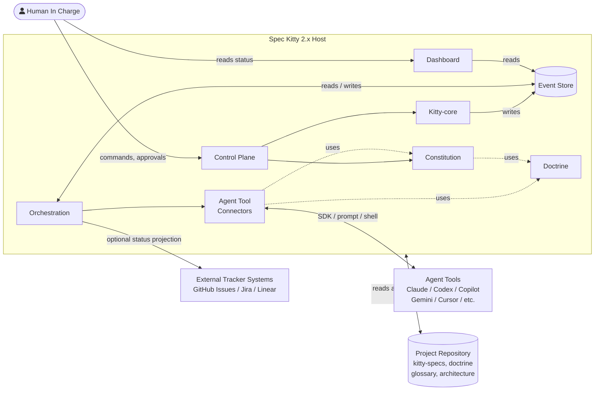

# 2.x System Context

| Field | Value |
|---|---|
| Status | Draft |
| Date | 2026-03-04 |
| Scope | C4 Level 1 system boundary and external interactions |
| Related ADRs | `2026-02-09-1`, `2026-02-09-2`, `2026-02-17-1`, `2026-02-17-2`, `2026-02-23-1`, `2026-02-23-2`, `2026-02-23-3`, `2026-01-29-13` |

## Purpose

Clarify where Spec Kitty 2.x starts and ends, who interacts with it, and which
boundaries must remain explicit for safe operation.

This view aligns with the [System Landscape](../00_landscape/README.md), which
defines the internal domain containers. The context view focuses on **what
crosses the system boundary** and under what contracts.

## Scope Rules

1. Focus on actors, external systems, and authority boundaries.
2. Capture why interactions exist and what constraints apply.
3. Defer internal domain container detail to `../02_containers/README.md` and
   `../03_components/README.md`.

## Primary Audience

| Audience | Why This View Matters |
|---|---|
| [Project Owner](../../audience/external/project-owner.md) | Understands accountability and approval boundaries. |
| [System Architect](../../audience/internal/system-architect.md) | Validates integration and authority contracts. |
| [AI Collaboration Agent](../../audience/internal/ai-collaboration-agent.md) | Aligns execution behavior with host-owned constraints. |
| [Spec Kitty CLI Runtime](../../audience/internal/spec-kitty-cli-runtime.md) | Enforces command and state authority boundaries. |

## Context Diagram

The system boundary contains the domain containers defined in the
[System Landscape](../00_landscape/README.md). External actors interact with
the system through specific boundary surfaces.

## External Actors

| External Actor | What It Is | Boundary Surface |
|---|---|---|
| Human In Charge | The user — project owner, developer, or operator | Control Plane (commands, approvals); Dashboard (read-only visibility) |
| Agent Tools | AI coding assistants (Claude, Codex, Copilot, Gemini, Cursor, etc.) | Reached through Agent Tool Connectors via SDK, prompt, or shell |
| External Tracker Systems | Issue trackers (GitHub Issues, Jira, Linear, etc.) | Optional status projection from Orchestration; feature-gated |
| Project Repository | Filesystem artifacts (kitty-specs, doctrine, glossary, architecture) | Canonical persistent state; read/write by the host |

## External Interaction Contracts

| From → To | Direction | Contract | Authority Rule |
|---|---|---|---|
| Human → Control Plane | inbound | Commands, interview answers, approvals | Final acceptance authority stays human-owned |
| Human → Dashboard | inbound | Read-only queries (kanban, status, history) | No write path; purely observational |
| Agent Tools ↔ Connectors | bidirectional | SDK calls, prompt dispatch, shell execution, result return | Agents execute within host constraints and directive scope |
| Orchestration → Tracker | outbound | Status/event projection | Tracker sync is optional and feature-gated; host retains state authority |
| Host ↔ Repository | bidirectional | Filesystem read/write of canonical project state | Repository artifacts are the authoritative persistent store |

## System Boundary Rules

The rules below are derived from the
[Architectural Principles](../00_landscape/README.md#architectural-principles)
established in the System Landscape. They express how those principles
constrain what crosses the system boundary.

1. **Host-owned authority is non-negotiable.** Orchestration is pluggable, but
   lifecycle state mutation authority is not delegated to external actors.
   *(Principle 3: Host-Owned State Authority)*
2. **Agent Tools are external.** They are reached through internal Connectors
   that enforce governance context (Doctrine, Constitution) at execution time.
   Agent Tools cannot bypass governance or directly mutate lifecycle state.
   *(Principle 5: Governance at the Execution Boundary)*
3. **Dashboard is read-only.** It provides visibility into the Event Store but
   has no write path to any container.
4. **Tracker integration is optional.** External projection is feature-gated
   to preserve local-first operation. Trackers consume host contracts but
   cannot become state authority.
   *(Principle 4: Local-First Operation)*
5. **Repository is canonical state.** All persistence flows through the
   repository (filesystem today, potentially a database behind the Event Store
   interface in future). No external system is an alternate source of truth.
   *(Principle 6: Event-Sourced Persistence)*

## Branch and Routing Boundary

1. Mission metadata carries target-line intent used for lifecycle routing.
2. Status/lifecycle persistence is routed by target-line intent, not by caller
   location alone.
3. Worktree invocation does not transfer canonical lifecycle authority.
4. Legacy missions without explicit target-line metadata remain supported via
   default routing behavior.

## Boundary and Trade-off Notes

1. The model favors traceability and deterministic behavior over implicit
   automation shortcuts.
2. External integrations are optional by design to preserve local-first
   operation.
3. Agent Tool Connectors are the governance enforcement point — they inject
   Doctrine and Constitution context into every execution, ensuring agents
   operate within defined constraints regardless of the connector implementation.

## Decision Traceability

<!-- DECISION: 2026-02-17-1 - Keep runtime loop authority in host boundary -->
<!-- DECISION: 2026-02-23-1 - Keep doctrine artifacts as governed policy inputs -->

## Traceability

- System landscape: `../00_landscape/README.md`
- Domain map: `../README.md#domain-breakdown`
- Usage flow reference: `../README.md#usage-flow-high-level-user-journey`
- Container view: `../02_containers/README.md`
- Component view: `../03_components/README.md`
- Runtime loop authority: `../adr/2026-02-17-1-canonical-next-command-runtime-loop.md`
- Doctrine governance model: `../adr/2026-02-23-1-doctrine-artifact-governance-model.md`
