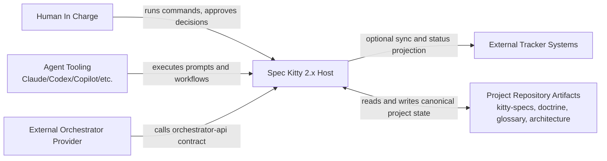
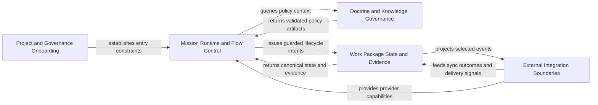

# 2.x System Context

| Field | Value |
|---|---|
| Status | Draft |
| Date | 2026-03-01 |
| Scope | C4 Level 1 system boundary and external interactions |
| Related ADRs | `2026-02-09-1`, `2026-02-09-2`, `2026-02-17-1`, `2026-02-17-2`, `2026-02-23-1`, `2026-02-23-2`, `2026-02-23-3`, `2026-01-29-13` |

## Purpose

Clarify where Spec Kitty 2.x starts and ends, who interacts with it, and which
boundaries must remain explicit for safe operation.

## Scope Rules

1. Focus on actors, external systems, and authority boundaries.
2. Capture why interactions exist and what constraints apply.
3. Defer internal subsystem detail to `../02_containers/README.md` and
   `../03_components/README.md`.

## Primary Audience

| Audience | Why This View Matters |
|---|---|
| [Project Owner](../../audience/external/project-owner.md) | Understands accountability and approval boundaries. |
| [System Architect](../../audience/internal/system-architect.md) | Validates integration and authority contracts. |
| [AI Collaboration Agent](../../audience/internal/ai-collaboration-agent.md) | Aligns execution behavior with host-owned constraints. |
| [Spec Kitty CLI Runtime](../../audience/internal/spec-kitty-cli-runtime.md) | Enforces command and state authority boundaries. |

## Context Diagram (Mermaid)

## External Interaction Contracts

| External Entity | Interaction Contract | Boundary Rule |
|---|---|---|
| Human In Charge | Command invocation and approval checkpoints | Final acceptance authority stays human-owned. |
| Agent Tooling | Prompt-driven workflow execution | Agents execute within host constraints and directive scope. |
| External Orchestrator Provider | Orchestrator API calls | Provider is adapter-only; host remains lifecycle authority. |
| External Tracker Systems | Status/event projection | Tracker sync is optional and feature-gated. |
| Project Repository Artifacts | Filesystem state read/write | Repository artifacts are canonical persistent state. |

## Domain Context Map

See [2.x Domain Breakdown](../README.md#domain-breakdown) for full detail.

| Domain | Context-Level Boundary Statement |
|---|---|
| Project and Governance Onboarding | Entry conditions and governance defaults must be explicit before runtime execution. |
| Mission Runtime and Flow Control | Runtime loop owns action sequencing and mission resolution precedence. |
| Doctrine and Knowledge Governance | Doctrine and glossary provide policy context but do not bypass runtime sequencing. |
| Work Package State and Evidence | Lifecycle transitions remain host-authoritative and auditable. |
| External Integration Boundaries | External services consume host contracts and cannot become state authority. |

## Usage Flow Reference

See [Usage Flow High-Level User Journey](../README.md#usage-flow-high-level-user-journey)
for the generic cross-domain execution path that these boundaries protect.

## Branch and Routing Boundary

1. Feature metadata carries target-line intent used for lifecycle routing.
2. Status/lifecycle persistence is routed by target-line intent, not by caller
   location alone.
3. Worktree invocation does not transfer canonical lifecycle authority.
4. Legacy features without explicit target-line metadata remain supported via
   default routing behavior.

## Boundary and Trade-off Notes

1. Host-owned authority is intentional: orchestration is pluggable, state mutation authority is not.
2. External integrations are optional by design to preserve local-first operation.
3. The model favors traceability and deterministic behavior over implicit automation shortcuts.

## Decision Traceability

<!-- DECISION: 2026-02-17-1 - Keep runtime loop authority in host boundary -->
<!-- DECISION: 2026-02-23-1 - Keep doctrine artifacts as governed policy inputs -->

## Traceability

- Domain map: `../README.md#domain-breakdown`
- Usage flow reference: `../README.md#usage-flow-high-level-user-journey`
- Container view: `../02_containers/README.md`
- Component view: `../03_components/README.md`
- Runtime loop authority: `../adr/2026-02-17-1-canonical-next-command-runtime-loop.md`
- Doctrine governance model: `../adr/2026-02-23-1-doctrine-artifact-governance-model.md`
