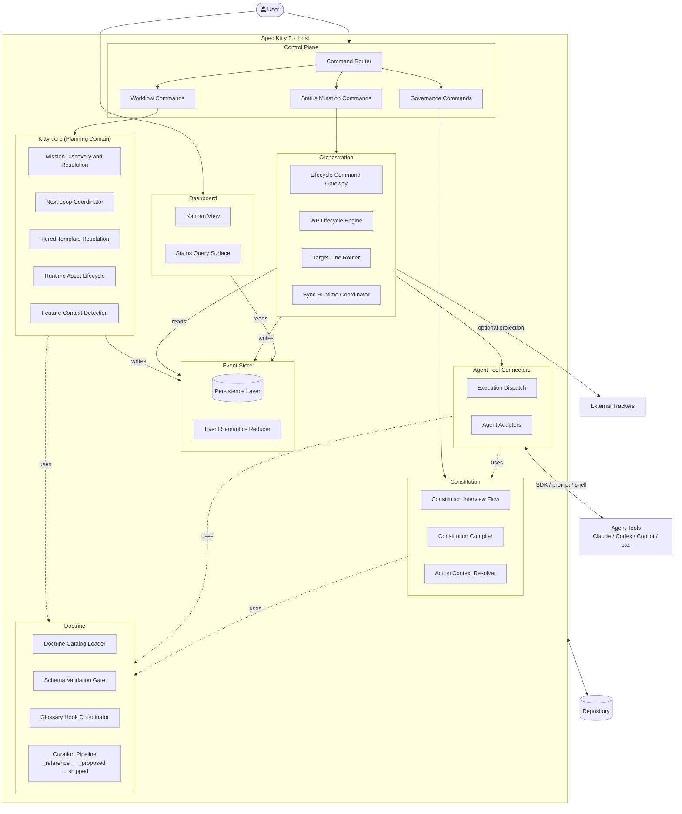

# 2.x Containers

| Field | Value |
|---|---|
| Status | Draft |
| Date | 2026-03-04 |
| Scope | C4 Level 2 container model |
| Related ADRs | `2026-01-29-13`, `2026-02-09-1..4`, `2026-02-17-1..3`, `2026-02-23-1..3`, `2026-02-27-1..3` |

## Purpose

Define the internal container boundaries of Spec Kitty 2.x and how they
collaborate. This view decomposes the system boundary established in the
[System Context](../01_context/README.md) into the domain containers defined
in the [System Landscape](../00_landscape/README.md).

All containers follow the
[Architectural Principles](../00_landscape/README.md#architectural-principles),
particularly **Interface-First Design** and **Implementation-Agnostic Domain
Boundaries**.

## Scope Rules

1. Use stable logical container boundaries aligned with the landscape model.
2. Focus on contracts, responsibilities, and behavior loops.
3. Defer intra-container component detail to `../03_components/README.md`.
4. Use `runtime-execution-domain.md` for deeper lifecycle/routing details.

## Container Diagram

## Container Responsibilities

| Container | Core Responsibility | Behavioral Ownership |
|---|---|---|
| **Control Plane** | User-facing interaction surface | Routes commands to Kitty-core (planning), Orchestration (lifecycle), and Constitution (governance) |
| **Kitty-core** | Planning domain — specify, plan, tasks | Owns mission resolution, execution graph construction, next-action decisioning, and template resolution |
| **Event Store** | Central persistence for all system state | Records events from Kitty-core and Orchestration; serves reads to Dashboard and Orchestration |
| **Orchestration** | Execution coordination | Reads state to make scheduling decisions; dispatches work to Connectors; writes lifecycle events; enforces guarded transitions |
| **Dashboard** | Read-only visibility | Presents kanban, status, and history views from Event Store data; no write path |
| **Agent Tool Connectors** | Pluggable execution providers | Receives dispatched work from Orchestration; executes through SDK/prompt/shell; consumes Doctrine and Constitution at execution time |
| **Doctrine** | Knowledge store and curation pipeline | Loads and validates governance artifacts (directives, tactics, procedures, paradigms, styleguides, toolguides, mission templates); provides glossary checks; owns the `_reference/` → `_proposed/` → `shipped/` promotion pipeline |
| **Constitution** | Governance rules | Compiles governance bundles from Doctrine via interview flow; provides action context for runtime use |

## Container-Internal Component Mapping

Each container decomposes into components documented in
`../03_components/README.md`. The mapping below shows which components belong
to which landscape container.

| Landscape Container | Internal Components |
|---|---|
| Control Plane | Command Router, Workflow Command Set, Status Mutation Command Set, Governance Command Set, Orchestrator API Command Set |
| Kitty-core | Next Loop Coordinator, Mission Discovery and Resolution, Runtime Asset Lifecycle Coordinator, Tiered Template Resolution Pipeline, Runtime Asset Migration Path, Feature Context Detection, Next-Action Recommendation Output |
| Event Store | Event Semantics Reducer (materialization), persistence layer (JSONL / frontmatter / database) |
| Orchestration | Lifecycle Command Gateway, Target-Line Router, WP Lifecycle Engine, Sync Runtime Coordinator, Sync Identity Resolver, Lamport Clock Coordinator, Offline Queue Manager, Sync Transport Session, Tracker Connector Gateway |
| Dashboard | Kanban View, Status Query Surface |
| Agent Tool Connectors | Execution Dispatch, Agent Adapters (per-agent SDK/prompt/shell implementations) |
| Doctrine | Doctrine Catalog Loader, Schema Validation Gate, Glossary Hook Coordinator, Curation Pipeline (`engine.py`, `state.py`, `workflow.py`) |
| Constitution | Constitution Interview Flow, Constitution Compiler, Action Context Resolver |

## Behavioral Collaboration Loops

### Loop A: Planning (User → Kitty-core → Event Store)

1. User invokes planning commands through Control Plane (specify, plan, tasks).
2. Control Plane routes to Kitty-core.
3. Kitty-core resolves the mission template (Doctrine artifact) and constructs
   the execution graph (WP dependency DAG) for the concrete mission.
4. Planning artifacts and events are written to the Event Store.

### Loop B: Execution Coordination (Orchestration ↔ Event Store → Connectors)

1. Orchestration reads current state from the Event Store (WP status,
   dependency completion, execution history).
2. Orchestration determines which work packages are ready for execution.
3. Orchestration dispatches work to Agent Tool Connectors.
4. Connectors execute work using Doctrine and Constitution context.
5. Results flow back through Orchestration, which writes lifecycle events
   to the Event Store.

### Loop C: Governance (User → Constitution → Doctrine)

1. User initiates governance update through Control Plane.
2. Control Plane routes to Constitution interview flow.
3. Constitution Compiler produces governance bundles from Doctrine artifacts.
4. Action Context Resolver refreshes governance context for runtime use.

### Loop D: Visibility (Dashboard ← Event Store)

1. Dashboard reads from Event Store (kanban, status, history).
2. No write path — purely observational.
3. User accesses Dashboard directly (not through Control Plane).

### Loop F: Doctrine Curation (Human → Doctrine Pipeline → Catalog)

1. Human (or agent) drops raw reference material into `_reference/<source>/`.
2. Agent extracts and authors structured doctrine artifacts into `<type>/_proposed/`.
3. Human runs `spec-kitty doctrine curate` — the Curation Pipeline presents artifacts
   in depth-first order (directives first, then referenced tactics and styleguides).
4. For each artifact the human accepts (→ promoted to `shipped/`), drops (→ deleted),
   or skips (→ deferred to next session). Session state is persisted and resumable.
5. Shipped artifacts are loaded by the Doctrine Catalog at runtime via Two-Source Loading.

### Loop E: External Projection (Orchestration → Tracker)

1. Orchestration optionally projects lifecycle events to external trackers.
2. Projection is feature-gated (Principle 4: Local-First Operation).
3. External systems cannot mutate host state (Principle 3: Host-Owned
   State Authority).

## Interaction Constraints

1. **Kitty-core does not execute work** — it produces the execution graph;
   Orchestration dispatches it.
2. **Orchestration does not plan** — it executes the graph that Kitty-core
   produced; it does not construct planning artifacts.
3. **Event Store is a shared boundary** — writers (Kitty-core, Orchestration)
   and readers (Dashboard, Orchestration) interact through interface contracts.
4. **Dashboard has no write path** — strictly read-only.
5. **Agent Tool Connectors are governance-aware** — they inject Doctrine and
   Constitution context into every execution (Principle 5).
6. **Constitution depends only on Doctrine** — never on Kitty-core,
   Orchestration, or Event Store.

## Domain-to-Container Allocation

See [2.x Domain Breakdown](../README.md#domain-breakdown) for the domain-level model.

| Domain | Primary Containers | Secondary Containers |
|---|---|---|
| Project and Governance Onboarding | Control Plane, Constitution | Kitty-core, Doctrine |
| Mission Runtime and Flow Control | Kitty-core, Control Plane | Doctrine, Event Store |
| Doctrine and Knowledge Governance | Doctrine, Constitution | Kitty-core |
| Work Package State and Evidence | Orchestration, Event Store | Control Plane |
| External Integration Boundaries | Agent Tool Connectors, Orchestration | Event Store |

## Runtime/Execution Domain Detail

See [Runtime/Execution Domain (Container Detail)](runtime-execution-domain.md)
for canonical lifecycle FSM, transition guard summary, and execution/routing
invariants.

## Decision Traceability

<!-- DECISION: 2026-02-27-2 - Keep tracker persistence authority in host -->
<!-- DECISION: 2026-02-23-1 - Keep doctrine as typed and validated artifact set -->

## Traceability

- System landscape: `../00_landscape/README.md`
- Architectural principles: `../00_landscape/README.md#architectural-principles`
- Domain map: `../README.md#domain-breakdown`
- Usage flow reference: `../README.md#usage-flow-high-level-user-journey`
- Runtime/execution detail: `runtime-execution-domain.md`
- Context view: `../01_context/README.md`
- Component view: `../03_components/README.md`
- Runtime loop ADR: `../adr/2026-02-17-1-canonical-next-command-runtime-loop.md`
- Lifecycle ADRs: `../adr/2026-02-09-1-canonical-wp-status-model.md`, `../adr/2026-02-09-2-wp-lifecycle-state-machine.md`
