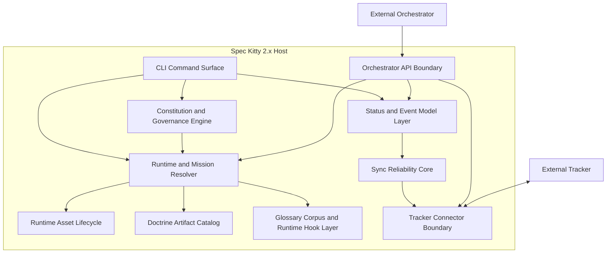

# 2.x Containers

| Field | Value |
|---|---|
| Status | Draft |
| Date | 2026-03-01 |
| Scope | C4 Level 2 container model |
| Related ADRs | `2026-01-29-13`, `2026-02-09-1..4`, `2026-02-17-1..3`, `2026-02-23-1..3`, `2026-02-27-1..3` |

## Purpose

Show the major logical containers in Spec Kitty 2.x and define how they
collaborate to enforce governance, runtime sequencing, lifecycle mutation, and
integration boundaries.

## Scope Rules

1. Use stable logical container boundaries, not implementation package inventories.
2. Focus on contracts, responsibilities, and behavior loops.
3. Defer intra-container component detail to `../03_components/README.md`.
4. Use `runtime-execution-domain.md` for deeper lifecycle/routing details that
   would overload the top-level container map.

## Container Diagram (Mermaid)

## Container Responsibilities

| Container | Core Responsibility | Behavioral Ownership |
|---|---|---|
| CLI Command Surface | Interactive and scripted command entry point | Validates command intent and routes to runtime/governance/state surfaces |
| Runtime and Mission Resolver | Canonical `next` loop and mission precedence | Owns execution sequencing and next-action decisioning, not lifecycle persistence |
| Runtime Asset Lifecycle | Runtime bootstrap, tiered asset resolution, and migration path management | Maintains deterministic template/mission/script resolution behavior |
| Constitution and Governance Engine | Constitution interview, generation, and action context projection | Produces governance constraints consumed by runtime |
| Doctrine Artifact Catalog | Typed governance and mission assets | Loads/validates doctrine resources for runtime use |
| Glossary Corpus and Runtime Hook Layer | Context glossary lifecycle and glossary-aware execution checks | Applies terminology and context safeguards at runtime edges |
| Status and Event Model Layer | Canonical lifecycle and event semantics | Enforces guarded transitions and persists event-sourced lifecycle state |
| Sync Reliability Core | Identity, ordering, queueing, and delivery coordination for sync | Preserves reliable projection behavior under offline/auth variability |
| Orchestrator API Boundary | Stable host API contract for orchestration providers | Exposes controlled ingress without delegating state authority |
| Tracker Connector Boundary | Outbound synchronization surface for tracker systems | Projects state externally through feature-gated adapters |

## Domain-to-Container Allocation

See [2.x Domain Breakdown](../README.md#domain-breakdown) for the domain-level model.

| Domain | Primary Containers | Secondary Containers |
|---|---|---|
| Project and Governance Onboarding | CLI Command Surface, Constitution and Governance Engine | Runtime and Mission Resolver, Runtime Asset Lifecycle |
| Mission Runtime and Flow Control | Runtime and Mission Resolver, CLI Command Surface | Doctrine Artifact Catalog, Status and Event Model Layer |
| Doctrine and Knowledge Governance | Doctrine Artifact Catalog, Glossary Corpus and Runtime Hook Layer | Constitution and Governance Engine |
| Work Package State and Evidence | Status and Event Model Layer, Runtime and Mission Resolver | Sync Reliability Core, Tracker Connector Boundary |
| External Integration Boundaries | Orchestrator API Boundary, Tracker Connector Boundary | Status and Event Model Layer, Sync Reliability Core |

## Behavioral Collaboration Loops

### Loop A: Runtime Decisioning and Lifecycle Mutation

1. CLI captures user command and routes to runtime.
2. Runtime resolves mission/assets and returns a next-action decision.
3. Lifecycle mutation commands execute through the status/event model layer.
4. Status/event model validates transitions, appends events, and materializes snapshots.

### Loop B: Branch-Target Aware Lifecycle Routing

1. Feature metadata provides target-line routing intent.
2. Status/lifecycle commits are applied on the target line.
3. Caller context (main repository or worktree) does not reassign lifecycle authority.

### Loop C: External Projection Without Authority Transfer

1. Status model materializes canonical lifecycle changes.
2. Sync reliability core governs identity, ordering, and queueing behavior.
3. Tracker connector projects selected status externally.
4. External systems receive projection but cannot mutate host authority directly.

## Usage Flow Reference

See [Usage Flow High-Level User Journey](../README.md#usage-flow-high-level-user-journey)
for a generic end-to-end execution narrative.

## Runtime/Execution Domain Detail

See [Runtime/Execution Domain (Container Detail)](runtime-execution-domain.md)
for canonical lifecycle FSM, transition guard summary, and execution/routing invariants.

## Interaction Constraints

1. State transitions are host-authoritative; providers and trackers use contract surfaces only.
2. Runtime decisioning and lifecycle persistence are intentionally separated.
3. Target-line routing is metadata-driven and remains stable across invocation contexts.
4. Tracker integrations are feature-gated and boundary-scoped to avoid implicit persistence coupling.

## Decision Traceability

<!-- DECISION: 2026-02-27-2 - Keep tracker persistence authority in host -->
<!-- DECISION: 2026-02-23-1 - Keep doctrine as typed and validated artifact set -->

## Traceability

- Domain map: `../README.md#domain-breakdown`
- Usage flow reference: `../README.md#usage-flow-high-level-user-journey`
- Runtime/execution detail: `runtime-execution-domain.md`
- Context view: `../01_context/README.md`
- Component view: `../03_components/README.md`
- Runtime loop ADR: `../adr/2026-02-17-1-canonical-next-command-runtime-loop.md`
- Lifecycle ADRs: `../adr/2026-02-09-1-canonical-wp-status-model.md`, `../adr/2026-02-09-2-wp-lifecycle-state-machine.md`
