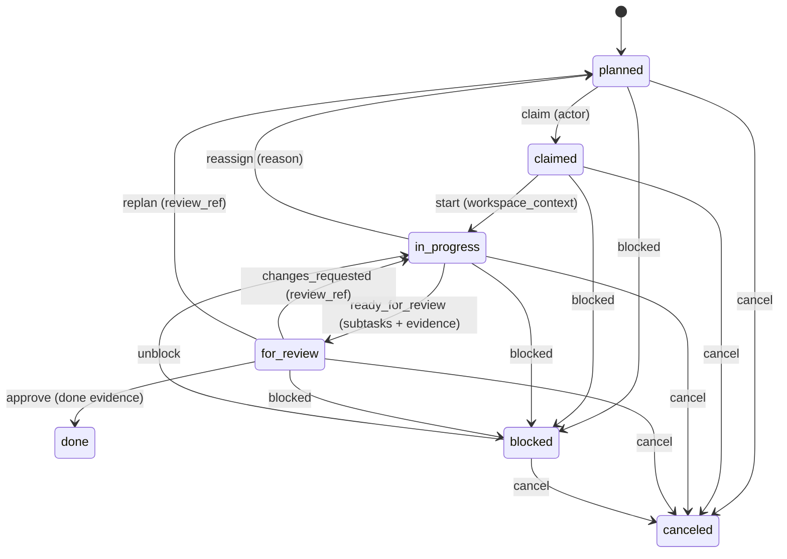
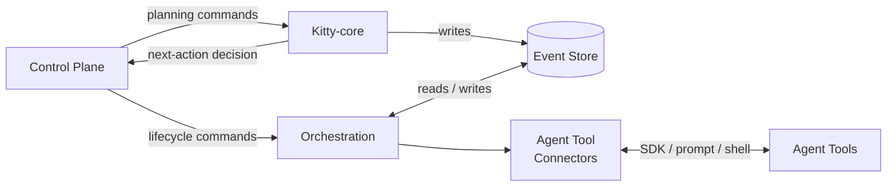

# 2.x Runtime/Execution Domain (Container Detail)

| Field | Value |
|---|---|
| Status | Draft |
| Date | 2026-03-04 |
| Scope | Container-level runtime/execution behavior and lifecycle authority model |
| Related ADRs | `2026-01-29-13`, `2026-02-09-1`, `2026-02-09-2`, `2026-02-17-1` |

## Purpose

Provide a focused container-level view of runtime/execution behavior, including
decisioning authority, lifecycle mutation authority, branch-target routing, and
the canonical work package lifecycle FSM.

This document details the interaction between three landscape containers:
**Kitty-core** (planning), **Orchestration** (execution coordination), and
**Event Store** (persistence). See [System Landscape](../00_landscape/README.md)
for the full container model.

## Domain Boundary (Container Level)

| Concern | Primary Containers | Outcome |
|---|---|---|
| Planning and decisioning | Kitty-core, Control Plane | Execution graph construction, next-action recommendation |
| Lifecycle mutation | Orchestration, Event Store | Guarded transition validation and event-sourced persistence |
| Execution dispatch | Orchestration, Agent Tool Connectors | Work dispatch to pluggable execution providers |
| Sync projection | Orchestration (Sync internals) | Ordered, durable, optional external projection |

## Runtime/Execution Invariants

1. Planning and lifecycle mutation are separate authorities.
2. Kitty-core decides what should happen next (planning domain).
3. Orchestration coordinates when and how it happens (execution domain).
4. Event Store validates and persists what did happen (persistence domain).
5. Lifecycle authority remains host-owned even when projection is enabled.
6. Every WP execution begins with a constitution context bootstrap call that
   injects action-scoped governance into the agent prompt (Principle 5:
   Governance at the Execution Boundary).

## Branch Target Routing Invariants

1. Mission metadata is the routing authority source (`target_branch`).
2. Lifecycle/status commits route to the target line, not caller location.
3. Worktree context does not reassign lifecycle authority.
4. Legacy missions without explicit target-line metadata continue on default routing.

## Canonical Work Package Lifecycle FSM

## Transition Guard Summary

1. Canonical lanes: `planned`, `claimed`, `in_progress`, `for_review`, `done`, `blocked`, `canceled`.
2. `done` and `canceled` are terminal unless force override is explicitly used.
3. Guard requirements are transition-specific and include:
   `actor`, `workspace_context`, `review_ref`, done evidence, and explicit reason fields.

## Runtime/Execution Container Interaction

## Traceability

- System landscape: `../00_landscape/README.md`
- Architectural principles: `../00_landscape/README.md#architectural-principles`
- Domain overview: `../README.md#domain-breakdown`
- Container map: `README.md`
- Usage flow: `../README.md#usage-flow-high-level-user-journey`
- Component model: `../03_components/README.md`
