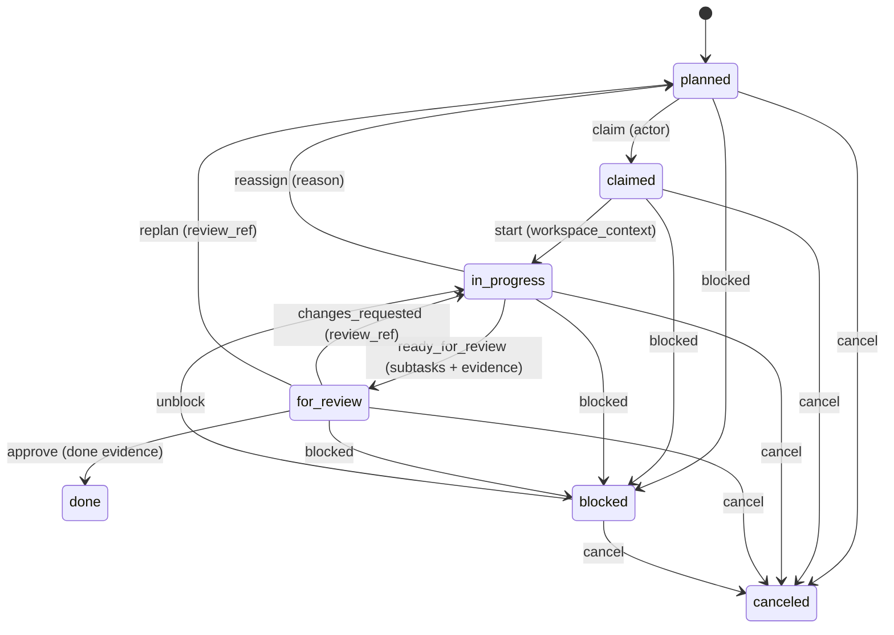
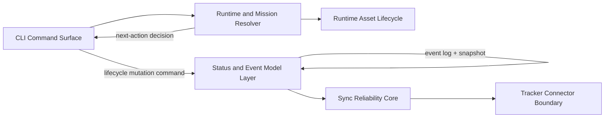

# 2.x Runtime/Execution Domain (Container Detail)

| Field | Value |
|---|---|
| Status | Draft |
| Date | 2026-03-01 |
| Scope | Container-level runtime/execution behavior and lifecycle authority model |
| Related ADRs | `2026-01-29-13`, `2026-02-09-1`, `2026-02-09-2`, `2026-02-17-1` |

## Purpose

Provide a focused container-level view of runtime/execution behavior, including
decisioning authority, lifecycle mutation authority, branch-target routing, and
the canonical work package lifecycle FSM.

## Domain Boundary (Container Level)

| Concern | Primary Containers | Outcome |
|---|---|---|
| Runtime decisioning | `CLI Command Surface`, `Runtime and Mission Resolver`, `Runtime Asset Lifecycle` | Deterministic next-action recommendation flow |
| Lifecycle mutation | `Status and Event Model Layer` | Guarded transition validation and event-sourced persistence |
| Sync projection reliability | `Sync Reliability Core`, `Tracker Connector Boundary` | Ordered, durable, optional external projection |

## Runtime/Execution Invariants

1. Runtime decisioning and lifecycle mutation are separate authorities.
2. Runtime decides what should happen next.
3. Status/event model validates and persists what did happen.
4. Lifecycle authority remains host-owned even when projection is enabled.

## Branch Target Routing Invariants

1. Feature metadata is the routing authority source (`target_branch`).
2. Lifecycle/status commits route to the target line, not caller location.
3. Worktree context does not reassign lifecycle authority.
4. Legacy features without explicit target-line metadata continue on default routing.

## Canonical Work Package Lifecycle FSM

## Transition Guard Summary

1. Canonical lanes: `planned`, `claimed`, `in_progress`, `for_review`, `done`, `blocked`, `canceled`.
2. `done` and `canceled` are terminal unless force override is explicitly used.
3. Guard requirements are transition-specific and include:
   `actor`, `workspace_context`, `review_ref`, done evidence, and explicit reason fields.

## Runtime/Execution Container Interaction

## Traceability

- Domain overview: `../README.md#domain-breakdown`
- Container map: `README.md`
- Usage flow: `../README.md#usage-flow-high-level-user-journey`
- Component model: `../03_components/README.md`
