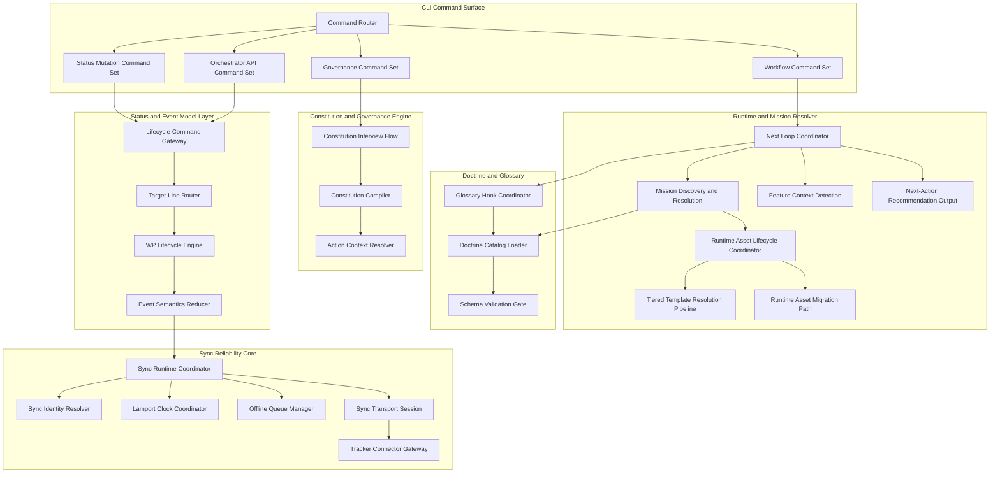
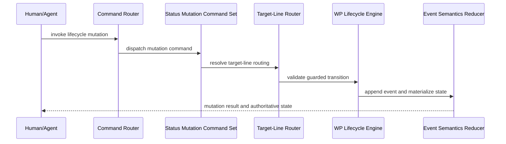
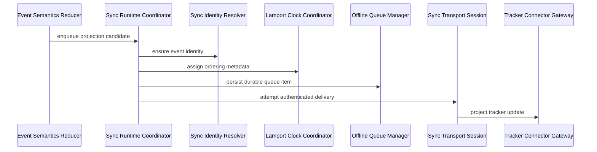
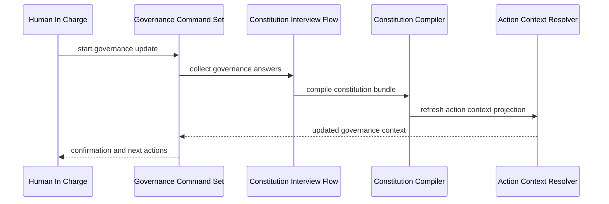
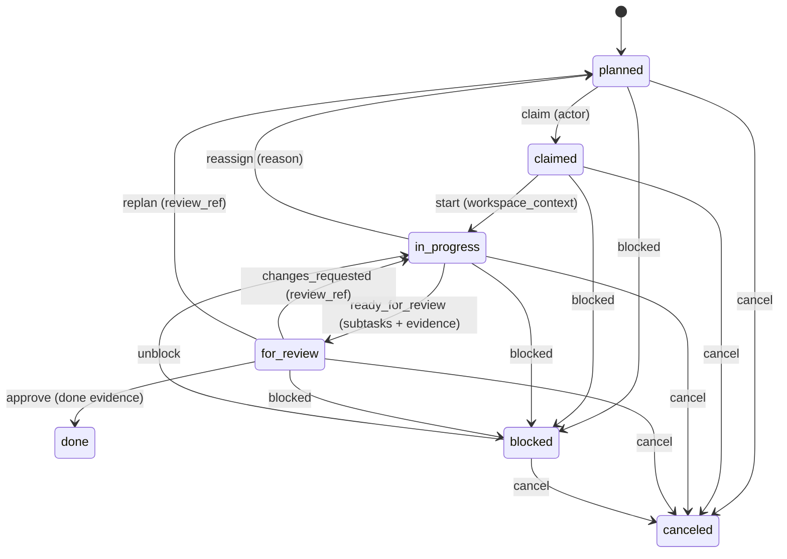

# 2.x Components

| Field | Value |
|---|---|
| Status | Draft |
| Date | 2026-03-01 |
| Scope | C4 Level 3 logical component view |
| Related ADRs | `2026-01-29-13`, `2026-02-09-1..4`, `2026-02-17-1..3`, `2026-02-23-1..3`, `2026-02-25-1..3` |

## Purpose

Define component-level boundaries for Spec Kitty 2.x while remaining
implementation-agnostic and behavior-focused.

## Scope Rules

1. Focus on conceptual components and contracts, not file/class listings.
2. Explain behavior and interaction patterns that matter architecturally.
3. Keep component definitions aligned with container boundaries and ADR decisions.

## Component Diagram (Mermaid)



## Component Responsibility Map

| Component | Responsibility |
|---|---|
| Command Router | Normalizes and dispatches commands to the correct capability surface |
| Workflow Command Set | Drives specify/plan/tasks/implement/review/merge command families |
| Status Mutation Command Set | Handles lane transition and status-mutation command families |
| Governance Command Set | Handles constitution/guidance workflow interactions |
| Orchestrator API Command Set | Handles API-surface lifecycle operations |
| Next Loop Coordinator | Governs canonical per-agent execution sequencing |
| Mission Discovery and Resolution | Selects mission/runtime assets by deterministic precedence |
| Runtime Asset Lifecycle Coordinator | Coordinates runtime bootstrap, tier selection, and compatibility checks |
| Tiered Template Resolution Pipeline | Resolves prompt/template payloads by configured precedence tiers |
| Runtime Asset Migration Path | Applies forward-compatible migration behavior for legacy runtime assets |
| Feature Context Detection | Determines active feature context without ambiguous heuristics |
| Next-Action Recommendation Output | Emits decisioning output without applying lifecycle mutation |
| Constitution Interview Flow | Captures governance intent from the Human in Charge |
| Constitution Compiler | Produces constitution bundles and references |
| Action Context Resolver | Provides command-scoped governance context |
| Doctrine Catalog Loader | Loads doctrine assets as typed artifacts |
| Schema Validation Gate | Enforces artifact compliance before runtime use |
| Glossary Hook Coordinator | Applies glossary checks during mission execution |
| Lifecycle Command Gateway | Normalizes lifecycle mutation requests before state transition validation |
| Target-Line Router | Resolves routing intent from feature metadata (`target_branch`) |
| WP Lifecycle Engine | Enforces canonical work-package state transitions |
| Event Semantics Reducer | Materializes authoritative state from event logs |
| Sync Runtime Coordinator | Owns sync runtime lifecycle and projection scheduling behavior |
| Sync Identity Resolver | Adds and backfills identity attribution for emitted events |
| Lamport Clock Coordinator | Maintains monotonic event ordering across projections |
| Offline Queue Manager | Persists events for eventual sync when transport/auth is unavailable |
| Sync Transport Session | Manages authenticated realtime and delivery sessions |
| Tracker Connector Gateway | Adapts host state to external tracker APIs |

## Domain Alignment Matrix

See [2.x Domain Breakdown](../README.md#domain-breakdown) for domain-level definitions.

| Domain | Primary Components |
|---|---|
| Project and Governance Onboarding | `Governance Command Set`, `Constitution Interview Flow`, `Constitution Compiler` |
| Mission Runtime and Flow Control | `Command Router`, `Next Loop Coordinator`, `Mission Discovery and Resolution`, `Runtime Asset Lifecycle Coordinator`, `Tiered Template Resolution Pipeline`, `Next-Action Recommendation Output` |
| Doctrine and Knowledge Governance | `Doctrine Catalog Loader`, `Schema Validation Gate`, `Glossary Hook Coordinator` |
| Work Package State and Evidence | `Status Mutation Command Set`, `Lifecycle Command Gateway`, `Target-Line Router`, `WP Lifecycle Engine`, `Event Semantics Reducer`, `Feature Context Detection` |
| External Integration Boundaries | `Orchestrator API Command Set`, `Sync Runtime Coordinator`, `Sync Transport Session`, `Tracker Connector Gateway` |

## Behavioral Sequences

### Sequence A: Canonical `next` Decisioning (No Direct Mutation)

```mermaid
sequenceDiagram
    participant User as Human/Agent
    participant Router as Command Router
    participant Loop as Next Loop Coordinator
    participant Mission as Mission Discovery and Resolution
    participant Doctrine as Doctrine Catalog Loader

    User->>Router: invoke next-style command
    Router->>Loop: dispatch runtime action
    Loop->>Mission: resolve mission assets
    Mission->>Doctrine: load and validate doctrine context
    Doctrine-->>Loop: validated context
    Loop-->>User: next-action recommendation
```

### Sequence B: Lifecycle Mutation and Target-Line Routing



### Sequence C: Sync Projection Reliability Path



### Sequence D: Governance Update and Runtime Reuse



## Canonical Work Package FSM



Guard summary:
1. Canonical lanes: `planned`, `claimed`, `in_progress`, `for_review`, `done`, `blocked`, `canceled`.
2. `done` and `canceled` are terminal unless an explicit force override is used.
3. Transition guard requirements are transition-specific and include actor, workspace context, review reference, done evidence, and explicit reason fields.

## Coupling and Trade-off Notes

1. `next` loop centralization improves consistency but requires strict mission compatibility discipline.
2. Runtime decisioning and lifecycle mutation are intentionally separated, reducing hidden side effects.
3. Governance and doctrine coupling is deliberate to preserve policy traceability.
4. Sync reliability internals are explicit because ordering/durability constraints affect system behavior.
5. Tracker connector isolation keeps third-party integration optional and bounded.

## Decision Traceability

<!-- DECISION: 2026-02-09-2 - Enforce explicit lifecycle transitions via dedicated engine -->
<!-- DECISION: 2026-02-25-1 - Keep verify/doctor command taxonomy separate from workflow commands -->

## Traceability

- Domain map: `../README.md#domain-breakdown`
- Usage flow reference: `../README.md#usage-flow-high-level-user-journey`
- Context view: `../01_context/README.md`
- Container view: `../02_containers/README.md`
- Runtime loop ADR: `../adr/2026-02-17-1-canonical-next-command-runtime-loop.md`
- Doctrine governance ADR: `../adr/2026-02-23-1-doctrine-artifact-governance-model.md`
