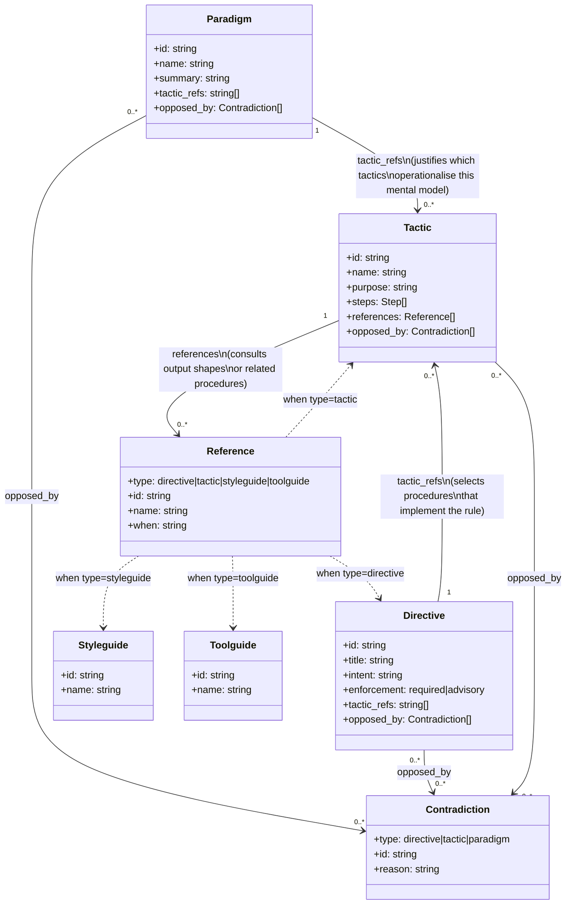
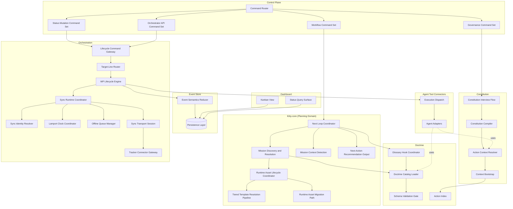
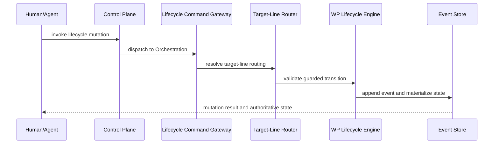
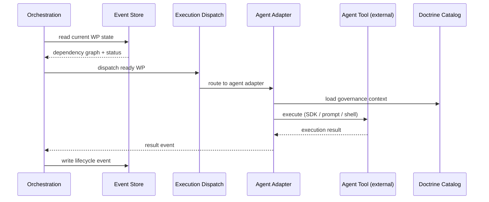
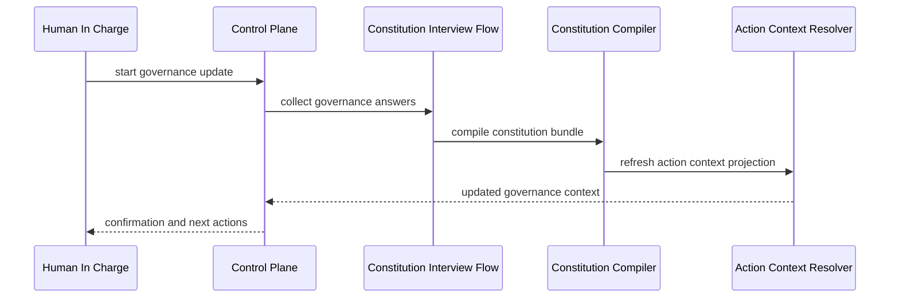
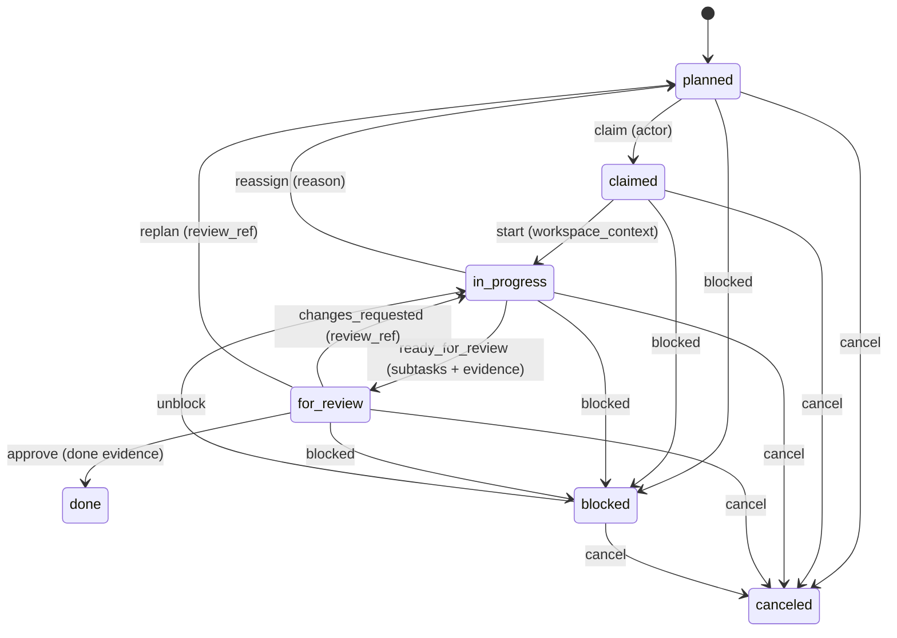

# 2.x Components

| Field | Value |
|---|---|
| Status | Draft |
| Date | 2026-03-04 |
| Scope | C4 Level 3 logical component view |
| Related ADRs | `2026-01-29-13`, `2026-02-09-1..4`, `2026-02-17-1..3`, `2026-02-23-1..3`, `2026-02-25-1..3` |

## Purpose

Define component-level boundaries for Spec Kitty 2.x while remaining
implementation-agnostic and behavior-focused. Components are grouped under the
domain containers defined in the
[System Landscape](../00_landscape/README.md).

## Scope Rules

1. Focus on conceptual components and contracts, not file/class listings.
2. Explain behavior and interaction patterns that matter architecturally.
3. Keep component definitions aligned with landscape container boundaries and
   ADR decisions.

## Doctrine Stack Domain Model

The Doctrine Stack is the knowledge layer that governs how agents reason and act. The diagram below shows the conceptual elements, their reference directions, and the contradiction relationship introduced in v0.12.



### Reference Direction Rules

| From | To | Mechanism | Meaning |
|---|---|---|---|
| Paradigm | Tactic | `tactic_refs` | Approach justifies which tactics operationalise it |
| Directive | Tactic | `tactic_refs` | Rule selects the step-by-step procedure that fulfils it |
| Tactic | Tactic / Styleguide / Toolguide / Directive | `references[*]` | Step consults related procedures or output-shape contracts |
| Any | Any | `opposed_by[*]` | Explicit tension: this artifact's intent conflicts with the referenced artifact under certain conditions |

**Leaf nodes** — Styleguides and Toolguides are terminal. They are referenced *by* tactics; they carry no outward references themselves.

**Cycle constraint** — Tactic-to-tactic references (via `references[*]`) must form a DAG. Cycles would cause infinite resolution loops and are detected by `test_tactic_reference_graph_has_no_cycles` in `tests/doctrine/test_directive_consistency.py`.

**Contradiction semantics** — `opposed_by` does not mean "superseded". Both artifacts remain valid and applicable. The field documents a known tension so agents can surface it when the two artifacts are simultaneously active (e.g. Directive 024 Locality of Change vs Directive 025 Boy Scout Rule).

## Component Diagram

Components are grouped by their parent landscape container. Arrows show
internal collaboration patterns.



## Component Responsibility Map

Components are organized by their parent landscape container.

### Control Plane

| Component | Responsibility |
|---|---|
| Command Router | Normalizes and dispatches commands to the correct capability surface |
| Workflow Command Set | Drives specify/plan/tasks/implement/review/merge command families |
| Status Mutation Command Set | Handles lane transition and status-mutation command families |
| Governance Command Set | Handles constitution/guidance workflow interactions |
| Orchestrator API Command Set | Handles API-surface lifecycle operations |

### Kitty-core

| Component | Responsibility |
|---|---|
| Next Loop Coordinator | Governs canonical per-agent execution sequencing |
| Mission Discovery and Resolution | Selects mission/runtime assets by deterministic precedence |
| Runtime Asset Lifecycle Coordinator | Coordinates runtime bootstrap, tier selection, and compatibility checks |
| Tiered Template Resolution Pipeline | Resolves prompt/template payloads by configured precedence tiers |
| Runtime Asset Migration Path | Applies forward-compatible migration behavior for legacy runtime assets |
| Mission Context Detection | Determines active mission context without ambiguous heuristics |
| Next-Action Recommendation Output | Emits decisioning output without applying lifecycle mutation |

### Event Store

| Component | Responsibility |
|---|---|
| Event Semantics Reducer | Materializes authoritative state from event logs |
| Persistence Layer | Reads/writes events (filesystem JSONL/frontmatter today, database in future) |

### Orchestration

| Component | Responsibility |
|---|---|
| Lifecycle Command Gateway | Normalizes lifecycle mutation requests before state transition validation |
| Target-Line Router | Resolves routing intent from mission metadata (`target_branch`) |
| WP Lifecycle Engine | Enforces canonical work-package state transitions |
| Sync Runtime Coordinator | Owns sync runtime lifecycle and projection scheduling behavior |
| Sync Identity Resolver | Adds and backfills identity attribution for emitted events |
| Lamport Clock Coordinator | Maintains monotonic event ordering across projections |
| Offline Queue Manager | Persists events for eventual sync when transport/auth is unavailable |
| Sync Transport Session | Manages authenticated realtime and delivery sessions |
| Tracker Connector Gateway | Adapts host state to external tracker APIs |

### Dashboard

| Component | Responsibility |
|---|---|
| Kanban View | Presents WP status as a kanban board from Event Store data |
| Status Query Surface | Provides mission progress and execution history queries |

### Agent Tool Connectors

| Component | Responsibility |
|---|---|
| Execution Dispatch | Receives dispatched work from Orchestration and routes to the correct adapter |
| Agent Adapters | Per-agent implementations (in-tool prompt, async shell, SDK, remote API) |

### Doctrine

| Component | Responsibility |
|---|---|
| Doctrine Catalog Loader | Loads doctrine assets as typed artifacts via `DoctrineService` aggregation facade |
| Schema Validation Gate | Enforces artifact compliance before runtime use |
| Glossary Hook Coordinator | Applies glossary checks during mission execution |
| Action Index | Per-action directive/tactic/styleguide/toolguide selection scoping. Loaded from `missions/<mission>/actions/<action>/index.yaml`. Provides the action-side of the two-stage intersection that determines which governance applies to a given execution phase. |

### Constitution

| Component | Responsibility |
|---|---|
| Constitution Interview Flow | Captures governance intent from the Human in Charge |
| Constitution Compiler | Produces constitution bundles and references via transitive resolution (directive → tactic → styleguide/toolguide chains) |
| Action Context Resolver | Provides action-scoped governance context with depth semantics (1=compact, 2=bootstrap, 3=extended). Uses two-stage intersection: Action Index ∩ project selections. |
| Context Bootstrap | Entry point at every execution boundary (Principle 5). First invocation per action returns depth-2 full content; subsequent calls default to depth-1 compact. State tracked in `context-state.json`. |

## Domain Alignment Matrix

See [2.x Domain Breakdown](../README.md#domain-breakdown) for domain-level definitions.

| Domain | Landscape Container | Primary Components |
|---|---|---|
| Project and Governance Onboarding | Control Plane, Constitution | `Governance Command Set`, `Constitution Interview Flow`, `Constitution Compiler` |
| Mission Runtime and Flow Control | Kitty-core, Control Plane | `Command Router`, `Next Loop Coordinator`, `Mission Discovery and Resolution`, `Runtime Asset Lifecycle Coordinator`, `Tiered Template Resolution Pipeline`, `Next-Action Recommendation Output` |
| Doctrine and Knowledge Governance | Doctrine | `Doctrine Catalog Loader`, `Schema Validation Gate`, `Glossary Hook Coordinator`, `Action Index` |
| Work Package State and Evidence | Orchestration, Event Store | `Lifecycle Command Gateway`, `Target-Line Router`, `WP Lifecycle Engine`, `Event Semantics Reducer`, `Mission Context Detection` |
| Execution Dispatch | Agent Tool Connectors | `Execution Dispatch`, `Agent Adapters` |
| Visibility | Dashboard | `Kanban View`, `Status Query Surface` |
| External Integration Boundaries | Orchestration (Sync internals) | `Sync Runtime Coordinator`, `Sync Transport Session`, `Tracker Connector Gateway` |

## Behavioral Sequences

### Sequence A: Planning Decisioning (Kitty-core)

```mermaid
sequenceDiagram
    participant User as Human/Agent
    participant CP as Control Plane
    participant Loop as Next Loop Coordinator
    participant Mission as Mission Discovery
    participant Doctrine as Doctrine Catalog Loader

    User->>CP: invoke planning command
    CP->>Loop: dispatch to Kitty-core
    Loop->>Mission: resolve mission assets
    Mission->>Doctrine: load and validate doctrine context
    Doctrine-->>Loop: validated context
    Loop-->>User: next-action recommendation
```

### Sequence B: Lifecycle Mutation (Orchestration → Event Store)



### Sequence C: Execution Dispatch (Orchestration → Connectors)



### Sequence D: Governance Update (Constitution)



## Canonical Work Package FSM



Guard summary:
1. Canonical lanes: `planned`, `claimed`, `in_progress`, `for_review`, `done`, `blocked`, `canceled`.
2. `done` and `canceled` are terminal unless an explicit force override is used.
3. Transition guard requirements are transition-specific and include actor, workspace context, review reference, done evidence, and explicit reason fields.

## Coupling and Trade-off Notes

1. `next` loop centralization in Kitty-core improves consistency but requires strict mission compatibility discipline.
2. Planning (Kitty-core) and lifecycle mutation (Orchestration) are intentionally separated, reducing hidden side effects.
3. Governance and doctrine coupling is deliberate to preserve policy traceability.
4. Sync reliability internals within Orchestration are explicit because ordering/durability constraints affect system behavior.
5. Tracker connector isolation keeps third-party integration optional and bounded.
6. Agent Tool Connectors enforce governance at the execution boundary (Principle 5).

## Decision Traceability

<!-- DECISION: 2026-02-09-2 - Enforce explicit lifecycle transitions via dedicated engine -->
<!-- DECISION: 2026-02-25-1 - Keep verify/doctor command taxonomy separate from workflow commands -->

## Traceability

- System landscape: `../00_landscape/README.md`
- Architectural principles: `../00_landscape/README.md#architectural-principles`
- Domain map: `../README.md#domain-breakdown`
- Usage flow reference: `../README.md#usage-flow-high-level-user-journey`
- Context view: `../01_context/README.md`
- Container view: `../02_containers/README.md`
- Runtime/execution detail: `../02_containers/runtime-execution-domain.md`
- Runtime loop ADR: `../adr/2026-02-17-1-canonical-next-command-runtime-loop.md`
- Doctrine governance ADR: `../adr/2026-02-23-1-doctrine-artifact-governance-model.md`
