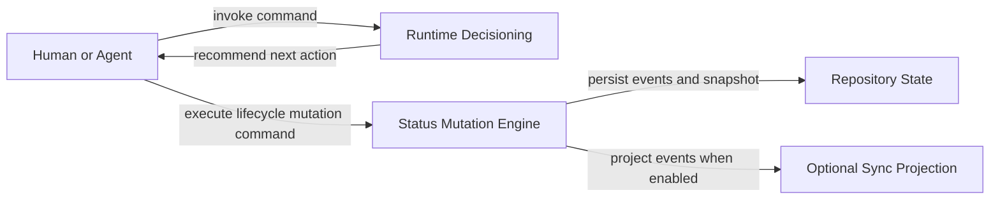

# Architecture 2.x

This directory is the current architecture track for Spec Kitty.

## What This Track Captures

1. Core architecture decisions and constraints (`adr/`).
2. End-to-end behavior expectations (`user_journey/`).
3. Active architecture initiatives (`initiatives/`).
4. Layered C4 documentation for system responsibilities and behavior:
   - `01_context/`
   - `02_containers/`
   - `03_components/`
5. Cross-cutting domain responsibility map (`domain-breakdown.md`).

## C4 Entrypoint Rule

Each C4 directory uses a single canonical entrypoint document:

- `01_context/README.md`
- `02_containers/README.md`
- `03_components/README.md`

Additional detailed pages can live beside the entrypoint files when needed.
This removes README indirection while preserving clear expansion space.

## Recommended Reading Order

1. [Domain Breakdown](domain-breakdown.md)
2. [Usage Flow High-Level User Journey](README.md#usage-flow-high-level-user-journey)
3. [C4 Context](01_context/README.md)
4. [C4 Containers](02_containers/README.md)
5. [Runtime/Execution Domain Detail](02_containers/runtime-execution-domain.md)
6. [C4 Components](03_components/README.md)
7. [Audience Personas](../audience/README.md)
8. [2.x ADR Index](adr/README.md)
9. [2.x User Journeys](user_journey/README.md)

## Usage Flow High-Level User Journey

| Field | Value |
|---|---|
| Status | Draft |
| Date | 2026-03-01 |
| Scope | Generic end-to-end execution and authority flow for Spec Kitty 2.x |
| Related ADRs | `2026-02-09-1`, `2026-02-09-2`, `2026-02-17-1`, `2026-01-29-13` |

### Purpose

Provide a generic, implementation-aligned usage flow that the C4 context,
container, and component views can reference.

### High-Level Flow

### Authority Notes

1. Runtime decisioning and status mutation are separate responsibilities.
2. Runtime decides what should happen next.
3. Status engine validates and persists what did happen.
4. Lifecycle persistence is host-authoritative and event-sourced.
5. External projections do not own canonical lifecycle state.

### Branch and Target-Line Routing (Generic)

1. Each feature carries routing intent in feature metadata.
2. Lifecycle/status commits are routed to the feature target line.
3. Invocation location (for example, main repo vs worktree) does not transfer
   lifecycle authority away from the configured target line.
4. Legacy features without explicit target-line metadata use default routing.

### Lifecycle Model Reference

See [C4 Components](03_components/README.md) for the canonical lifecycle FSM
diagram and transition guard summary.

## Structural Breakdown (Hierarchy)

```mermaid
flowchart TD
    root["architecture/2.x/"]

    domain["domain-breakdown.md"]
    usage["README.md#usage-flow-high-level-user-journey"]
    c1dir["01_context/"]
    c1doc["README.md"]
    c2dir["02_containers/"]
    c2doc["README.md"]
    c2detail["runtime-execution-domain.md"]
    c3dir["03_components/"]
    c3doc["README.md"]
    audience["../audience/README.md"]
    adrdir["adr/README.md"]
    ujdir["user_journey/README.md"]
    initdir["initiatives/README.md"]

    root --> domain
    root --> usage
    root --> c1dir
    c1dir --> c1doc
    root --> c2dir
    c2dir --> c2doc
    c2dir --> c2detail
    root --> c3dir
    c3dir --> c3doc
    root --> adrdir
    root --> ujdir
    root --> initdir
    root --> audience

    click domain "domain-breakdown.md" "Domain Breakdown"
    click usage "README.md#usage-flow-high-level-user-journey" "Usage Flow High-Level User Journey"
    click c1doc "01_context/README.md" "C4 Context"
    click c2doc "02_containers/README.md" "C4 Containers"
    click c2detail "02_containers/runtime-execution-domain.md" "Runtime/Execution Domain Detail"
    click c3doc "03_components/README.md" "C4 Components"
    click audience "../audience/README.md" "Audience Personas"
    click adrdir "adr/README.md" "2.x ADR Index"
    click ujdir "user_journey/README.md" "2.x User Journeys"
    click initdir "initiatives/README.md" "2.x Initiatives"
```

## Scope Guardrail

Do not duplicate code-level inventories or class-level maps in architecture docs.
Code-level tracking belongs in `src/` README and package-level documentation.
