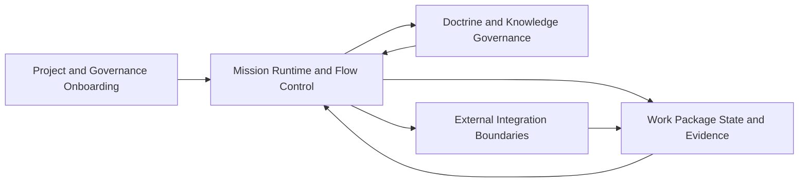

# 2.x Domain Breakdown

| Field | Value |
|---|---|
| Status | Draft |
| Date | 2026-03-01 |
| Scope | 2.x domain responsibilities and behavior loops |
| Related ADRs | `2026-02-09-1..4`, `2026-02-17-1..3`, `2026-02-23-1..3`, `2026-02-27-1..3` |

## Purpose

Define the core behavioral domains in Spec Kitty 2.x so C4 context, container,
and component documents stay aligned and non-overlapping.

## Domain Map

| Domain | Core Responsibilities | Runtime Inputs | Runtime Outputs | Primary Audience | Primary Containers |
|---|---|---|---|---|---|
| Project and Governance Onboarding | Capture project intent, bootstrap governance defaults, and establish mission entry conditions | Project context, constitution interview answers | Compiled governance context, enabled mission surfaces | [Project Owner](../audience/external/project-owner.md), [Maintainer](../audience/internal/maintainer.md) | `CLI Command Surface`, `Constitution and Governance Engine` |
| Mission Runtime and Flow Control | Drive the canonical `next` loop, mission discovery, and action execution sequencing | Command intent, feature context, mission assets | Next-action decisions, routed lifecycle command intent | [AI Collaboration Agent](../audience/internal/ai-collaboration-agent.md), [Spec Kitty CLI Runtime](../audience/internal/spec-kitty-cli-runtime.md) | `Runtime and Mission Resolver`, `CLI Command Surface` |
| Doctrine and Knowledge Governance | Load and validate doctrine assets, maintain glossary compatibility, and provide policy context | Doctrine catalog assets, glossary checks, governance constraints | Validated policy/context artifacts for runtime use | [System Architect](../audience/internal/system-architect.md), [AI Collaboration Agent](../audience/internal/ai-collaboration-agent.md) | `Doctrine Artifact Catalog`, `Glossary Corpus and Runtime Hook Layer` |
| Work Package State and Evidence | Enforce canonical lifecycle transitions, event semantics, and evidence quality boundaries | Routed lifecycle mutation commands, transition evidence payloads | Event log entries, state snapshot materialization, auditable transition history | [Lead Developer](../audience/internal/lead-developer.md), [Maintainer](../audience/internal/maintainer.md) | `Status and Event Model Layer`, `Runtime and Mission Resolver` |
| External Integration Boundaries | Expose orchestrator and tracker integration surfaces without transferring host state authority | Host state/events, sync configuration, auth availability | Optional external projection, orchestrator contract responses | [Spec Kitty CLI Runtime](../audience/internal/spec-kitty-cli-runtime.md), [System Architect](../audience/internal/system-architect.md) | `Orchestrator API Boundary`, `Tracker Connector Boundary` |

## Core Behavioral Loops

## Domain Invariants

### Runtime Decisioning vs State Mutation

1. Mission runtime decides what should happen next.
2. Status/event model validates and persists what did happen.
3. Runtime may recommend a transition, but only the status/event model can apply it.
4. This split preserves deterministic decisioning and auditable mutation authority.

### Branch Topology and Target-Line Routing

1. Feature metadata is the authority source for target-line routing (`target_branch`).
2. Lifecycle commits route to the feature target line (`main` for legacy, `2.x` or other explicit value when set).
3. Worktree execution context must not override target-line authority.
4. Cross-domain usage flow reference: [Usage Flow High-Level User Journey](README.md#usage-flow-high-level-user-journey).

### Work Package Lifecycle and Execution Model

Detailed runtime/execution lifecycle modeling (including canonical FSM,
transition guards, and branch-target routing invariants) is documented in:
[Runtime/Execution Domain (Container Detail)](02_containers/runtime-execution-domain.md).

### Sync Reliability and Runtime Asset Lifecycle

1. Sync behavior is not only a connector boundary; it depends on internal reliability primitives:
   identity attribution, Lamport ordering, offline queue persistence, and runtime lifecycle coordination.
2. Runtime asset lifecycle includes deterministic tiered resolution and controlled migration behavior.
3. These behaviors remain host-owned and feed both runtime decisioning and projection reliability.

### Loop Notes

1. Onboarding initializes constraints and defaults consumed by runtime execution.
2. Runtime consumes doctrine/glossary context conditionally, based on mission and configured checks.
3. Runtime decisioning and state mutation are separate loops connected by explicit command handoff.
4. State and evidence outputs can be projected to external systems through gated boundaries.
5. External integrations are adapters, not alternate owners of lifecycle state.

## Traceability Pointers

- Context framing: `01_context/README.md`
- Container responsibility model: `02_containers/README.md`
- Component behavior model: `03_components/README.md`
- Usage flow reference: `README.md#usage-flow-high-level-user-journey`
- Audience persona catalog: `../audience/README.md`
