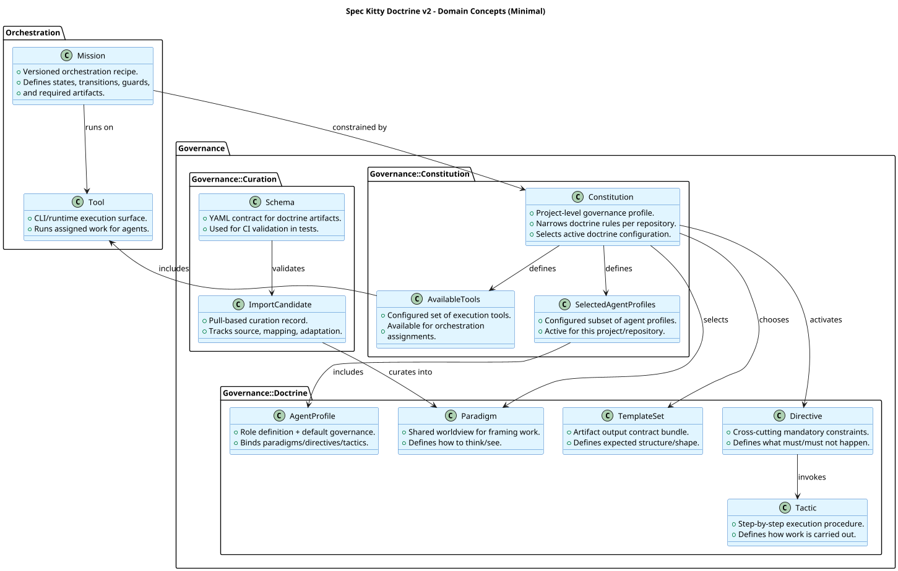

# Explicit Governance Layer Model

**Filename:** `2026-02-17-1-explicit-governance-layer-model.md`

**Status:** Proposed

**Date:** 2026-02-17

**Deciders:** Stijn Dejongh, Spec assistant

**Technical Story:** Spec Kitty v2 doctrine restructuring

---

## Context and Problem Statement

Spec Kitty v2 is introducing a clearer governance model that integrates curated doctrine concepts (paradigms, directives, tactics, template sets, agent profiles) without overloading mission definitions.

Current artifacts and terminology have partially overlapping responsibilities:

- Mission definitions contain orchestration and behavior details.
- Governance selection logic is not consistently modeled as project-level configuration.
- Curation and schema validation are conceptually present but not yet formalized as first-class governance concerns.

This creates ambiguity in how runtime behavior is selected and constrained per project.

## Decision Drivers

- Clear separation of orchestration vs governance concerns
- Constitution as per-project governance authority
- Pull-based doctrine curation with provenance
- Early validation of governance artifacts via schemas/tests
- Readable conceptual model for architecture and glossary alignment

## Considered Options

- Option 1: Keep mission-centric model where missions directly select all doctrine assets
- Option 2: Use constitution-centric governance selection model (chosen)
- Option 3: Keep hybrid model with no explicit authority boundary

## Decision Outcome

**Chosen option:** "Option 2: Constitution-centric governance selection model", because it cleanly separates workflow orchestration from project-specific governance activation and keeps curation/validation concerns explicit.

### Consequences

#### Positive

- Mission remains a stable orchestration contract (states/transitions/guards/artifacts).
- Constitution becomes the explicit per-project selector for active governance assets.
- Governance vocabulary aligns with glossary updates (`Paradigm`, `Directive`, `Tactic`, `TemplateSet`, `AgentProfile`).
- Curation and schema validation become visible architecture concerns.

#### Negative

- Requires migration effort from mission-embedded behavior text to doctrine artifacts.
- Introduces additional governance entities that need documentation and maintenance.

#### Neutral

- This ADR defines the model boundary; implementation details (file formats, parsers, runtime wiring) remain feature-level work.

### Confirmation

This decision is confirmed when:

1. Missions define orchestration only in canonical docs and runtime structures.
2. Constitution explicitly declares selected profiles/tools and active governance selectors.
3. Curation artifacts and schema validations are represented in repository structure and tests.
4. Glossary terms and architecture artifacts stay in sync with this model.

## Pros and Cons of the Options

### Option 1: Mission-centric governance selection

Missions directly encode governance selections and behavior activation.

**Pros:**

- Fewer files and indirections
- Easier short-term implementation

**Cons:**

- Blurs orchestration and governance authority
- Weak per-project configurability semantics
- Harder to reason about overrides and governance provenance

### Option 2: Constitution-centric governance selection (chosen)

Constitution selects active governance assets; mission focuses on orchestration.

**Pros:**

- Strong authority boundary
- Better per-project adaptability
- Cleaner glossary and model consistency
- Fits pull-based curation and profile/tool selection concepts

**Cons:**

- More moving parts
- Requires migration and validation plumbing

### Option 3: Hybrid/no explicit authority

Keep existing mixed pattern and incrementally evolve without explicit model contract.

**Pros:**

- Lowest immediate change cost

**Cons:**

- Continues semantic drift
- Higher long-term complexity and ambiguity

## More Information

### Diagram

- PlantUML source: [`architecture/diagrams/explicit-governance-layer-model.puml`](../diagrams/explicit-governance-layer-model.puml)

### Model Summary (from diagram)

- `Mission -> Constitution` (`constrained by`)
- `Mission -> Tool` (`runs on`)
- `Constitution` selects/activates governance assets and defines selected profiles/tools
- `Directive -> Tactic` (`invokes`)
- `ImportCandidate -> Paradigm` (`curates into`)
- `Schema -> ImportCandidate` (`validates`)
