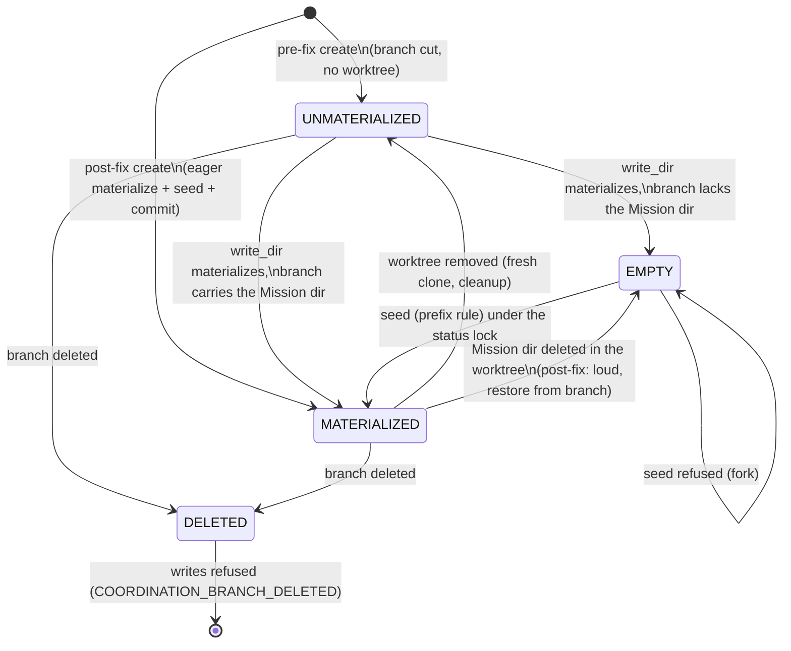

# Data Model: coord-artifact-single-home-01M3V4BE

Library and CLI value objects. Nothing here is persisted except where a row says so. Line references are at `ecb5dd914a`.

## 1. Partition classification (placement taxonomy)

The authority is `src/mission_runtime/artifacts.py`. `_PRIMARY_ARTIFACT_KINDS` is at L158-186 and `_PLACEMENT_ARTIFACT_KINDS` (the COORD set) at L194-213. The ledger's residue-dir entry is `_COORD_RESIDUE_DIRS["decisions"]` at L287.

| Kind | Files | Partition before | Partition after | Write location after |
|------|-------|------------------|-----------------|----------------------|
| `STATUS_STATE` | `status.events.jsonl`, `status.json` | COORD | COORD | `write_dir(STATUS_STATE)`: the coordination surface for a coordination-routed Mission |
| `DECISION_LOG` | `decisions.events.jsonl` | COORD | COORD | `write_dir(DECISION_LOG)` |
| `TRACER_FILE` | `traces/*.md` | COORD | COORD | `write_dir(TRACER_FILE)` |
| `REVIEW_CYCLE` | `tasks/<wp>/review-cycle-*.md` | COORD | COORD | `write_dir(REVIEW_CYCLE)` |
| `ISSUE_MATRIX` | `issue-matrix.json` | COORD | COORD | `write_dir(ISSUE_MATRIX)` |
| `ACCEPTANCE_MATRIX` | `acceptance-matrix.json` | COORD | COORD | `write_dir(ACCEPTANCE_MATRIX)` |
| **`DECISION_LEDGER`** | `decisions/DM-*.md`, `decisions/index.json` | **COORD** (#3928) | **PRIMARY** | the PRIMARY partition dir (unchanged in practice: `decisions/service.py::_ledger_dir` L255-279 already resolves `PRIMARY_METADATA`) |
| every other kind | spec, plan, tasks, meta, lanes, ... | PRIMARY | PRIMARY | unchanged |

Decision events stay COORD on both streams: the status log carries `Decision*` events, and `decisions.events.jsonl` carries `DecisionGitLog` events.

For non-coordination topologies (`lanes`, `single_branch`), every kind resolves to the PRIMARY partition, as today (C-008).

**Residue classification after the ledger move** (research D12, Decision Moment `plan.design.topology-less-callers`):

| Caller of `is_coord_residue_churn` | `decisions/` is residue? |
|---|---|
| passes `topology=None`, slug known, Mission is coordination-routed | **no**: real work (the stored topology is resolved at the predicate) |
| passes `topology=None`, slug known, Mission is `lanes`/`single_branch` | as today (the base verdict is kept; C-008) |
| passes `topology=None` and no slug | as today (base verdict; listed) |
| passes a coordination topology | **no**: real work |
| passes a non-coordination topology | no, as today (nothing is residue there) |

Non-coordination Missions keep exactly today's ledger handling. Paths covered by a registered merge driver (including `decisions/index.json`) are skipped by the planning-recency resolver (research D12, "Merge-driver hazard").

## 2. Write-location accessor result

`PlacementSeam.write_dir(kind) -> WriteLocation`. The contract is in `contracts/write-location-accessor.md`.

```text
WriteLocation (frozen)
  path: Path                     absolute Mission directory to write <kind> files into
  checkout_root: Path            root of the checkout holding `path` (coordination worktree root, or repository root checkout)
  surface: "primary" | "coordination"
  coord_state_before: CoordState | None   None for PRIMARY kinds / non-coord topologies
  establishment: Establishment   NONE | MATERIALIZED | SEEDED | RESTORED_FROM_BRANCH
  seed: SeedReport | None        set only when establishment is SEEDED or RESTORED_FROM_BRANCH
```

### Handling per `CoordState`

`CoordState` is defined in `missions/_read_path_resolver.py:250-275`.

| `CoordState` (write side) | Action | Result |
|---------------------------|--------|--------|
| any state, **PUBLISHED** Mission and E2-eligible kind (`REVIEW_CYCLE`, `TRACER_FILE`, `ISSUE_MATRIX`, `ACCEPTANCE_MATRIX`; `resolution.py:191-199`) | none: checked before any coordination probe | PRIMARY dir, `surface="primary"`, `checkout_root` = repository root checkout (research D23) |
| `NONE` (no coordination branch) | none | PRIMARY dir, `surface="primary"` |
| `MATERIALIZED` | none, **unless a seed commit is pending** (I-SEED-10): then the next seed attempt re-commits the dir with the trailer | coordination Mission dir |
| `UNMATERIALIZED`, local head (whether or not the branch already carries the kind; the absorbed gate, research D22) | `CoordinationWorkspace.resolve` (`workspace.py:296`), re-probe, then the `MATERIALIZED` or `EMPTY` row | coordination Mission dir |
| `UNMATERIALIZED`, remote-only branch | refuse, `COORDINATION_WORKTREE_UNMATERIALIZED` (existing `_raise_unmaterialized`, `surface_resolver.py:877`) | error with a recovery hint (ruling Q1, #4970 parity) |
| `EMPTY`, no `Spec-Kitty-Coordination-Seed: <mission_id>` trailer in the coordination branch history (pre-fix Mission, including one whose branch tree carries PRIMARY files; research D4) | seed (section 3) | coordination Mission dir, `SEEDED` |
| `EMPTY`, seed trailer present (post-fix Mission; a regression) | loud warning, then restore **COORD-kind paths only** from the branch tip (explicit pathspec; ruling Q3), then seed rules for any root-only records | coordination Mission dir, `RESTORED_FROM_BRANCH` |
| `DELETED` (branch declared but missing) | refuse, `COORDINATION_BRANCH_DELETED` (existing `CoordinationBranchDeleted`) with the recovery hint | error |

The read side keeps today's `EMPTY` fallback to the repository root checkout (C-002). The only read-side change: for a post-fix Mission, the `EMPTY` warning (`surface_resolver.py:1430-1450`) fires for both `coord` and `lanes_with_coord`, not only `lanes_with_coord`.

## 3. Seed operation

```text
SeedRequest
  repo_root, mission_slug, mid8, coordination_branch
  coord_mission_dir: Path   (worktree path; absent on entry; EMPTY state)
  root_mission_dir: Path    (repository root checkout)
  records: COORD-partition files found under root_mission_dir (status.events.jsonl,
           decisions.events.jsonl, traces/*.md, tasks/*/review-cycle-*.md,
           issue-matrix.json, acceptance-matrix.json)

SeedReport (frozen)
  carried: tuple[str, ...]          Mission-relative paths copied root -> coordination
  restored_root: tuple[str, ...]    root paths reset to their committed state (or removed if untracked)
  restored_from_branch: tuple[str, ...]
  coord_commit: str | None          commit id of the seed commit on the coordination branch
  warnings: tuple[str, ...]
```

### Invariants

- **I-SEED-1 (lock).** The seed runs under `feature_status_lock(<git-common-dir>, <mission dir name>)`. The coordination and root surfaces share this lock: it is keyed on the git common dir plus the Mission dir name (`status/locking.py:147,278`), and it is reentrant (`machine_file_lock(..., reentrant=True)`).
- **I-SEED-1a (lock identity).** The lock root is `owned.owned_root` when owned, else `repo_root`. The key is `coord_mission_dir_name(slug, mid8)`, the same key as `coord_status_lock` and `commit_router._coord_status_locks`. The timeout is bounded at `BOUNDED_STATUS_LOCK_TIMEOUT_SECONDS` (`status/locking.py:54`), so `STATUS_LOCK_HELD` is reachable; the default `-1` waits forever.
- **I-SEED-2 (lock order).** The workspace lock (`CoordinationWorkspace.resolve`) may be taken while the status lock is held, which is the order `BookkeepingTransaction.acquire` already uses (`transaction.py:292` then `:465`). The status lock is never acquired while the workspace lock is held. Materialization therefore completes, and its lock is released, before the seed takes the status lock.
- **I-SEED-3 (atomic visibility).** The seed builds the full Mission dir in a sibling temp dir in the coordination worktree (`kitty-specs/.<dir>.seed-<pid>-<ulid>`) and makes it visible with a single `os.rename`. A reader sees either no dir (`EMPTY`, read fallback to root, which holds the same records) or the complete dir. A crash leaves only an ignorable temp dir. The next seed removes stale `.seed-*` dirs under the lock.
- **I-SEED-4 (prefix rule, per log stream).** For `status.events.jsonl` and `decisions.events.jsonl`, take `R` = the event-id sequence of the root log and `C` = the event-id sequence of the coordination-side log. `C` is the worktree file if present, else the blob on the coordination branch tip. The classifier is the pure `coordination/event_prefix.py` (`event_ids_of`, `classify_prefix`), shared with the fork detector.
  - `C` empty: the coordination log becomes the root log, byte for byte.
  - `C` a proper prefix of `R`: the coordination log becomes `C` plus `R[len(C):]`, whose lines are taken from the root file.
  - `R` a prefix of `C`, or equal: nothing to carry.
  - Neither is a prefix of the other, and both are non-empty: refuse with `COORD_SEED_FORK_REFUSED` (section 4).
- **I-SEED-5 (non-log records).** Traces, review-cycle files and the matrices are carried only when absent on the coordination side. When present on both sides and different, the coordination copy wins and the root copy is reported in `warnings`; it is not restored, so no data is discarded.
- **I-SEED-10 (pending seed).** A seed commit is **pending** iff the coordination branch history has no `Spec-Kitty-Coordination-Seed: <mission_id>` trailer **and** the coordination tip has no COORD-kind blob under the Mission dir, i.e. the Mission dir is wholly untracked, which only a refused seed leaves. A never-seeded pre-fix MATERIALIZED Mission (#5519 shape) has committed COORD blobs at the tip, so it never matches. The fast path is a porcelain check that reports `?? kitty-specs/<dir>/` (the whole dir untracked); only then are the trailer and tip probed.
- **I-SEED-6 (exactly once).** After the rename the state is `MATERIALIZED`, so later writes never seed again. The only later seed activity is retrying a refused seed **commit** (I-SEED-10), which carries nothing new over and never duplicates an event id. No event id appears twice in one log, because the prefix rule only appends ids that are not in `C`.
- **I-SEED-7 (durable).** The seed commits the carried files on the coordination branch through the existing coordination commit path (`commit_for_mission(kind=STATUS_STATE, ...)` with coordination-worktree paths). This happens before the triggering write appends, so the triggering write's own commit is a separate commit.
- **I-SEED-8 (root restoration).** Each carried root file that is tracked and dirty is restored to `HEAD` (`git checkout -- <path>`). Each carried root file that is untracked is removed. A file tracked and clean on the target branch stays as is (pre-fix Missions keep their committed history, C-004). Every restored path is listed in `restored_root`.
- **I-SEED-9 (no planning copies).** The seed never writes PRIMARY-partition files (such as `meta.json` or `spec.md`) into the coordination Mission dir (US1.3).

### Outcomes

| Outcome | Condition | Exit |
|---------|-----------|------|
| `SEEDED` | prefix rule satisfied | write proceeds |
| `SEEDED` (empty) | no root records (create-time seed) | write proceeds |
| `RESTORED_FROM_BRANCH` | post-fix `EMPTY` | write proceeds; loud warning |
| refused `COORD_SEED_FORK_REFUSED` | I-SEED-4 fork | write aborts, nothing modified |
| refused `COORDINATION_BRANCH_DELETED` | branch missing | write aborts |
| refused `STATUS_LOCK_HELD` | status lock timeout | write aborts |

## 4. Fork-detection report

A fork is defined per stream (`status.events.jsonl`, `decisions.events.jsonl`): both surfaces carry a non-empty log, and neither event-id sequence is a prefix of the other.

```text
SurfaceLog
  surface: "primary" | "coordination"
  source: "worktree" | "ref"        worktree file when present, else the branch tip blob
  ref: str | None                    target branch (primary) / coordination branch
  path: str
  event_ids: tuple[str, ...]

StreamForkFinding
  stream: "status.events.jsonl" | "decisions.events.jsonl"
  state: "single_home" | "prefix" | "forked" | "absent"
  primary: SurfaceLog | None
  coordination: SurfaceLog | None
  decisions_only_on_primary: tuple[decision_id, ...]
  decisions_only_on_coordination: tuple[decision_id, ...]
  decisions_on_both: tuple[decision_id, ...]

LedgerHomeFinding
  state: "primary" | "coordination_only" | "both" | "absent"
  entries_only_on_coordination: tuple[decision_id, ...]
  dm_files_only_on_coordination: tuple[str, ...]

DecisionsForkReport
  mission_slug, topology
  streams: tuple[StreamForkFinding, ...]
  ledger: LedgerHomeFinding
  forked: bool                          any stream state == "forked"
  reconcile_steps: tuple[str, ...]      printed, never executed (C-003)
```

Orphan rule after this Mission: an index entry is orphaned only when its decision id appears in neither surface's events (union over both streams and both surfaces). `--repair` never removes an entry otherwise (FR-011).

## 5. Commit outcome per surface

```text
PathFate (frozen)
  path: str                 repo-relative path as the caller passed it
  reason: str               machine-readable (see contracts/commit-outcome.md)
  owning_path: str | None   the owning-surface path actually committed or inspected

SurfaceOutcome (frozen)
  surface: "primary" | "coordination"
  branch: str
  status: "committed" | "unchanged" | "refused" | "error"
  commit_hash: str | None
  committed: tuple[str, ...]
  skipped: tuple[PathFate, ...]    genuine no-ops only (clean on the owning surface)
  refused: tuple[PathFate, ...]    named refusals
  diagnostic: str | None

CommitRouterResult (existing, commit_router.py:174-205, extended additively)
  status, placement_ref, commit_hash, commit_hashes, diagnostic, reason   (unchanged meaning)
  surfaces: tuple[SurfaceOutcome, ...] = ()                               (new)
```

`surfaces` has one element per partition group the batch touched. The legacy top-level fields keep today's caller-surface selection for compatibility. Consumers read `surfaces` through the shared renderer.

## 6. Coordination surface lifecycle (per coordination-routed Mission)



## 7. Atomicity boundaries

| Operation | Boundary | Rollback |
|-----------|----------|----------|
| Create (coordination-routed) | create transaction: target scaffold commit (if not suppressed) plus coordination branch, worktree, seed commit | `_restore_git_state_after_failed_create` (`mission_creation.py:683`) also removes the coordination worktree and the seed commit, by deleting the branch when this create minted it or resetting it to its pre-create tip otherwise |
| Seed | status lock plus temp-dir rename plus one coordination commit, made before the triggering write proceeds (ruling Q5) | before the rename: drop the temp dir. After the rename but before the commit (refused): the dir stays (records are not lost), and the next seed attempt (the next COORD write, which finds the seed pending, I-SEED-10) re-commits it with the trailer |
| Status transition | existing `_emit_on_coord_then_commit` (`status_transition.py:475-537`) | unchanged |
| Commit router batch | one commit per partition group | per-group outcome reported; no cross-group rollback (unchanged) |
| `doctor decisions --repair` | ledger `index.json.lock` (`_decisions_doctor.py:404`) | the repair writes only additive changes |
| Consolidation seed (IC-18) | `write_dir` at `executor.py:4183`, before the merge lock and the pre-mutation snapshot | the seed is part of the pre-mutation state and is never rolled back; a later FAIL/REFUSE rolls back only this run's landing |
