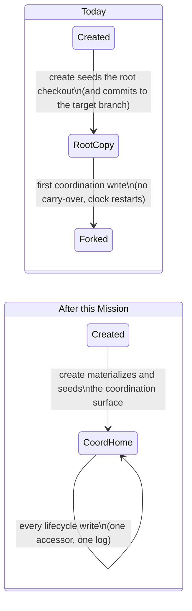

# Mission Specification: Coordination artifacts get one durable home

**Mission Branch**: `issue-5440-coord-artifact-single-home`
**Created**: 2026-10-01
**Status**: Draft (revision 3: plan-phase folds applied, covering the operator's plan-phase rulings and the plan's spec findings S1-S6; revision 2 applied the post-spec squad folds, see `squad-post-spec.md`)
**Input**: Operator brief for the coordination-commit cluster (#5440, #5513, #5519, #5501, #2533, #5023). It was grounded by a two-lens squad against `main` @ `ecb5dd914a` with real-CLI reproductions, then refined by a post-spec adversarial squad (acceptance and boundary lenses).

## Overview

A coordination-routed Mission (topology `coord` or `lanes_with_coord`) keeps its lifecycle records on a separate **coordination surface**: the coordination branch, checked out in a coordination worktree. The records are status events, decision events, tracer files, and review and acceptance bookkeeping.

Today those records have no single durable home from the moment the Mission is created:

- **Mission create** seeds the status log in the repository root checkout and commits it to the **target branch**. The coordination branch is cut beforehand, without the Mission directory.
- **While the coordination worktree has no Mission directory**, every lifecycle write lands in the repository root checkout. The first write that creates the directory on the coordination surface switches the home, and nothing carries the earlier records over, so the log forks and its logical clock restarts. Writers pick their write location from a *read* resolver, and that resolver substitutes the repository root checkout for an empty coordination surface.
- **Each committer compensates differently.** `accept` makes a raw commit of every dirty Mission file onto the current branch. The commit router skips a status log handed in by its repository-root path and reports "unchanged". A mixed commit reports only the caller's surface, hiding a skip or re-route on the other surface. Records end up on the target branch, reported "unchanged" while uncommitted, silently re-routed, or dropped.
- **`doctor decisions --repair`** rebuilds the decision index from one half of a forked log and drops the other half, while `decision verify` reports clean. The decision ledger is classified as a coordination record but written to and read from the repository root checkout. That split also makes `spec-commit` re-route decision files and trigger the fork.

Operators lose trust because the tool commits to the wrong branch and reports success while records stay uncommitted or are lost. This Mission gives every coordination-partition record **one home and one commit branch for the Mission's whole lifetime**, reached through **one write-location accessor on the existing placement seam**, and makes every command report honestly where each record went.

## Domain Language

| Term | Meaning in this Mission | Avoid |
|------|-------------------------|-------|
| **Coordination-routed Mission** | A Mission whose stored topology is `coord` or `lanes_with_coord`, including one in an owned checkout | "coord mission" in user-facing text without the topology |
| **COORD-partition record** | A record the placement taxonomy assigns to the coordination surface: the status log (status events, including decision events), the decision event stream (`decisions.events.jsonl`), tracer files, review-cycle records, the acceptance matrix and the issue matrix | "status files" when decision, tracer or matrix records are meant too |
| **Decision ledger** | The per-decision record files and the decision index (`DM-*.md`, `index.json`). A **PRIMARY-partition** record after this Mission | confusing it with **decision events** |
| **Coordination surface** | The coordination branch plus its checked-out coordination worktree | "coord dir" |
| **Repository root checkout** | The non-worktree checkout where planning commands run; the write location of the PRIMARY partition | "main repo", or bare "primary" without naming the sense |
| **Target branch** | The branch the Mission's completed work lands on (`target_branch` in `meta.json`) | "main", unless the branch really is `main` |
| **Write-location accessor** | The single operation on the existing placement seam that answers "where does a write of record kind K for this Mission go". It owns establishing and seeding the coordination surface. | deriving a write location from a read resolver |
| **Seed** | The one-time carry-over of a pre-fix Mission's COORD-partition records from the repository root checkout to an empty coordination surface | "migrate", "sync" |
| **Fork** | A Mission whose status log, or decision event stream, exists on both surfaces with event-id sequences where neither is a prefix of the other | "duplicate" |
| **Commit outcome** | What a commit request reports *per surface*: branch, commit id, and the committed, skipped and refused paths with reasons | a single success flag |

"Primary" is overloaded: it can mean the PRIMARY partition, the primary branch, the repository root checkout, or the target ref. Every requirement below names the sense it means.

## User Scenarios & Testing *(mandatory)*

### User Story 1 - Creating a coordination-routed Mission keeps the target branch clean (Priority: P1)

An operator creates a coordination-routed Mission through the normal path: `agent mission create --pr-bound --start-branch <topic>` from the primary branch, or with an explicit `--topology coord` / `lanes_with_coord`. The creation records (Mission created, specify started) belong on the coordination surface. Today they are committed to the target branch, and the coordination branch is born without the Mission directory.

**Why this priority**: It is the birth of the defect. Every later fork, silent skip and repair loss starts from records seeded in the wrong place (#5440, P0; #2533).

**Independent Test**: Create a coordination-routed Mission through the CLI in a fresh repository, parametrized over `coord` and `lanes_with_coord`. Then inspect the target branch's history, the coordination branch's tree, and what the read classifier reports.

**Acceptance Scenarios**:

1. **Given** a repository on a non-protected topic branch, **When** the operator creates a coordination-routed Mission, **Then**:
   - no commit between the creation base and the target-branch tip touches a COORD-partition record of that Mission;
   - the target branch still receives the Mission's planning metadata (`meta.json`), as a positive control;
   - the coordination branch's tree holds the Mission's status log with the creation events.
2. **Given** the same Mission, **When** a read classifies the coordination surface immediately after create, **Then** it reports the surface as materialized and holding the Mission directory, never empty.
3. **Given** the same Mission, **When** the operator inspects the coordination surface's Mission directory, **Then** it contains COORD-partition records only, never `meta.json` or other planning copies.
4. **Given** the primary branch is protected (where the target-branch scaffold commit is suppressed by design), **When** the operator creates a coordination-routed Mission, **Then** the coordination surface is still materialized and seeded, independently of that suppression.
5. **Given** a create that fails after the coordination surface was seeded, **When** create rolls back, **Then** the coordination seed is undone together with the rest of the create.
6. **Given** a newly created coordination-routed Mission, **When** `doctor coordination` runs, **Then** the expected divergence between the coordination branch and the target branch is not reported as `COORDINATION_BRANCH_DIVERGED_VS_TARGET`. A genuinely diverged coordination branch is still reported. Create's own coordination-branch check (`ensure_coordination_branch`) uses the same expected-divergence rule whenever it meets an existing coordination branch.

---

### User Story 2 - Lifecycle records never fork (Priority: P1)

An operator works a coordination-routed Mission through specify, plan, tasks and implement. Along the way they open decisions, append tracer entries, move work packages and record review cycles. Every COORD-partition record must land in one log, in causal order, whatever state the coordination worktree is in.

**Why this priority**: Today the first coordination write silently switches the log's home, orphaning earlier decisions and restarting the logical clock (#5519, #2533, P0).

**Independent Test**: For each writer family, drive the write through its CLI entry point in each reachable coordination-surface state, and inspect both surfaces. The families are those named in FR-003, enumerated per site in plan.md IC-04 and IC-18.

**Acceptance Scenarios**:

1. **Given** a coordination-routed Mission, **When** a decision is opened, then a tracer entry is appended, then a second decision is opened, **Then** all events are in one status log on the coordination surface, and the logical clock continues without restarting.
2. **Given** the same Mission, **When** `finalize-tasks` records its lifecycle events and `move-task` records a transition, **Then** they land in that same log.
3. **Given** a coordination-routed Mission whose coordination worktree is not materialized, **When** any COORD-partition write happens, **Then**:
   - if the coordination branch exists locally (for example after the worktree was removed), the coordination surface is materialized first and the write lands there; it never lands in the repository root checkout;
   - if the coordination branch exists only on the remote (a fresh clone), the write is refused before anything is written, with a recovery hint naming the command that creates the local branch. This is #4970 parity: a remote-only branch is never auto-materialized before a write.
4. **Given** a Mission created before this fix (empty coordination surface, records in the repository root checkout), **When** the first coordination write happens:
   - if the coordination log is absent, or its event-id sequence is a prefix of the root-checkout log, **Then** the missing records are carried over exactly once and committed in one commit on the coordination branch. The new event is appended after them, and the root-checkout copy is restored to its committed state and reported.
   - if both logs are non-empty and neither event-id sequence is a prefix of the other, **Then** the write is refused with a fork diagnostic. The diagnostic names both locations and the reconcile steps.
5. **Given** the carry-over in scenario 4, **When** a second coordination write happens, **Then** nothing is carried over again, and no event id appears twice.
6. **Given** a coordination-routed Mission whose coordination surface is already materialized but forked (the #5519 shape), **When** further writes happen, **Then** they go to the coordination surface without a lockout, and the fork stays visible through `doctor decisions` (US4).
7. **Given** a Mission created after this fix, **When** its coordination surface is ever found empty, **Then**:
   - the empty state is reported loudly, for both coordination topologies, because it signals a regression;
   - a COORD-partition write first restores the Mission directory from the coordination branch tip, then lands there;
   - a read keeps today's fallback to the repository root checkout.
8. **Given** a coordination-routed Mission whose coordination branch is missing, **When** a COORD-partition write happens, **Then** it is refused loudly with a recovery hint.
9. **Given** a coordination-routed Mission created before this fix, with an empty coordination surface, **When** `consolidate` records its status bookkeeping, or `materialize` regenerates `status.json`, **Then** the write goes through the same accessor. The surface is seeded once, and nothing is written into the repository root checkout's copy.

---

### User Story 3 - Commits put every record on its surface and report it honestly (Priority: P1)

An operator, or a command such as `accept`, `finalize-tasks`, `retrospect`, `setup-plan` or `spec-commit`, asks for a set of Mission files to be committed. Each file must be committed on its owning surface. A file is refused only for a named reason, and every surface's outcome is reported.

**Why this priority**: These are false successes. `accept` exits cleanly with status rows uncommitted, and `spec-commit` reports success while dropping the status log and silently re-routing decision files (#5513, P0; #5501, P1).

**Independent Test**: Make a status log dirty only on the coordination surface, request a commit of it by its repository-root path, and inspect the result and both branches. Then drive `spec-commit`, `accept`, `finalize-tasks` and `retrospect` through the CLI with mixed batches.

**Acceptance Scenarios**:

1. **Given** a status log modified only on the coordination surface, **When** a commit is requested for it by its repository-root path, **Then** it is committed on the coordination branch. It is refused only for a named reason:
   - the coordination ref is protected;
   - the status lock is held by another writer;
   - the coordination branch is missing;
   - the path cannot be routed.
   It is never reported "unchanged" or "skipped".
2. **Given** the same fixture but with a clean coordination copy, **When** the commit is requested, **Then** it is reported "unchanged". This is the positive control.
3. **Given** a mixed request where one surface's group commits and the other's group is skipped or refused, **When** the commit completes, **Then** the result reports each surface's outcome separately, and the skip or refusal is visible to the caller.
4. **Given** `spec-commit` invoked with `spec.md`, decision-ledger files, trace files and the status log, **When** it runs, **Then** text and JSON output name each argument's fate:
   - the decision ledger is committed with `spec.md` on the target branch;
   - traces and the status log are committed on the coordination branch, or refused with a named reason.
   It never reports success while ignoring an argument.
5. **Given** `accept` on a coordination-routed Mission, with a COORD-partition record dirty in the repository root checkout, **When** it commits its residual changes, **Then** that record is not committed to the target branch.
6. **Given** `accept`, with a COORD-partition record dirty only in the coordination worktree, **When** it commits its residual changes, **Then** that record is committed on the coordination branch. Scenarios 5 and 6 are proven separately.
7. **Given** `accept`, **When** it classifies dirty Mission files, **Then** its dirty-tree gate and its committer give the same partition answer for every path.
8. **Given** `finalize-tasks`, **When** its lifecycle records are dirty only on the coordination surface, **Then** its pre-commit dirtiness check sees them, and they are committed on the coordination branch.
9. **Given** `finalize-tasks` or `retrospect` commits a mixed batch, **When** one surface is skipped or refused, **Then** the command's CLI output reports it.

---

### User Story 4 - Decision records have one reconciled home and a safe repair (Priority: P2)

An operator runs `decision verify` and `doctor decisions` on a Mission. The decision ledger is a PRIMARY-partition record and decision events are COORD-partition records. The diagnosis must read each from its declared home. A fork, or a ledger that exists only on the coordination branch (pre-fix Missions), must be reported precisely, and `--repair` must never lose a decision.

**Why this priority**: The current repair destroys data while verify says clean (#5519 doctor leg, #5023).

**Independent Test**: Run `decision verify`, `doctor decisions` and `doctor decisions --repair` against the fork fixtures, and compare the index before and after each.

**Acceptance Scenarios**:

1. **Given** a Mission whose status log or decision event stream is forked, **When** the operator runs `doctor decisions`, **Then** it reports the fork and names which decisions are on which surface. This works from refs alone (fresh clone) and from working trees.
2. **Given** the same Mission, **When** the operator runs `decision verify`, **Then** it does not report clean. This is proven separately from scenario 1.
3. **Given** the same Mission, **When** the operator runs `doctor decisions --repair`, **Then** no index entry is removed whose events exist on either surface, the output prints the reconcile steps, and no automatic re-sequencing is performed.
4. **Given** an unforked Mission with a genuine orphaned index entry, **When** `--repair` runs, **Then** that orphan is still repaired. This is the positive control.
5. **Given** a pre-fix Mission whose decision ledger was committed only on the coordination branch, **When** the operator runs `doctor decisions`, **Then** it reports the ledger as present only on the coordination branch, and `--repair` copies it to the PRIMARY partition.
6. **Given** a pre-fix Mission whose ledger exists only on the coordination branch, **When** consolidation or coordination teardown runs, **Then** it refuses to destroy that coordination branch and points to `doctor decisions --repair`.
7. **Given** any Mission, **When** decision-ledger files are classified, committed, or checked by `accept`'s dirty-tree gate and the consolidation dirty gate, **Then** they are treated as PRIMARY-partition records everywhere. An uncommitted ledger in the repository root checkout is committed by `accept` on the target branch, never silently reset as coordination residue. Decision events remain COORD-partition records.
8. **Given** a fresh clone of a Mission created after this fix, mid-flight, **When** the operator lists or verifies decisions, **Then** every decision is found.
9. **Given** two lanes that both add decisions, **When** their branches are integrated, **Then** the decision index merges with no lost entries. As a PRIMARY-partition record the index now travels with lane branches, so the existing single-writer ruling for `decisions/` in `tests/architectural/test_merge_reconciliation_class_guard.py` is amended and the index gets a merge driver (plan research D13).

---

### User Story 5 - Finalize keeps the planning commit reference current (Priority: P3)

When `finalize-tasks` runs after further planning commits, the Mission's recorded `planning_commit_sha` must point at the commit that actually holds the finalized planning artefacts. That way every downstream drift and staleness check compares against the right base.

**Why this priority**: It was folded into #5023 from #5131. Today the refresh is an opt-in flag, so a stale reference is the default.

**Independent Test**: Commit a planning change after an earlier finalize, re-run `finalize-tasks`, and compare the recorded reference with the planning commit.

**Acceptance Scenarios**:

1. **Given** a Mission whose planning artefacts changed after `planning_commit_sha` was recorded, **When** `finalize-tasks` runs without any opt-in flag, **Then** `planning_commit_sha` is refreshed to the commit holding the finalized planning artefacts.
2. **Given** no planning change since the recorded reference, **When** `finalize-tasks` runs, **Then** the reference is unchanged. This is the positive control.
3. **Given** a planning change, but the automatic refresh is refused by the existing refresh safety rules (for example the advance-only rule), **When** `finalize-tasks` runs without the opt-in flag, **Then**:
   - finalize continues and keeps the old reference;
   - it prints a warning naming the recorded commit, the would-be commit, and the manual `--refresh-planning-commit` route.

---

### User Story 6 - Implement receipts name the real branch (Priority: P3)

After `implement`, the CLI prints which commits it made on which branch. Today it prints the status-transition message against the target branch, although the status record went to the coordination branch. That misleading receipt was the evidence behind #5440's "implement" claim.

**Why this priority**: A receipt that names the wrong branch erodes trust and misdirects investigations, but nothing is lost.

**Independent Test**: Run `implement` on a coordination-routed Mission and resolve every printed receipt's commit id against the branches.

**Acceptance Scenarios**:

1. **Given** a coordination-routed Mission, **When** `implement` claims a work package, **Then** every receipt line carries a commit id and the branch it names actually contains that commit.
2. **Given** `implement` also commits on the target branch (work-package metadata), **When** receipts print, **Then** that line names the target branch. This is a positive control, so "always print the coordination branch" fails.

---

### Edge Cases

- **Missions created before this fix with status already on the target branch.** Fix forward only. Nothing rewrites existing history; consolidation-side divergence for these Missions stays with #4955.
- **Missions whose log is already forked and materialized.** No lockout. They are detected and guided (US2.6, US4).
- **Owned checkouts with a coordination topology.** The same rules apply.
- **Non-coordination topologies (`lanes`, `single_branch`).** Behaviour is unchanged; everything routes to the PRIMARY partition as today.
- **Protected target branch.** Commits to it stay refused as today. This Mission adds no new bypass.
- **Read-side behaviour for an empty coordination surface.** It is kept as today, falling back to the repository root checkout. For post-fix Missions the empty state is reported loudly (US2.7). Retiring the fallback is a follow-up.
- **Seeding must be atomic.** Readers never observe a coordination Mission directory without its carried-over log. Seeding happens under the same status lock as the write, before the write validates the transition against the log's history.
- **Transient staging.** COORD-partition records are written directly on the coordination surface through the write-location accessor. A command that stages a COORD record in the repository root checkout during the transition must remove that copy before it returns, leaving no residue.

## Requirements *(mandatory)*

### Functional Requirements

| ID | Title | User Story | Priority | Status | Delivery | No-op passable? |
|----|-------|------------|----------|--------|----------|-----------------|
| FR-001 | Create commits creation records on the coordination branch | As an operator creating a coordination-routed Mission (via `--pr-bound --start-branch`, or an explicit `coord` / `lanes_with_coord` topology), I want the creation records committed on the coordination branch, and no commit between the creation base and the target tip touching a COORD-partition record, so that consolidation never meets a second copy (#5440). | High | Open | [build] | no — `meta.json` on the target branch is the same-fixture positive control; the history probe, not the tip tree, is asserted |
| FR-002 | Create materializes and seeds the coordination surface | As an operator, I want create to materialize the coordination worktree and seed it with the Mission's COORD-partition records only (no planning copies), so that a new Mission's coordination surface is never empty and reads immediately classify it as materialized (#2533). | High | Open | [build] | no — asserted via the coordination branch tree and the production read classifier on the same fixture |
| FR-002a | Create seeds on a protected target and rolls back atomically | As an operator, I want seeding to happen even when the target-branch scaffold commit is suppressed (protected primary branch), and a failed create to undo the coordination seed together with the rest of create. | High | Open | [build] | no |
| FR-002b | Coordination-vs-target relation redefined | As an operator, I want `doctor coordination` to expect the by-design divergence between a seeded coordination branch and the target branch, so that every new Mission is not reported as `COORDINATION_BRANCH_DIVERGED_VS_TARGET`. Create's own check (`ensure_coordination_branch`) shares the same expected-divergence rule for the rare case where it meets an existing coordination branch. | High | Open | [build] | no — a genuinely diverged legacy fixture must still be reported |
| FR-003 | One write-location accessor for every COORD-partition record | As an operator, I want every COORD-partition writer to obtain its write location from one write-location accessor on the existing placement seam. For a coordination-routed Mission, that location is the coordination surface in every coordination-worktree state. Then the log never forks (#5519, #2533). The writer families: - status transitions: move-task, mark-status, and the transactional status path's own coordination-directory composition; - decision events in the status log, and the decision event stream; - the finalize bootstrap; - tracer; - review-cycle; - the issue and acceptance matrices; - accept's birth cutover; - retrospect and agent-retrospect event appends; - lanes recovery; - the consolidation executor's status writes; - `materialize`'s `status.json`. Every writer is enumerated in plan.md IC-04 and IC-18. | High | Open | [build] | no — one test per writer family; each fails if that family still uses a read resolver |
| FR-003a | Writes establish the coordination surface or refuse loudly | As an operator, I want the following, so that no state silently substitutes the repository root checkout: - a COORD write on an unmaterialized Mission whose coordination branch exists locally materializes the coordination surface first; - a write when the coordination branch exists only on the remote (fresh clone) is refused before anything is written, with a recovery hint (#4970 parity); - a write when the coordination branch is missing is refused with a recovery hint; - a post-fix Mission found with an empty coordination surface warns loudly for both coordination topologies, and a write first restores the Mission directory from the coordination branch tip. | High | Open | [build] | no |
| FR-004 | Seed-time carry-over, exactly once | As an operator of a pre-fix Mission, I want the first COORD write that finds an empty coordination surface to do all of the following, so that history continues on one surface. It carries the root-checkout records over when the coordination log is absent or a prefix of them. It commits the carried records once on the coordination branch, before the triggering write proceeds. It appends the new event after them, with the logical clock continuing. It restores the root-checkout copy to its committed state and reports it. | High | Open | [build] | no — the logical-clock continuation, the single seed commit on the coordination branch, and the root copy's restoration are all asserted |
| FR-004a | Seed is idempotent and atomic | As an operator, I want later writes never to re-carry (no event id appears twice in one log), and the seed to complete atomically under the write's status lock before the write validates against the log, so that readers never see a partial seed. | High | Open | [build] | no |
| FR-004b | Seed refuses a true fork | As an operator, I want a seed that finds both logs non-empty, with neither event-id sequence a prefix of the other, to refuse with a fork diagnostic naming both locations and the reconcile steps, so that diverged history is never overwritten. | High | Open | [build] | no — same fixture shape as FR-004 with one diverging event |
| FR-005 | Accept routes both residual legs through the commit router | As an operator running `accept`, I want both residual legs committed through the commit router's partition grouping, with the raw commit of every dirty Mission file removed, so that COORD records never reach the target branch and accept's dirty gate and committer agree on every path's partition (#5440, #5513). The two legs are the repository-root-checkout leg and the coordination-worktree leg. | High | Open | [build] | no — two fixtures (dirty in the root checkout / dirty only in the coordination worktree); reverting either leg's fix turns its fixture red |
| FR-006 | The commit router commits the owning-surface copy | As a command committing a COORD-partition record by its repository-root path, I want the record committed on the coordination branch whenever the coordination copy is dirty. It is refused only for a named reason: protected coordination ref, status lock held, coordination branch missing, or an unroutable path. Then "unchanged" always means unchanged (#5513). | High | Open | [build] | no — the clean-coordination-copy fixture still reports unchanged; a router that always refuses fails the commit assertion |
| FR-007 | Per-surface commit outcomes in the shared result contract | As a command author, I want the commit result to carry each surface's outcome, rendered by one shared renderer, and every consumer to report through it rather than reading only the caller-surface fields, so that a skip or refusal on one surface is never masked (#5501, #5513). The outcome covers branch, commit id, and the committed, skipped and refused paths with reasons. Every consumer of the commit result is covered, as enumerated in plan.md IC-07: - the commands accept, finalize-tasks (including its planning-pin refresh), retrospect, setup-plan, record-analysis and spec-commit; - the report transaction and the orchestrator API; - the write seam and its callers: the tracer, the issue and acceptance matrices, and accept's coordination residuals; - the tasks-port commit wrapper and its callers: review-cycle, mark-status and map-requirements. | High | Open | [build] | no — fixture: one surface's group commits while the other's is skipped |
| FR-007a | spec-commit names every argument's fate | As an operator running `spec-commit`, I want text and JSON output to name each argument's fate, so that it never reports success while ignoring an argument (#5501). The decision ledger is committed with planning files on the target branch. Traces and the status log are committed on the coordination branch, or refused with a named reason. | High | Open | [build] | no |
| FR-007b | finalize-tasks sees coordination-only dirt | As an operator running `finalize-tasks`, I want its pre-commit dirtiness check to include the coordination surface, and its CLI output to report every surface's outcome, so that coordination-only records are not judged "no changes" and left uncommitted (#5513). | High | Open | [build] | no |
| FR-008 | Target-branch advance retired for coordination-routed Missions | As an operator, I want the commit router's post-commit target-branch advance retired for coordination-routed Missions, so that seeding the coordination surface at create cannot carry COORD records onto the target branch by fast-forward. Consolidation's bookkeeping projection is explicitly excluded from this rule. | High | Open | [build] | no — fixture where the target branch is an ancestor of the coordination tip |
| FR-009 | Decision ledger reclassified to the PRIMARY partition | As an operator, I want the decision ledger classified as a PRIMARY-partition record in the placement taxonomy and the coordination-residue mapping, so that its classification matches where it is written and read (#5023). The consequences: the commit router stops staging it to the coordination branch, and accept's dirty gate and the consolidation dirty gate treat uncommitted ledger files as real work (committed by `accept`), never as residue to reset. | Medium | Open | [build] | no — a committed-ledger fixture is the positive control for the accept gate |
| FR-009a | Ledger writes and reads stay on the PRIMARY partition | As an operator, I want decision-ledger writes and reads to remain on the PRIMARY partition (already true since #4966), so that the reclassification is behaviour-aligned. | Medium | Open | [ratchet] | yes — pins existing behaviour; paired with FR-009's [build] rows on the same fixture |
| FR-009b | Ledger durability: commit point, clone, lane merge | As an operator, I want new Missions' decision ledgers committed by the existing PRIMARY-partition committers (spec-commit, setup-plan, finalize-tasks, accept) with no new auto-commit, every decision found from a fresh clone mid-Mission, and the decision index merging across lanes without losing entries (#5023). The index gets a merge driver, and the existing single-writer ruling for `decisions/` in `test_merge_reconciliation_class_guard.py` is amended (plan research D13). | Medium | Open | [build] | no |
| FR-009c | Pre-fix ledger fix-forward via doctor | As an operator of a pre-fix Mission whose ledger exists only on the coordination branch, I want the following, so that no decision is lost and no read fallback is added: - `doctor decisions` reports that state, and `--repair` copies the ledger to the PRIMARY partition; - consolidation and coordination teardown refuse to destroy such a coordination branch and point to the repair. | Medium | Open | [build] | no |
| FR-010 | doctor decisions detects forks | As an operator, I want `doctor decisions` to inspect both surfaces (refs and working trees) for both decision-event streams and report a fork, naming which decisions are on which surface (#5519). | High | Open | [build] | no |
| FR-010a | decision verify stops reporting clean on a fork | As an operator, I want `decision verify` to report a forked Mission as not clean, so that verification and doctor agree (#5519). | High | Open | [build] | no — proven separately from FR-010 |
| FR-011 | Repair never drops a decision | As an operator, I want `doctor decisions --repair` never to remove an index entry whose events exist on either surface, and to print the reconcile steps instead of re-sequencing (#5519). | High | Open | [build] | no — an unforked Mission's genuine orphan is still repaired (positive control) |
| FR-012 | finalize-tasks refreshes the planning commit reference | As an operator, I want `finalize-tasks` to refresh `planning_commit_sha` automatically when the planning artefacts changed since it was recorded, so that drift checks compare against the right base (#5023 via #5131). When the existing refresh safety rules refuse the automatic refresh, finalize warns and continues with the old reference. The warning names both commits and the manual `--refresh-planning-commit` route. | Low | Open | [build] | no — the unchanged-planning fixture keeps the reference (positive control); a refused-refresh fixture asserts the warning and the kept reference |
| FR-013 | Implement receipts name the real branch | As an operator, I want every `implement` receipt line to carry a commit id and the branch that actually contains it, so that receipts never claim a status commit on the target branch. | Low | Open | [build] | no — a target-branch commit by implement must be labelled with the target branch (positive control) |
| FR-014 | Guard against read resolvers used as COORD write locations | As a maintainer, I want the existing write-side rederivation gate family extended (no new parallel gate) so that it fails when a COORD-partition writer derives its write location from a read resolver. Requirements: - a concrete floor of guarded writers; - shown red at the base revision on today's real offenders (the decision event writers); - a self-mutation test; - a shrink-only allowlist. | High | Open | [build] | no — red at base on real sites, not only on the planted mutation |
| FR-015 | End-to-end invariant over the full coordination workflow | As a maintainer, I want one end-to-end test, parametrized over `coord` and `lanes_with_coord` through the production create path, that drives create → decision → tracer → finalize → implement → accept → consolidate. It asserts: - no target-branch commit touches a COORD-partition record before consolidation; - exactly one status log; - every decision present; - a monotonic logical clock. A variant moves the merge base (the target gains an unrelated commit that the Mission absorbs) and still consolidates without a target content conflict (#5440). | High | Open | [build] | no |
| FR-016 | Red-first reproductions for every defect | As a maintainer, I want a failing-first reproduction through the pre-existing entry point for each defect, so that every fix is proven red-to-green (ADR 2026-07-17-1): - #5440 (PR #5518, adopted); - #5513 (PR #5520, adopted); - #5519: the repair dropping decisions, and the logical clock restarting; - #5501: spec-commit dropping the status log; - #2533: spec-commit's split-brain warning right after a new coordination create. The legacy-empty control still warns. The decomposition test that pins today's defective create tree is re-pinned. After the fixes, the transitional reproductions move into the owning modules' test files rather than standing as regression markers. | High | Open | [build] | no |
| FR-017 | Decision records and seam documentation updated | As a maintainer, I want the following amended to state the single-home rule, the write-location accessor, the write side's refusal to substitute the repository root checkout, the retained read-side fallback, and the decision-ledger reclassification, so that architecture documentation matches shipped behaviour: - ADR 2026-06-19-1; - the empty-surface note in ADR 2026-09-24-2; - the artifact-placement seam documentation; - the stale coordination-residue comment. | Medium | Open | [build] | yes — review-only; the PR cites the amended ADR sections as the checkable anchor |

### Non-Functional Requirements

| ID | Title | Requirement | Category | Priority | Status |
|----|-------|-------------|----------|----------|--------|
| NFR-001 | Create stays fast | On the same fixture, the median of 5 warm runs of coordination-routed Mission create stays within +1.0 second of the measured baseline median at `ecb5dd914a`. The baseline is recorded in research.md (about 2.64 s). There is no absolute bound. Measured manually and recorded in the PR; not a CI performance test. | Performance | High | Open |
| NFR-002 | Zero record loss | Across the fork fixtures, 0 decision index entries and 0 status events are lost by any command this Mission changes, and no event id appears more than once within a single log. The fixtures are: root uncommitted + coordination untracked (#5519 shape); root committed on target + coordination committed; fresh clone; ledger only on the coordination branch. | Reliability | High | Open |
| NFR-003 | New-code coverage | New and changed code reaches ≥ 90% line coverage (diff-cover gate), and every new branch or helper has a focused test in the same work package. | Maintainability | High | Open |
| NFR-004 | Complexity ceiling | No function touched by this Mission exceeds cyclomatic complexity 15 (ruff C901 / Sonar S3776). Functions near the ceiling get a behaviour-preserving extraction first. | Maintainability | High | Open |
| NFR-005 | Static gates clean | ruff, ruff format and mypy --strict report 0 issues on changed files, with no new suppressions. | Maintainability | High | Open |

### Constraints

| ID | Title | Constraint | Category | Priority | Status |
|----|-------|------------|----------|----------|--------|
| C-001 | Reconcile existing authorities; one sanctioned seam extension | The fix routes through the existing placement authorities: the partition taxonomy, the commit-placement seam, the coordination write precondition, and the existing coordination commit path. The only sanctioned addition is one write-location accessor on the existing placement seam, which owns materializing and seeding. No second surface classifier, and no additional commit mechanism for status records (accept's raw commit is removed, not added to). | Technical | High | Open |
| C-002 | Keep the read-side fallback | The read-side fallback for an empty coordination surface stays; only writes stop substituting the repository root checkout. | Technical | High | Open |
| C-003 | No automatic log merge | Already-forked logs are detected and guided, never merged or re-sequenced automatically. The shared events reducer and #4941 stay out of scope. | Technical | High | Open |
| C-004 | Fix forward | No command rewrites existing Mission history; pre-fix Missions are healed going forward (seed at first write, ledger repair) or diagnosed. | Technical | High | Open |
| C-005 | Red-first through existing entry points | Every defect is reproduced by a failing test through its pre-existing CLI or library entry point before its fix lands (ADR 2026-07-17-1). | Process | High | Open |
| C-006 | No full heavy suites locally | Mission work runs targeted tests and the named architectural gate files only; full architectural, end-to-end, performance and `test-full` sweeps belong to CI. | Process | High | Open |
| C-007 | Terminology canon | User-facing text says Mission, never feature, and names the sense of "primary" it means. | Process | High | Open |
| C-008 | Non-coordination topologies unchanged | `lanes` and `single_branch` Missions behave exactly as today. | Technical | High | Open |

### Key Entities

- **Coordination-routed Mission**: a Mission whose stored topology is `coord` or `lanes_with_coord`. It owns a target branch and a coordination branch, which diverge by design from creation onward.
- **COORD-partition record**: a record whose single home is the coordination surface: the status log, the decision event stream, tracer files, review-cycle records, and the acceptance and issue matrices.
- **Decision ledger**: the per-decision record files and the decision index. A PRIMARY-partition record; its events stay COORD.
- **Write-location accessor**: the single seam operation giving a record kind's write location for a Mission. It owns materialize-and-seed.
- **Commit outcome**: what a commit request reports, per surface: the branch, the commit, and the committed, skipped and refused paths with reasons.

## Success Criteria *(mandatory)*

### Measurable Outcomes

- **SC-001**: In the end-to-end coordination workflow (both coordination topologies, linear and moved-merge-base variants), 0 commits between the creation base and the target-branch tip touch a COORD-partition record before consolidation, and consolidation succeeds — [build] · no-op passable: no
- **SC-002**: A coordination-routed Mission driven through decision → coordination write → decision produces exactly 1 status log holding 100% of its decision events, with the logical clock never restarting — [build] · no-op passable: no
- **SC-003**: Across accept, finalize-tasks, retrospect, setup-plan, spec-commit and the commit router, 0 commit requests report "unchanged" or "skipped" while the owning surface's copy is dirty — [build] · no-op passable: no
- **SC-004**: Across the NFR-002 fork fixtures, `doctor decisions --repair` removes 0 index entries whose events exist on either surface, and `decision verify` reports every forked fixture as not clean — [build] · no-op passable: no
- **SC-005**: Every red-first reproduction named in FR-016 goes from failing at `ecb5dd914a` to passing, and the extended gate (FR-014) is red at `ecb5dd914a` on real offenders and red on its planted mutation — [build] · no-op passable: no

## Assumptions

- The `TARGET_BRANCH_CONTENT_CONFLICT` reported in #5440 did not reproduce on a linear flow. FR-015's moved-merge-base variant is the closest reproduction; already-diverged target copies of pre-fix Missions are handled by #4955.
- #5440's "implement leaks status" evidence is the misleading receipt covered by FR-013; no status record is committed to the target branch by `implement` today.
- #2533's implement-claim leg was reported fixed earlier (`3599c05990` / `e4644c2342`). Plan verifies this on `ecb5dd914a`, and the issue matrix records it.
- Eager materialization at create is decided (decision `specify.design.seed-mechanism`). A direct coordination-ref commit was rejected: it leaves the Mission unmaterialized, so reads raise, and it trips the coordination write precondition.

## Out of Scope

- #3536: already fixed by `27f205f2fd` and closed.
- #5515: not reproduced; the attempts are recorded on the issue.
- #4955: consolidation-side divergence of append-only logs for Missions whose target copy already diverged.
- Retiring the read-side fallback for an empty coordination surface (follow-up).
- Automatic merge or re-sequencing of already-forked logs.
- A read fallback for pre-fix Missions' coordination-only ledger; that case is repaired via doctor (FR-009c).

## Issue Traceability

| Issue | Covered by |
|-------|------------|
| #5440 | FR-001, FR-002, FR-002a, FR-003 (consolidation writers), FR-005, FR-008, FR-013, FR-015, FR-016 |
| #5513 | FR-005, FR-006, FR-007, FR-007b, FR-016 |
| #5519 | FR-003, FR-003a, FR-004, FR-004a, FR-004b, FR-010, FR-010a, FR-011, FR-015, FR-016 |
| #2533 | FR-002, FR-002b, FR-003, FR-004, FR-016 |
| #5501 | FR-007, FR-007a, FR-016 |
| #5023 | FR-009, FR-009a, FR-009b, FR-009c, FR-011, FR-012, FR-017 |
