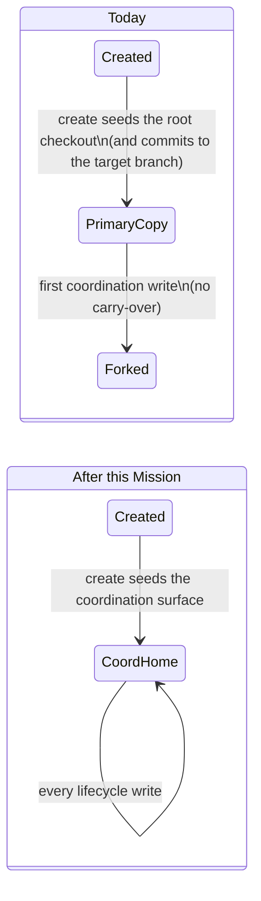

# Mission Specification: Coordination artifacts get one durable home

**Mission Branch**: `issue-5440-coord-artifact-single-home`
**Created**: 2026-10-01
**Status**: Draft
**Input**: Operator brief for the coordination-commit cluster (#5440, #5513, #5519, #5501, #2533, #5023), grounded by a two-lens squad against `main` @ `ecb5dd914a` with real-CLI reproductions.

## Overview

A coordination-routed Mission (topology `coord` or `lanes_with_coord`) keeps its lifecycle records on a separate **coordination surface**:
- status events,
- decision events,
- tracer files,
- review and acceptance bookkeeping.

That surface is the coordination branch, checked out in a coordination worktree. Today those records have no single durable home from the moment the Mission is created:

- **Mission create** seeds the status log in the repository root checkout and commits it to the **target branch**, while the coordination branch is cut without the Mission directory.
- **Writes during the empty window.** While the coordination worktree has no Mission directory, every lifecycle write lands in the repository root checkout. The first write that creates the directory on the coordination surface switches the home, and nothing carries the earlier records over. The log forks and its clock restarts.
- **Committers compensate unevenly.** Each committer handles the mismatch differently: `accept`, `spec-commit` and the commit router. Records end up on the target branch, are reported "unchanged" while uncommitted, are silently re-routed, or are dropped.
- **The repair loses data.** `doctor decisions --repair` rebuilds the decision index from one half of a forked log and drops the other half, while `decision verify` reports clean.

Operators lose trust because the tool commits to the wrong branch and reports success while records stay uncommitted or are lost. This Mission gives every coordination-partition record **one home and one commit branch for the Mission's whole lifetime**, and makes every command report honestly where each record went.

## Domain Language

| Term | Meaning in this Mission | Avoid |
|------|-------------------------|-------|
| **Coordination-routed Mission** | A Mission whose stored topology is `coord` or `lanes_with_coord` | "coord mission" in user-facing text without the topology |
| **COORD-partition record** | A lifecycle record the placement taxonomy assigns to the coordination surface: status events (including decision events), tracer files, review-cycle and acceptance/issue-matrix bookkeeping | "status files" when decision or tracer records are meant too |
| **Coordination surface** | The coordination branch plus its checked-out coordination worktree | "coord dir" |
| **Repository root checkout** | The non-worktree checkout where planning commands run (the PRIMARY partition's write location) | "main repo", "primary" without naming the sense |
| **Target branch** | The branch the Mission's completed work lands on (`target_branch` in `meta.json`) | "main" unless the branch really is `main` |
| **Decision ledger** | The per-decision record files and the decision index (`DM-*.md`, `index.json`) | confusing it with **decision events**, which live in the status log |
| **Fork** | The same Mission's status log existing on two surfaces with diverging events | "duplicate" |

"Primary" is overloaded (PRIMARY partition, primary branch, repository root checkout, target ref). Every requirement below names the sense it means.

## User Scenarios & Testing *(mandatory)*

### User Story 1 - Creating a coordination-routed Mission leaves the target branch clean (Priority: P1)

An operator creates a coordination-routed Mission on a topic branch. The creation records (Mission created, specify started) belong on the coordination surface. Today they are committed to the topic (target) branch, which later collides with the coordination copy at consolidation.

**Why this priority**: It is the birth of the defect. Every later fork, silent skip and repair loss starts from records seeded in the wrong place (#5440, P0).

**Independent Test**: Create a coordination-routed Mission in a fresh repository and inspect the target branch tree and the coordination branch tree.

**Acceptance Scenarios**:

1. **Given** a repository on a non-protected topic branch, **When** the operator creates a `coord` Mission, **Then** the target branch carries no COORD-partition record for that Mission, and the coordination branch carries the Mission's creation events.
2. **Given** the same Mission, **When** the operator lists the coordination surface immediately after create, **Then** it already holds the Mission directory: the surface is never born empty for a new Mission.
3. **Given** a `coord` Mission whose coordination branch already contains the creation records, **When** any later command passes the target branch to a commit, **Then** the target branch is never advanced onto coordination history that carries COORD-partition records.

---

### User Story 2 - Lifecycle records never fork (Priority: P1)

An operator works through specify, plan and tasks on a coordination-routed Mission, opening decisions and appending tracer entries. Every lifecycle record must land in one log, in causal order, whatever state the coordination worktree is in.

**Why this priority**: Today the first coordination write silently switches the log's home. Earlier decisions become orphaned and the clock restarts (#5519, #2533, P0).

**Independent Test**: Open a decision, then perform a write that populates the coordination surface (a tracer append or a decision-ledger commit), then open another decision. Inspect both surfaces.

**Acceptance Scenarios**:

1. **Given** a coordination-routed Mission, **When** a decision is opened before any other coordination write, then a tracer entry is appended, then a second decision is opened, **Then** all events are in one status log on the coordination surface, and their logical clock is strictly increasing.
2. **Given** the same sequence, **When** `finalize-tasks` records its lifecycle events, **Then** they land in that same log.
3. **Given** a coordination-routed Mission created before this fix (empty coordination surface, records in the repository root checkout), **When** the first coordination write happens, **Then** the existing records are carried to the coordination surface exactly once, or the command refuses with a fork diagnostic. The home never switches silently.

---

### User Story 3 - Commits report every record honestly (Priority: P1)

An operator, or a command such as `accept`, `finalize-tasks`, `retrospect` or `spec-commit`, asks for a set of Mission files to be committed. Each file must be committed on its owning surface or explicitly reported as skipped or refused. Nothing is reported "unchanged" while it is uncommitted, and the outcome for one surface never hides the outcome for another.

**Why this priority**: These are false successes. `accept` exits cleanly with status rows uncommitted, and `spec-commit` reports success while dropping the status log and silently re-routing decision files (#5513, P0; #5501, P1).

**Independent Test**: Make a status log dirty only on the coordination surface, request a commit of it by its repository-root path, and inspect the result and both branches. Then run `spec-commit` with planning, decision, trace and status paths together.

**Acceptance Scenarios**:

1. **Given** a status log modified only on the coordination surface, **When** a commit is requested for it by its repository-root path, **Then** it is committed on the coordination branch, or the request is refused with an error. It is never reported "unchanged".
2. **Given** a mixed request spanning both partitions, **When** the commit completes, **Then** the result reports each surface's outcome (branch, commit, skipped or refused paths), and a skip or refusal on one surface is never masked by success on the other.
3. **Given** `spec-commit` invoked with `spec.md`, decision files, trace files and the status log, **When** it runs, **Then** its output (text and JSON) names every argument it committed on another branch, skipped, or refused, together with the owning surface. It never reports success while silently ignoring an argument.
4. **Given** `accept` on a coordination-routed Mission, **When** it commits its residual changes, **Then** no COORD-partition record is committed to the target branch, and every dirty coordination record ends up committed on the coordination branch.

---

### User Story 4 - Decision records have one reconciled home and a safe repair (Priority: P2)

An operator runs `doctor decisions` on a Mission. The decision ledger (record files plus index) and the decision events must be read from their declared homes, a fork must be reported precisely, and `--repair` must never lose a decision.

**Why this priority**: The current repair destroys data while verify says clean (#5519 doctor leg, #5023).

**Independent Test**: Use a Mission whose decision events are split across both surfaces. Run `decision verify`, `doctor decisions` and `doctor decisions --repair`, then compare the index before and after.

**Acceptance Scenarios**:

1. **Given** a Mission whose status log is forked across the repository root checkout and the coordination surface, **When** the operator runs `doctor decisions`, **Then** it reports the fork, naming which decisions are on which surface, and `decision verify` does not report clean.
2. **Given** the same Mission, **When** the operator runs `doctor decisions --repair`, **Then** no index entry is removed whose events exist on either surface. The output tells the operator how to reconcile the fork, and no automatic re-sequencing is performed.
3. **Given** any Mission, **When** decision records are written, read, committed, or checked by the accept dirty-tree gate, **Then** the decision ledger is treated as a PRIMARY-partition record everywhere (classification, writes, reads, commit placement), and decision events remain COORD-partition records in the status log.
4. **Given** a fresh clone of a coordination-routed Mission mid-flight, **When** the operator lists or verifies decisions, **Then** every decision is found.
5. **Given** two lanes that both add decisions, **When** their branches are integrated, **Then** the decision index merges without a conflict that loses entries.

---

### User Story 5 - Implement receipts name the real branch (Priority: P3)

After `implement`, the CLI prints which commits it made on which branch. Today it prints the status-transition message ("Start WP01 implementation [ok]") against the target branch, although the status record went to the coordination branch. That misleading receipt was the evidence behind #5440's "implement" claim.

**Why this priority**: A receipt that names the wrong branch erodes trust and sends investigations the wrong way, but nothing is lost.

**Independent Test**: Run `implement` on a coordination-routed Mission and compare the printed receipt with the actual commits on each branch.

**Acceptance Scenarios**:

1. **Given** a coordination-routed Mission, **When** `implement` claims a work package, **Then** each printed receipt line names the branch that actually received that commit and describes that commit's content.

---

### Edge Cases

- **Mission created before this fix with status already on the target branch.** Fix forward only: nothing rewrites existing history. New writes go to the coordination surface, and consolidation-side divergence for such Missions stays with #4955.
- **Mission whose log is already forked.** Detect and guide (US4). No automatic merge of the two halves.
- **Coordination worktree missing or not yet materialized at write time.** The write establishes and seeds the coordination surface first, or refuses loudly. It never writes to the repository root checkout instead.
- **Both surfaces hold diverging copies when the first seeded write happens.** Refuse with a fork diagnostic that names both locations. Never pick one silently.
- **Non-coordination topologies** (`lanes`, `single_branch`). Behaviour is unchanged: everything routes to the PRIMARY partition as today.
- **Protected target branch.** Commits to it stay refused as today. This Mission adds no new bypass.
- **Read-side behaviour for an empty coordination surface.** It is kept as today, falling back to the repository root checkout for reads. Retiring that fallback is a follow-up.

## Requirements *(mandatory)*

### Functional Requirements

| ID | Title | User Story | Priority | Status | Delivery | No-op passable? |
|----|-------|------------|----------|--------|----------|-----------------|
| FR-001 | Create seeds the coordination surface, not the target branch | As an operator creating a coordination-routed Mission, I want its creation records committed on the coordination branch and never on the target branch, so that consolidation never meets a second copy (#5440). | High | Open | [build] | no |
| FR-002 | Coordination surface never born empty | As an operator, I want a newly created coordination-routed Mission's coordination surface to already hold its Mission directory, so that no write window exists in which records land in the repository root checkout. | High | Open | [build] | no — paired with a `lanes` Mission fixture whose layout must stay unchanged |
| FR-003 | One write location for every COORD-partition record | As an operator, I want every COORD-partition write (status, decision, finalize and tracer events) to target the coordination surface for the Mission's whole lifetime, independent of whether the coordination worktree is materialized or populated, so that the log never forks (#5519, #2533). | High | Open | [build] | no |
| FR-004 | Seed on first write or refuse a fork | As an operator of a coordination-routed Mission created before this fix, I want the first coordination write to carry existing root-checkout records over to the coordination surface exactly once, or refuse with a fork diagnostic naming both locations when both copies diverge, so that history is never split or silently overwritten. | High | Open | [build] | no |
| FR-005 | Accept never commits COORD records to the target branch | As an operator running `accept`, I want its residual commit to keep COORD-partition records off the target branch and to commit every dirty coordination record on the coordination branch, so that acceptance never leaks status or leaves it uncommitted (#5440, #5513). | High | Open | [build] | no |
| FR-006 | Commit router never reports a dirty record as unchanged | As a command requesting a commit of a COORD-partition record by its repository-root path, I want the record committed on the coordination branch, or the request refused, whenever the coordination copy is dirty, so that "unchanged" always means unchanged (#5513). | High | Open | [build] | no — the same fixture with a clean coordination copy must still report unchanged |
| FR-007 | Every surface's outcome is reported | As a command committing a mixed batch, I want the result to carry each surface's outcome (branch, commit, skipped and refused paths) without one surface masking another, so that `finalize-tasks`, `retrospect`, `accept` and `spec-commit` can report truthfully (#5501, #5513). | High | Open | [build] | no |
| FR-007a | spec-commit names every argument's fate | As an operator running `spec-commit`, I want text and JSON output to name every argument that was committed on another branch, skipped or refused, with its owning surface, so that it never reports success while silently ignoring an argument (#5501). | High | Open | [build] | no |
| FR-008 | Target branch never fast-forwarded onto coordination history | As an operator, I want no command to advance the target branch onto coordination-branch history that carries COORD-partition records, so that seeding the coordination surface at create cannot leak records to the target branch through a fast-forward. | High | Open | [build] | no — fixture where the target is an ancestor of the coordination tip |
| FR-009 | Decision ledger is a PRIMARY-partition record | As an operator, I want the decision ledger classified, written, read, committed and dirty-checked as a PRIMARY-partition record, with decision events remaining in the COORD status log, so that its classification matches its behaviour (#5023). | Medium | Open | [build] | no |
| FR-009a | Decision ledger survives clones and lane integration | As an operator, I want every decision found from a fresh clone mid-Mission, and the decision index to merge across lanes without losing entries, so that the reconciled ledger is durable (#5023). | Medium | Open | [build] | no |
| FR-010 | doctor decisions detects forks | As an operator, I want `doctor decisions` to inspect both surfaces and report a forked log, naming which decisions are on which surface, and `decision verify` to stop reporting clean for a forked Mission, so that a fork is visible (#5519). | High | Open | [build] | no |
| FR-011 | Repair never drops a decision | As an operator, I want `doctor decisions --repair` never to remove an index entry whose events exist on either surface, and to print reconciliation guidance for a fork instead of re-sequencing it, so that repair cannot lose data (#5519). | High | Open | [build] | no — paired with an unforked Mission whose genuine orphan is still repaired |
| FR-012 | Implement receipts name the real branch | As an operator, I want each `implement` receipt line to name the branch that actually received that commit and describe its content, so that receipts never claim a status commit on the target branch. | Low | Open | [build] | no |
| FR-013 | Non-vacuous guard against read-root write locations | As a maintainer, I want an architectural gate that fails when a COORD-partition writer derives its write location from a read-surface resolver, so that the defect class cannot return. The gate has a concrete floor of guarded writers, a self-mutation test, and a shrink-only allowlist. | High | Open | [build] | no — the self-mutation test plants a violation and expects red |
| FR-014 | End-to-end invariant over the full coordination workflow | As a maintainer, I want one end-to-end test that drives create → decision → tracer → finalize → implement → accept → consolidate on a coordination-routed Mission and asserts the invariant, so that regressions across commands are caught. The invariant: the target branch never carries a COORD-partition record before consolidation, there is exactly one status log, every decision is present, and the logical clock is monotonic. | High | Open | [build] | no |
| FR-015 | Existing red-first reproductions turn green | As a maintainer, I want the reproduction tests from PR #5518 (#5440) and PR #5520 (#5513), and the decomposition test that pins today's defective create tree, adopted and turned green, with transitional reproductions moved to focused homes rather than left as standing regression markers, so that the fixes are proven red-to-green. | High | Open | [ratchet] | no |
| FR-016 | Decision records updated | As a maintainer, I want the placement decision records amended to state the single-home rule, the write side's refusal to substitute the repository root checkout, the retained read-side fallback, and the decision-ledger reclassification, so that the architecture documentation matches shipped behaviour. The records are ADR 2026-06-19-1, the empty-surface note in ADR 2026-09-24-2, and the artifact-placement seam documentation. | Medium | Open | [build] | yes — verified by review against the merged behaviour |

### Non-Functional Requirements

| ID | Title | Requirement | Category | Priority | Status |
|----|-------|-------------|----------|----------|--------|
| NFR-001 | Create stays fast | Creating a coordination-routed Mission completes in under 2 seconds on a typical project (charter standard), and adds no more than 1 second over the current create time measured on the same fixture. | Performance | High | Open |
| NFR-002 | Zero record loss | Across the fork, repair and integration fixtures, 0 decision index entries and 0 status events are lost or duplicated by any command this Mission changes. | Reliability | High | Open |
| NFR-003 | New-code coverage | New and changed code reaches at least 90% line coverage (diff-cover gate), and every new branch or helper has a focused test in the same work package. | Maintainability | High | Open |
| NFR-004 | Complexity ceiling | No function touched by this Mission exceeds cyclomatic complexity 15 (ruff C901 / Sonar S3776). | Maintainability | High | Open |
| NFR-005 | Static gates clean | ruff, ruff format and mypy --strict report 0 issues on changed files, with no new suppressions. | Maintainability | High | Open |

### Constraints

| ID | Title | Constraint | Category | Priority | Status |
|----|-------|------------|----------|----------|--------|
| C-001 | Reconcile existing authorities | The fix routes through the existing placement authorities: partition taxonomy, commit-placement seam, write-surface resolver, and the single coordination write precondition. No new authority, and no additional commit mechanism for status records. | Technical | High | Open |
| C-002 | Keep the read-side fallback | The read-side fallback for an empty coordination surface stays; only writes stop substituting the repository root checkout. | Technical | High | Open |
| C-003 | No automatic log merge | Already-forked logs are detected and guided, never merged or re-sequenced automatically (the shared events reducer and #4941 stay out of scope). | Technical | High | Open |
| C-004 | Fix forward | No command rewrites existing Mission history. Missions created before the fix are healed going forward or diagnosed. | Technical | High | Open |
| C-005 | Red-first through existing entry points | Every defect is reproduced by a failing test through its pre-existing CLI or library entry point before its fix lands (ADR 2026-07-17-1). | Process | High | Open |
| C-006 | No full heavy suites locally | Mission work runs targeted tests and the named architectural gate files only; full architectural, end-to-end, performance and `test-full` sweeps belong to CI. | Process | High | Open |
| C-007 | Terminology canon | User-facing text says Mission, never feature, and names the sense of "primary" it means. | Process | High | Open |
| C-008 | Non-coordination topologies unchanged | `lanes` and `single_branch` Missions behave exactly as today. | Technical | High | Open |

### Key Entities

- **Coordination-routed Mission**: a Mission whose stored topology is `coord` or `lanes_with_coord`. It owns a target branch and a coordination branch.
- **COORD-partition record**: a lifecycle record whose single home is the coordination surface (status events including decision events, tracer files, review-cycle, acceptance and issue matrices).
- **Decision ledger**: the per-decision record files and decision index. After this Mission it is a PRIMARY-partition record. Its events stay in the status log.
- **Commit outcome**: what a commit request reports, per surface. It covers the branch, the commit, and the committed, skipped and refused paths.

## Success Criteria *(mandatory)*

### Measurable Outcomes

- **SC-001**: In the end-to-end coordination workflow, the target branch carries 0 COORD-partition records before consolidation — [build] · no-op passable: no
- **SC-002**: A coordination-routed Mission driven through decision → coordination write → decision produces exactly 1 status log, holding 100% of its decision events in strictly increasing logical-clock order — [build] · no-op passable: no
- **SC-003**: 0 commit requests report "unchanged" while the owning surface's copy is dirty, across every command this Mission touches — [build] · no-op passable: no
- **SC-004**: `doctor decisions --repair` removes 0 index entries whose events exist on either surface; `decision verify` reports a forked Mission as not clean in 100% of the fork fixtures — [build] · no-op passable: no
- **SC-005**: Both pre-existing red-first reproductions (PRs #5518 and #5520) go from failing to passing, and the new architectural gate fails on its planted violation — [ratchet] · no-op passable: no

## Assumptions

- The create-time mechanism that seeds the coordination surface is decided in plan: eager coordination-worktree materialization committed through the existing coordination commit path, or a direct commit to the coordination ref. Seeding later is excluded because it leaves untracked residue in the repository root checkout.
- The `TARGET_BRANCH_CONTENT_CONFLICT` reported in #5440 did not reproduce on a linear flow; it likely needs a moved merge-base. The end-to-end test (FR-014) covers the linear flow. Already-diverged target copies are handled by #4955.
- The issue's "implement leaks status" evidence is the misleading receipt covered by FR-012. No status record is committed to the target branch by `implement` today.
- The opt-in `--refresh-planning-commit` behaviour (a facet folded into #5023 from #5131) is unchanged by this Mission.

## Out of Scope

- #3536: already fixed by `27f205f2fd` and closed.
- #5515: not reproduced; the attempts are recorded on the issue.
- #4955: consolidation-side divergence of append-only logs for Missions whose target copy already diverged.
- Retiring the read-side fallback for an empty coordination surface (follow-up).
- Automatic merge or re-sequencing of already-forked logs.
- Making the `planning_commit_sha` refresh automatic (the #5131 facet of #5023).

## Issue Traceability

| Issue | Covered by |
|-------|------------|
| #5440 | FR-001, FR-002, FR-005, FR-008, FR-012, FR-014, FR-015 |
| #5513 | FR-005, FR-006, FR-007, FR-015 |
| #5519 | FR-003, FR-004, FR-010, FR-011, FR-014 |
| #2533 | FR-002, FR-003, FR-004 |
| #5501 | FR-007, FR-007a |
| #5023 | FR-009, FR-009a, FR-011, FR-016 |
