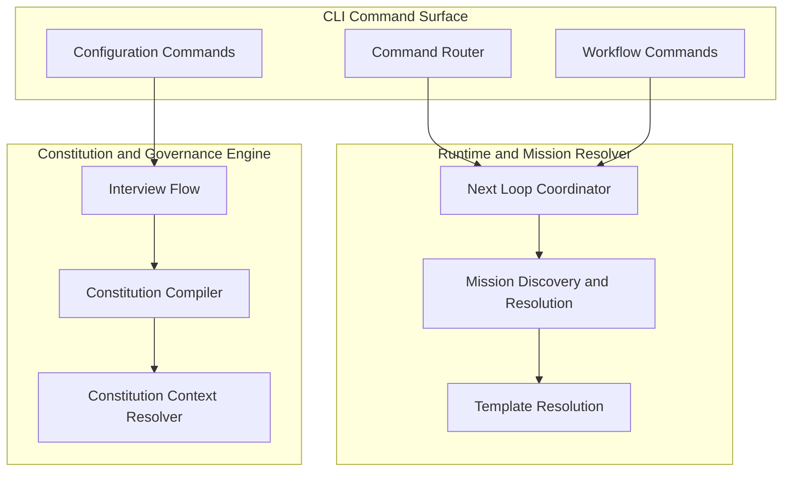

# C4 Level 3: Components

| Field | Value |
|---|---|
| Status | Draft |
| Date | YYYY-MM-DD |
| Scope | Logical components inside key containers |
| Related ADRs | `architecture/2.x/adr/...` |

## Purpose

Describe component boundaries and responsibilities without code-level inventories.

## Component Diagram (Mermaid)

## Component Responsibilities

| Component | Responsibility |
|---|---|
| Command Router | Dispatches command invocations |
| Workflow Commands | Feature/task lane transitions and execution surface |
| Next Loop Coordinator | Canonical per-agent loop orchestration |
| Mission Discovery and Resolution | Mission/runtime lookup and precedence |
| Template Resolution | Prompt/template retrieval for resolved action |
| Interview Flow | Captures governance/constitution intent |
| Constitution Compiler | Produces constitution bundle artifacts |
| Constitution Context Resolver | Provides action-scoped constitution context |

## Boundary and Coupling Notes

1. Stable boundaries.
2. Intentional couplings.
3. Guardrails against drift.

## Traceability

List links to ADRs and companion C4 levels.
