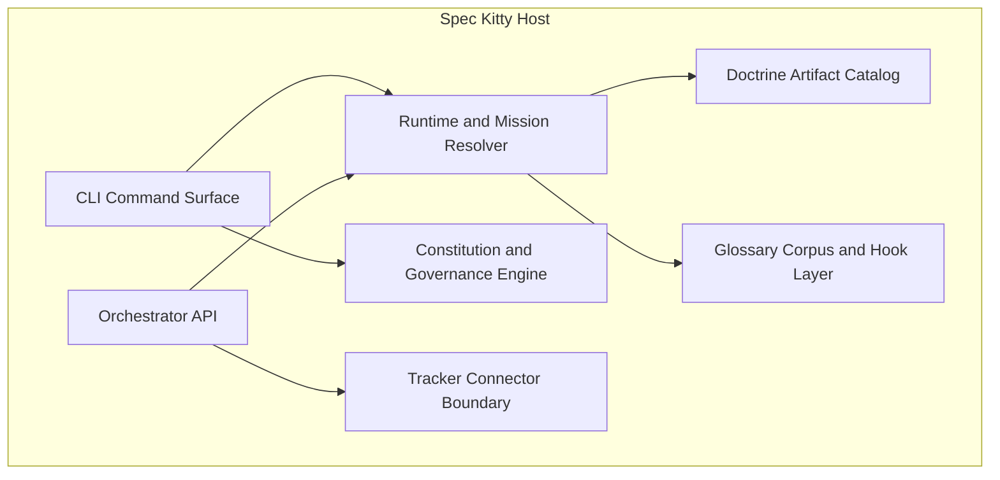

# C4 Level 2: Containers

| Field | Value |
|---|---|
| Status | Draft |
| Date | YYYY-MM-DD |
| Scope | Deployable/runtime containers and major subsystems |
| Related ADRs | `architecture/2.x/adr/...` |

## Purpose

Describe the major runtime/application containers and their responsibilities.

## Container Diagram (Mermaid)

## Container Responsibilities

| Container | Responsibility |
|---|---|
| CLI Command Surface | User and agent entrypoint |
| Runtime and Mission Resolver | Canonical `next` loop and mission resolution |
| Constitution and Governance Engine | Constitution interview/generate/context/status/sync |
| Doctrine Artifact Catalog | Typed directives/tactics/styleguides/templates |
| Glossary Corpus and Hook Layer | Context glossary and runtime glossary checks |
| Orchestrator API | External automation contract |
| Tracker Connector Boundary | Tracker integration handoff point |

## Interaction Notes

1. Primary data/control flows.
2. Safety/authority constraints.
3. Known limitations.

## Traceability

List links to ADRs and companion C4 levels.
