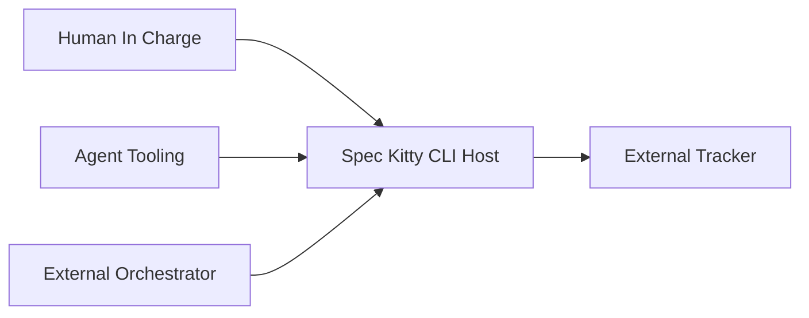

# C4 Level 1: System Context

| Field | Value |
|---|---|
| Status | Draft |
| Date | YYYY-MM-DD |
| Scope | System context (actors, external systems, boundaries) |
| Related ADRs | `architecture/2.x/adr/...` |

## Purpose

Describe who uses the system, what external systems it integrates with, and where responsibility boundaries sit.

## Context Diagram (Mermaid)

## Actor and System Roles

| Entity | Role |
|---|---|
| Human In Charge | Decision authority and workflow execution owner |
| Agent Tooling | Executes prompts and contributes implementation/review output |
| External Orchestrator | Calls host API contract for automation |
| External Tracker | Optional persistence/visibility target |
| Spec Kitty CLI Host | Canonical state and policy authority |

## Boundary Notes

1. Host authority boundaries.
2. External integration boundaries.
3. Out-of-scope areas for this level.

## Traceability

List links to ADRs and companion C4 levels.
