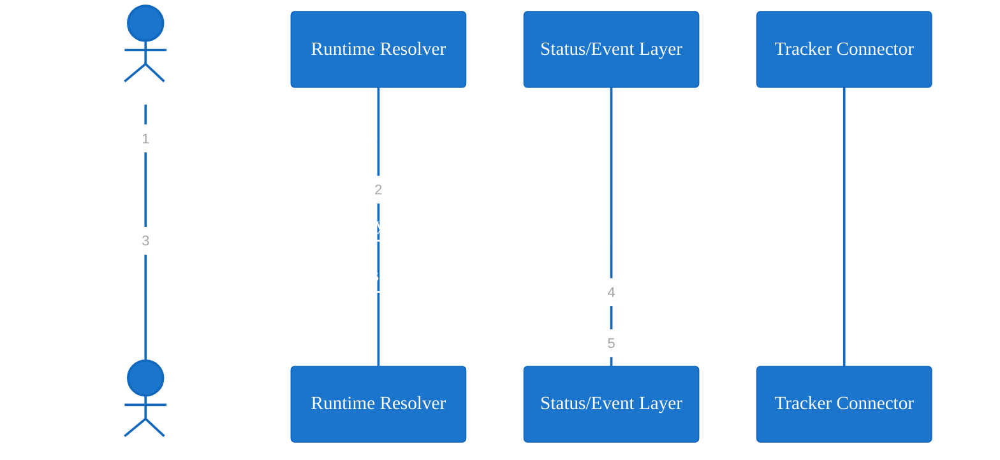

# Mermaid Theme: Bluegray Conversation

Use for interaction-heavy sequence diagrams where dialogue and handoff clarity
are primary.

## Snippet

## Recommended Use

1. Runtime handoff narratives.
2. Request lifecycle documentation.
3. Integration sequence sketches.
