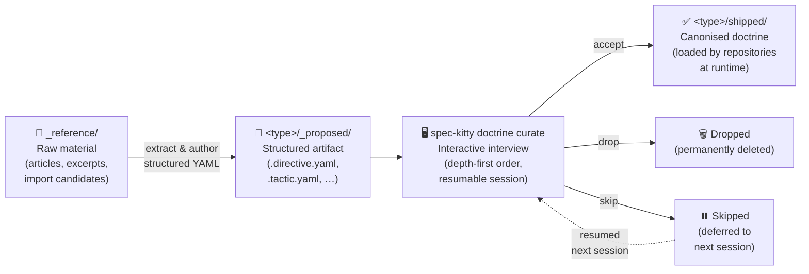

# Doctrine

The **Doctrine Domain** structures reusable governance knowledge in Spec Kitty. It
organizes behavior and constraints into composable artifacts that agents and humans
use across missions and ad-hoc interactions.

## Artifact Taxonomy

| Artifact             | Directory                               | Purpose                                                                     |
|----------------------|-----------------------------------------|-----------------------------------------------------------------------------|
| **Paradigm**         | [`paradigms/`](./paradigms)             | Worldview-level framing for how work is approached in a domain              |
| **Directive**        | [`directives/`](./directives)           | Constraint-oriented governance rules (required or advisory)                 |
| **Tactic**           | [`tactics/`](./tactics)                 | Reusable behavioral execution patterns (step-by-step recipes)               |
| **Procedure**        | [`procedures/`](./procedures)           | Stateful multi-step workflows with defined entry/exit conditions and actors  |
| **Styleguide**       | [`styleguides/`](./styleguides)         | Cross-cutting quality and consistency conventions                           |
| **Toolguide**        | [`toolguides/`](./toolguides)           | Tool-specific operational syntax and guidance                               |
| **Schema**           | [`schemas/`](./schemas)                 | Machine-validated contracts for doctrine artifact structure                 |
| **Template**         | [`templates/`](./templates)             | Output artifact scaffolds and interaction contracts                         |
| **Agent Profile**    | [`agent_profiles/`](./agent_profiles)   | Declarative agent identity: role, specialization, collaboration contracts   |

> **Procedure vs Tactic** — A tactic is a small, composable recipe invoked within a
> larger flow. A procedure is a stateful workflow with explicit entry and exit
> conditions, ordered steps, and assigned actor roles. Procedures may reference
> tactics but cannot be referenced by directives in the same way tactics can.

## Supporting Directories

| Directory       | Purpose                                                                                          |
|-----------------|--------------------------------------------------------------------------------------------------|
| `missions/`     | Workflow mission definitions (state machines, DAG runtimes, command and content templates)       |
| `curation/`     | Curation engine — `engine.py`, `state.py`, `workflow.py` powering the `_proposed/` → `shipped/` pipeline |
| `_reference/`   | Raw reference landing zone — unformatted material awaiting extraction into `_proposed/` artifacts |

## Curation Flow

New doctrine artifacts follow a three-stage pipeline before they are live:

### Stage details

| Stage | Location | Actor | Tool |
|-------|----------|-------|------|
| **1. Land** | `_reference/<source>/` | Human / Agent | File drop |
| **2. Extract** | `<type>/_proposed/` | Agent | Author `.yaml` artifact |
| **3. Curate** | interactive session | Human | `spec-kitty doctrine curate` |
| **4. Canonise** | `<type>/shipped/` | CLI | `promote_artifact()` in `curation/engine.py` |

Raw references in `_reference/` **should be removed** once their doctrine artifacts
exist in `_proposed/` or `shipped/`. Provenance is captured in the `.import.yaml`
candidate files, not in this landing zone.

## Package

`src/doctrine` is a standalone Python package (`spec-kitty-doctrine`) included in
the wheel distribution. It ships YAML artifacts, JSON schemas, markdown templates,
and the `agent_profiles` Python subpackage. See `pyproject.toml` for package metadata.

## Glossary Alignment

This package implements the **Doctrine Domain** as defined in the
[doctrine glossary context](../../glossary/contexts/doctrine.md). Key naming
distinctions:

- **Agent** = logical collaborator identity (defined here via agent profiles)
- **Tool** = concrete runtime product (Claude Code, Codex, etc.) — managed by `ToolConfig`

See [naming-decision-tool-vs-agent](../../glossary/naming-decision-tool-vs-agent.md)
for the canonical naming decision.
