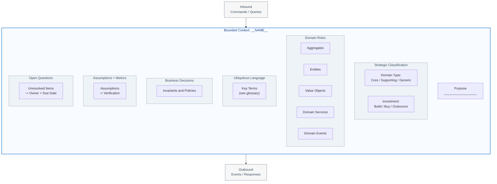

# Bounded Context Canvas Template

A structured one-page summary for a single bounded context, based on the
DDD Crew Bounded Context Canvas v5.

Use the [bounded-context-canvas-fill](../../tactics/shipped/bounded-context-canvas-fill.tactic.yaml)
tactic for guidance on the reasoning process behind each section.

---

## Canvas

| Field | Value |
|---|---|
| **Last updated** | YYYY-MM-DD |
| **Owner** | _team or person responsible_ |
| **Status** | Draft / Active / Deprecated |

### 1. Name

> _A clear, unambiguous name drawn from the ubiquitous language._

**Context name:** `__________________`

### 2. Purpose

> _One to three sentences describing what this context is responsible for
> and why it exists. Focus on business capability, not implementation._

```
__________________
```

### 3. Strategic Classification

| Dimension | Value |
|---|---|
| **Domain type** | Core Domain / Supporting Subdomain / Generic Subdomain |
| **Investment strategy** | Build in-house (top talent) / Build pragmatically / Buy or outsource |
| **Rationale** | _Why this classification?_ |

### 4. Domain Roles

| Role type | Entries |
|---|---|
| **Aggregates** | |
| **Entities** | |
| **Value Objects** | |
| **Domain Services** | |
| **Domain Events** | |

### 5. Inbound Communication

| Source context | Message | Pattern |
|---|---|---|
| _e.g. Sales_ | _e.g. RequestQuote_ | _sync API / event / shared DB_ |
| | | |

### 6. Outbound Communication

| Target context(s) | Message | Pattern |
|---|---|---|
| _e.g. Billing_ | _e.g. PremiumCalculated_ | _event / sync response_ |
| | | |

### 7. Ubiquitous Language

> _Key terms and definitions as used within this context. Highlight terms
> that have different meanings in other contexts._

| Term | Definition | Also used in (different meaning) |
|---|---|---|
| | | |
| | | |

See also: [Glossary Template](glossary-template.md) for a structured
glossary file compatible with [Contextive](../../toolguides/shipped/CONTEXTIVE.md).

### 8. Business Decisions

> _Key business rules and decisions that this context encapsulates._

- [ ] _e.g. Premium must be recalculated when risk factors change._
- [ ] _e.g. Discount cannot exceed 30% without underwriter approval._

### 9. Assumptions and Verification Metrics

| Assumption | Verification metric | Status |
|---|---|---|
| _e.g. Pricing completes within 200ms_ | _p99 latency of /quote endpoint_ | Unverified |
| | | |

### 10. Open Questions

| Question | Owner | Due date | Resolution |
|---|---|---|---|
| _e.g. Multi-currency pricing in v1?_ | _Product_ | _Sprint 3_ | _Pending_ |
| | | | |

---

## Canvas Diagram (Mermaid)



## Canvas Diagram (PlantUML)

```plantuml
@startuml bounded-context-canvas
!define BOUNDED_CONTEXT(name) rectangle name <<bounded_context>>
!define SECTION(name) rectangle name <<section>>

skinparam rectangle {
    BackgroundColor<<bounded_context>> #f8fbff
    BorderColor<<bounded_context>> #1c75cc
    FontColor<<bounded_context>> #103a82
    BackgroundColor<<section>> #eef3f7
    BorderColor<<section>> #8c9cab
    FontColor<<section>> #384b5f
}

BOUNDED_CONTEXT("Bounded Context: __NAME__") {
    SECTION("Purpose") as purpose
    SECTION("Strategic Classification\n--\nDomain Type | Investment Strategy") as classification
    SECTION("Domain Roles\n--\nAggregates | Entities | VOs | Services | Events") as roles
    SECTION("Ubiquitous Language\n--\nKey Terms (see glossary)") as language
    SECTION("Business Decisions\n--\nInvariants and Policies") as decisions
    SECTION("Assumptions + Metrics\n--\nAssumption -> Verification") as assumptions
    SECTION("Open Questions\n--\nQuestion -> Owner + Due Date") as questions

    purpose -[hidden]down- classification
    classification -[hidden]down- roles
    roles -[hidden]down- language
    language -[hidden]down- decisions
    decisions -[hidden]down- assumptions
    assumptions -[hidden]down- questions
}

rectangle "Inbound\nCommands / Queries" as inbound #f7f7f7
rectangle "Outbound\nEvents / Responses" as outbound #f7f7f7

inbound --> "Bounded Context: __NAME__"
"Bounded Context: __NAME__" --> outbound

@enduml
```

---

## Traceability

- Tactic: [bounded-context-canvas-fill](../../tactics/shipped/bounded-context-canvas-fill.tactic.yaml)
- Glossary: [glossary-template](glossary-template.md)
- Toolguide: [Contextive](../../toolguides/shipped/CONTEXTIVE.md)
