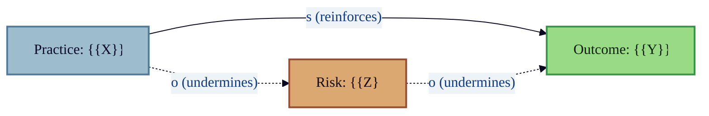

# Mermaid Template: Causal Map

Cause-effect relationship diagram using Mermaid flowchart. Models reinforcing
and undermining causal links between practices, outcomes, and risks.

## Template

## Placeholders

| Placeholder | Replace With |
|---|---|
| `{{X}}` | Practice or technique name |
| `{{Y}}` | Desired outcome |
| `{{Z}}` | Risk or failure mode |

## Notes

- Solid arrows (`-->`) represent reinforcing relationships.
- Dotted arrows (`.->`) represent undermining relationships.
- Mermaid does not support PlantUML-style `s()` / `o()` macros; use edge
  labels and line styles instead.

## When to Use

- Systems thinking: mapping feedback loops between practices and outcomes.
- Risk-benefit analysis for architecture or process decisions.
- ADR support: visualizing trade-offs behind a decision.
