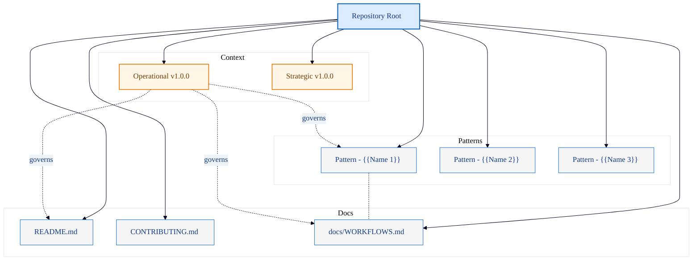

# Mermaid Template: Content Map

Content inventory diagram showing repository artifact relationships and
governance links.

## Template

## Placeholders

| Placeholder | Replace With |
|---|---|
| `{{Name N}}` | Pattern, module, or artifact name |

## When to Use

- Mapping documentation topology of a repository.
- Showing governance relationships between context documents and content.
- Onboarding orientation for new contributors.
