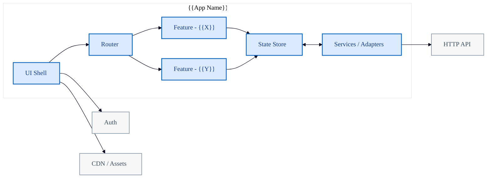

# Mermaid Template: Frontend Architecture

Component-level front-end architecture overview. Highlights boundaries and
responsibilities in UI projects.

## Template

## Placeholders

| Placeholder | Replace With |
|---|---|
| `{{App Name}}` | Application or front-end project name |
| `{{X}}`, `{{Y}}` | Feature module names |

## When to Use

- Documenting front-end component boundaries for design reviews.
- Showing the adapter layer between UI and back-end APIs.
- Onboarding developers to the front-end code structure.
