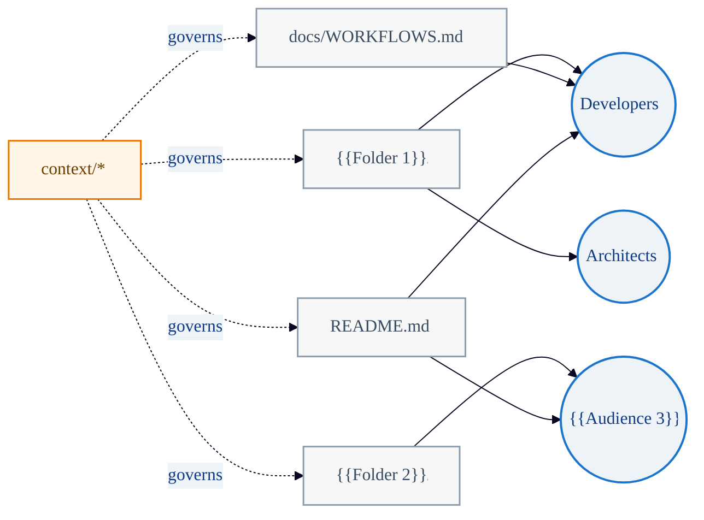

# Mermaid Template: Repo Content Graph

Repository structure graph mapping artifacts to audience segments. Shows
governance relationships between context documents and content.

## Template

## Placeholders

| Placeholder | Replace With |
|---|---|
| `{{Audience 3}}` | Target audience segment |
| `{{Folder N}}` | Repository folder or module name |

## When to Use

- Mapping which artifacts serve which audience segments.
- Governance visualization: which context documents govern which content.
- Repository orientation for new contributors.
