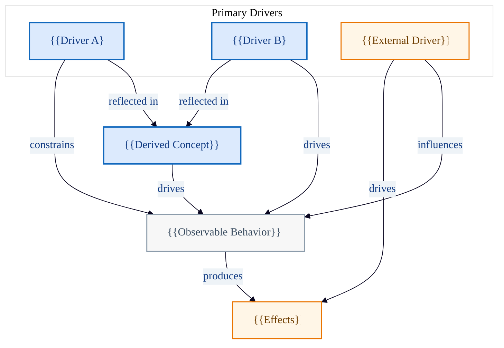

# Mermaid Template: Structure Meta Model

Conceptual meta model showing relationships between foundational drivers,
derived concepts, behaviors, and effects. Mermaid equivalent of the C4-based
PlantUML structure template.

## Template

## Placeholders

| Placeholder | Replace With |
|---|---|
| `{{Driver A/B}}` | Primary conceptual drivers (e.g., Axioms, Values) |
| `{{External Driver}}` | External context or environmental factor |
| `{{Derived Concept}}` | Concept derived from drivers (e.g., Creeds, Principles) |
| `{{Observable Behavior}}` | Observable actions or patterns |
| `{{Effects}}` | Outcomes or consequences |

## When to Use

- Domain modeling: showing how fundamental concepts relate.
- Strategic architecture: values -> behaviors -> effects chains.
- Conceptual (non-technical) domain visualization.
