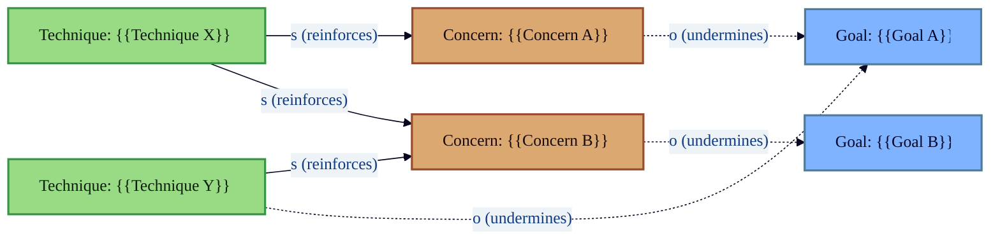

# Mermaid Template: System Map

High-level system context map modeling reinforcing and undermining
relationships between concerns, goals, and techniques.

## Template

## Placeholders

| Placeholder | Replace With |
|---|---|
| `{{Concern A/B}}` | Organizational concern, risk, or destructive lever |
| `{{Goal A/B}}` | Desired outcome or health indicator |
| `{{Technique X/Y}}` | Technique, practice, or intervention |

## Notes

- Solid arrows (`-->`) represent reinforcing (same-direction) relationships.
- Dotted arrows (`.->`) represent undermining (opposite-direction) relationships.
- Color classes mirror the PlantUML stickies theme: orange for concerns,
  bright blue for goals, green for techniques.

## When to Use

- High-level stakeholder orientation before detailed architecture views.
- Mapping organizational concerns against techniques and goals.
- Workshop facilitation: quickly sketching system-level dynamics.
