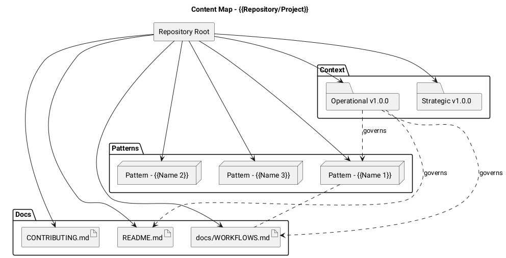

# PlantUML Template: Content Map

Content inventory diagram showing repository artifact relationships and
governance links. Useful for mapping documentation artifacts and their
dependencies.

## Template

## Placeholders

| Placeholder | Replace With |
|---|---|
| `{{Repository/Project}}` | Repository or project name |
| `{{Name N}}` | Pattern, module, or artifact name |

## When to Use

- Mapping the documentation topology of a repository.
- Showing governance relationships between context documents and content.
- Onboarding orientation: "here is what lives where and who owns it."
