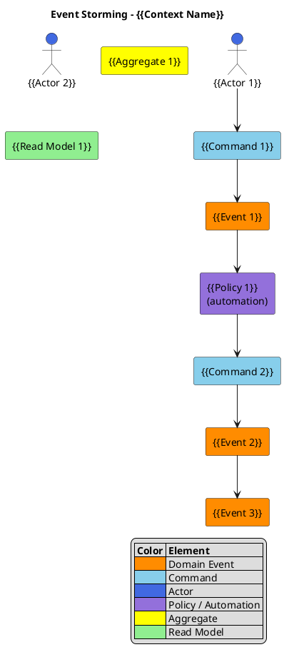

# PlantUML Template: Event Storming

Event Storming visual template following standard sticky note color
conventions (Alberto Brandolini). Models the flow from actors through
commands, domain events, and policies.

## Template

## Placeholders

| Placeholder | Replace With |
|---|---|
| `{{Context Name}}` | Bounded context or domain area being stormed |
| `{{Event N}}` | Domain event name (past tense, e.g., "OrderPlaced") |
| `{{Command N}}` | Command name (imperative, e.g., "PlaceOrder") |
| `{{Actor N}}` | Actor or role triggering commands |
| `{{Policy N}}` | Policy or automation rule reacting to events |
| `{{Aggregate N}}` | Aggregate root name |
| `{{Read Model N}}` | Read model or projection name |

## When to Use

- DDD discovery workshops: identifying domain events, commands, and aggregates.
- Bounded context boundary exploration.
- Onboarding domain experts to the event-first modeling approach.
