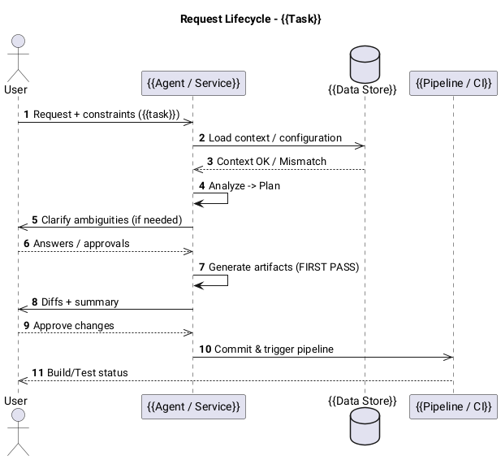

# PlantUML Template: Request Lifecycle

Sequence diagram modeling a request flow through system components. Shows
ingress/egress points and processing stages.

## Template

## Placeholders

| Placeholder | Replace With |
|---|---|
| `{{Task}}` | Name of the task or request being modeled |
| `{{Agent / Service}}` | The processing agent, service, or component |
| `{{Data Store}}` | Database, context stack, or configuration source |
| `{{Pipeline / CI}}` | CI/CD pipeline or downstream consumer |
| `{{task}}` | Short description of the request payload |

## When to Use

- Documenting how a user request flows through the system end-to-end.
- Clarifying async vs sync interaction boundaries.
- Design reviews for request handling pipelines.
