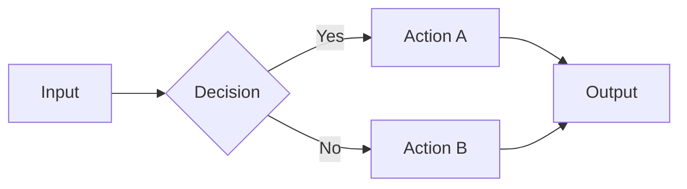
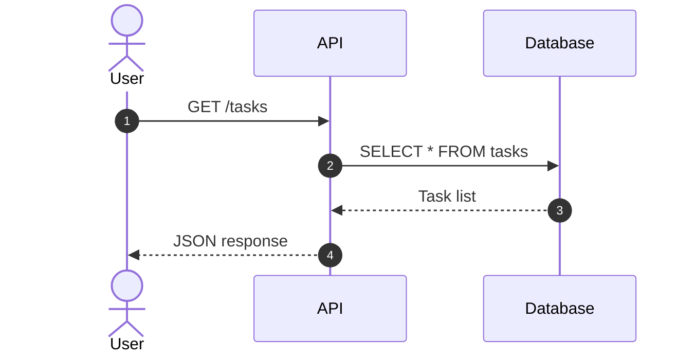
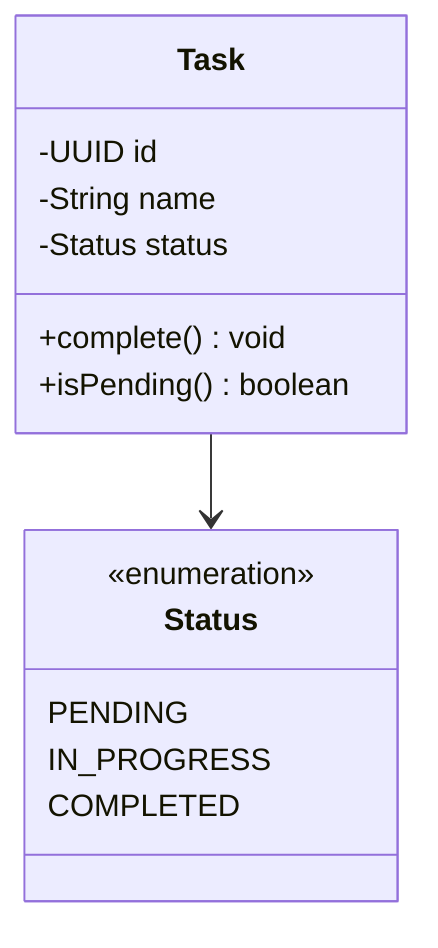
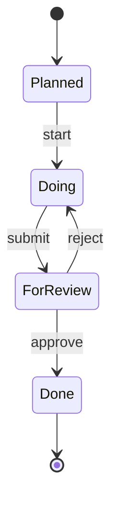
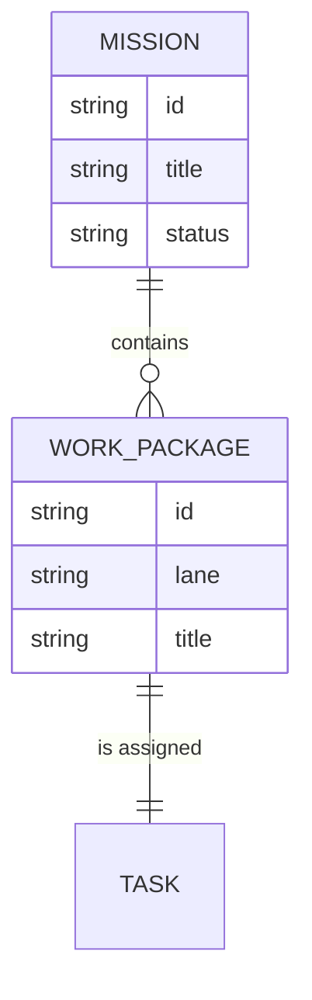
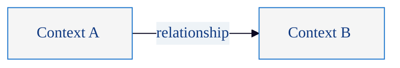
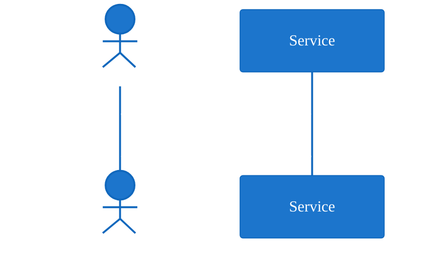
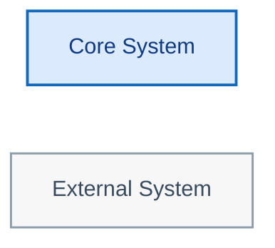

# Mermaid Diagramming

Diagram-as-code reference for Mermaid usage in Spec Kitty projects.

## Purpose and When to Use

Mermaid renders diagrams from plain-text definitions embedded directly in
Markdown. It requires no external tooling in most rendering environments
(GitHub, GitLab, VS Code, Hugo, Docusaurus). Use Mermaid when:

- Diagrams must render natively in Markdown previews and pull requests.
- No Java/Graphviz dependency is acceptable.
- The diagram type is well-supported: flowchart, sequence, class, state,
  entity-relationship, Gantt, pie, git graph, C4 (experimental).
- Inline rendering in `.md` files is preferred over separate source files.

Avoid Mermaid when:

- Fine-grained layout control is needed (Mermaid auto-layout is less
  configurable than PlantUML).
- Workshop-style sticky note macros or causal mapping DSLs are required
  (use PlantUML stickies theme instead).
- The diagram type is not yet well-supported in Mermaid (deployment,
  component packages, mind maps with deep nesting).

## Getting Started

### Quickest (no install)

Use the Mermaid Live Editor: <https://mermaid.live>

### VS Code

Install the **Markdown Preview Mermaid Support** extension. Mermaid blocks in
`.md` files render automatically in the preview pane.

### Command Line (Mermaid CLI)

```bash
# Install globally
npm install -g @mermaid-js/mermaid-cli

# Or use npx without install
npx @mermaid-js/mermaid-cli -h

# Render a .mmd file to SVG
mmdc -i diagram.mmd -o diagram.svg

# Render to PNG
mmdc -i diagram.mmd -o diagram.png
```

## Core Diagram Types

### Flowchart

General-purpose directed graphs. Use for architecture, process flows, and
dependency maps.



### Sequence Diagram

Model request flows, handoffs, and async interactions.



### Class Diagram

Model domain entities, value objects, and relationships.



### State Diagram

Model lifecycle transitions.



### Entity-Relationship Diagram

Model data relationships.



## Theming

Mermaid does not support `!include` files. Theming is done via `%%{init}%%`
directives embedded at the top of each diagram block.

### Common (Neutral) Theme



### Bluegray Conversation Theme



### Custom Node Classes

Use `classDef` and `class` to apply consistent styling per node role:



Theme snippets are available as copy-paste templates in
`src/doctrine/templates/diagrams/mermaid/themes/`.

## Rendering

### Inline in Markdown

Wrap Mermaid source in a fenced code block with the `mermaid` language tag:

````markdown

````

This renders natively on GitHub, GitLab, VS Code preview, and most static
site generators with Mermaid support.

### Command Line

```bash
# SVG (preferred)
mmdc -i diagram.mmd -o diagram.svg

# PNG
mmdc -i diagram.mmd -o diagram.png -b transparent

# With custom theme config
mmdc -i diagram.mmd -o diagram.svg -c mermaid-config.json
```

### CI Integration (GitHub Actions)

```yaml
- name: Render Mermaid diagrams
  uses: neenjaw/compile-mermaid-markdown-action@v1
  with:
    files: "docs/**/*.md"
    output: "docs/rendered"
```

## Project Conventions

1. Prefer Mermaid for diagrams embedded in Markdown documentation.
2. Prefer PlantUML for standalone diagram files, workshop visuals, and
   diagrams needing the stickies/causal DSL.
3. Use the `%%{init}%%` directive to apply project theme variables
   consistently.
4. Use `classDef` for role-based node styling (core, external, storage,
   boundary).
5. Use `{{placeholder}}` double-brace convention for template fill-in values.
6. Keep diagrams semantically focused: structure over decoration.
7. Store diagram source inline in `.md` files or as `.mmd` files alongside
   the documentation they support.

## Accessibility

- Provide alt text when embedding rendered images: ``.
- Use descriptive node labels; avoid abbreviations.
- Ensure sufficient color contrast between node fill and text.
- Test diagrams in both light and dark mode rendering contexts.

## Common Pitfalls

- **Init directive syntax**: The `%%{init}%%` block must be the first line of
  the Mermaid block. Whitespace before it causes parsing failures.
- **No include support**: Unlike PlantUML, Mermaid cannot `!include` shared
  files. Theme snippets must be copy-pasted.
- **Subgraph nesting**: Deeply nested subgraphs can produce unexpected
  layouts. Keep nesting to two levels maximum.
- **Long labels**: Wrap long text in quotes and keep labels concise to avoid
  layout overflow.
- **Renderer differences**: GitHub, VS Code, and `mmdc` may render the same
  diagram slightly differently. Test in your primary rendering target.

## Template Library

Spec Kitty ships ready-to-copy Mermaid templates in
`src/doctrine/templates/diagrams/mermaid/examples/`:

- `causal-map-mermaid-template.md`
- `content-map-mermaid-template.md`
- `frontend-architecture-mermaid-template.md`
- `repo-content-graph-mermaid-template.md`
- `request-lifecycle-sequence-mermaid-template.md`
- `structure-meta-model-mermaid-template.md`
- `system-map-mermaid-template.md`

Theme snippets are in `src/doctrine/templates/diagrams/themes/`:

- `mermaid-theme-common-template.md`
- `mermaid-theme-bluegray-conversation-template.md`

## References

- [Mermaid Official Documentation](https://mermaid.js.org/)
- [Mermaid Live Editor](https://mermaid.live)
- [Mermaid CLI (mmdc)](https://github.com/mermaid-js/mermaid-cli)
- [GitHub Mermaid Support](https://docs.github.com/en/get-started/writing-on-github/working-with-advanced-formatting/creating-diagrams)
