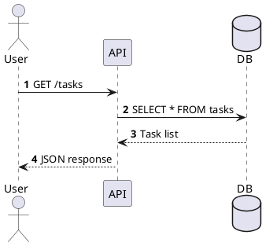
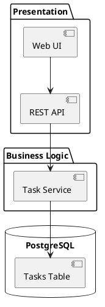
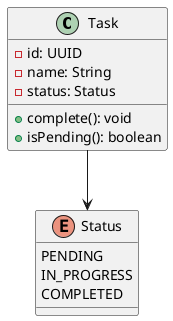
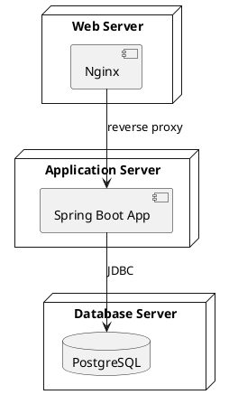

# PlantUML Diagramming

Diagram-as-code reference for PlantUML usage in Spec Kitty projects.

## Purpose and When to Use

PlantUML renders diagrams from plain-text source files that version-control
cleanly and produce consistent, auto-laid-out visuals. Use PlantUML when:

- Diagrams must be diffable and reviewable in pull requests.
- Consistent auto-layout matters more than pixel-perfect positioning.
- The diagram type is well-supported: sequence, component, class, deployment,
  C4, activity, state, mind map, or the custom stickies DSL.

Avoid PlantUML when:

- Pixel-perfect mockups or presentation-quality visuals are required.
- The target rendering environment has no Java/Graphviz support.
- Mermaid is already the project standard for the diagram category in question.

## Getting Started

### Quickest (no install)

Use the PlantUML Online Server: <https://www.plantuml.com/plantuml/uml>

### VS Code

Install the **PlantUML** extension. Press `Alt+D` to preview.

### Command Line

Prerequisites: JRE (Java 8+), PlantUML JAR, Graphviz.

```bash
# macOS
brew install plantuml graphviz

# Ubuntu/Debian
sudo apt install plantuml graphviz

# Verify
plantuml -version
```

## Core Diagram Types

### Sequence Diagram

Model request flows, handoffs, and async interactions.



### Component Diagram

Show packages, components, and their wiring.



### Class Diagram

Model domain entities, value objects, and relationships.



### Deployment Diagram

Show infrastructure nodes and their connections.



### C4 Context Diagram

Uses the C4-PlantUML stdlib for standardized architecture views.

```plantuml
@startuml
!include https://raw.githubusercontent.com/plantuml-stdlib/C4-PlantUML/master/C4.puml
!include https://raw.githubusercontent.com/plantuml-stdlib/C4-PlantUML/master/C4_Context.puml

Person(user, "User", "Task manager user")
System(taskSystem, "Task Management System", "Manages user tasks")
System_Ext(emailSystem, "Email System", "Sends notifications")

Rel(user, taskSystem, "Uses")
Rel(taskSystem, emailSystem, "Sends emails via")
@enduml
```

## Theming

Spec Kitty provides three PlantUML themes in
`src/doctrine/templates/diagrams/plantuml/themes/`:

| Theme | Use Case |
|---|---|
| **common** | Neutral baseline. ADRs, technical designs. |
| **bluegray_conversation** | Sequence/interaction diagrams. Full element styling. |
| **stickies** | Workshop visuals. Sticky note macros, causal relationships. |

### Including a Theme

```plantuml
@startuml
!include <relative-path>/puml-theme-bluegray_conversation.puml

' Your diagram content here
@enduml
```

### When to Skip Theming

- Teaching or exploring PlantUML basics.
- Neutral baselines for documentation or ADRs.
- Maximum portability across rendering contexts.

## Styling Patterns

### Basic Skinparam

```plantuml
skinparam shadowing false
skinparam linetype ortho
skinparam rectangle {
    BackgroundColor LightBlue
    BorderColor DarkBlue
}
```

### Shared Definitions

```plantuml
!define PROJECT_COLOR #1c75cc
!include common-styles.iuml
```

### Notes

```plantuml
note right of Task
  Tasks transition from PENDING
  to COMPLETED via complete().
  Status changes are immutable.
end note
```

## Rendering

### Command Line

```bash
# PNG (default)
plantuml diagram.puml

# SVG (preferred for documentation)
plantuml -tsvg diagram.puml

# Render all .puml files in a directory
plantuml -tsvg "src/doctrine/templates/diagrams/plantuml/examples/*.puml"

# Watch mode
plantuml -gui diagram.puml
```

### GitHub/GitLab Embedding

Use the PlantUML proxy to render in Markdown without local tooling:

```markdown

```

### CI Integration (GitHub Actions)

```yaml
- name: Render PlantUML diagrams
  uses: grassedge/generate-plantuml-action@v1
  with:
    path: docs/diagrams
    message: "Render PlantUML diagrams"
```

### Makefile

```makefile
PUML_SRC := $(wildcard docs/diagrams/*.puml)
PUML_SVG := $(PUML_SRC:.puml=.svg)

diagrams: $(PUML_SVG)

%.svg: %.puml
	plantuml -tsvg $<
```

## Project Conventions

1. Prefer SVG output for scalability and accessibility.
2. Store `.puml` source files alongside the documentation they support.
3. Commit diagram source; generate rendered output in CI or locally before review.
4. Use `{{placeholder}}` double-brace convention for template fill-in values.
5. Keep diagrams semantically focused: structure over decoration.
6. Prefer diagram-as-code over screenshots to keep artifacts diffable.
7. Use `skinparam monochrome true` for high-contrast accessibility mode.

## Accessibility

- Provide alt text in Markdown: ``.
- Prefer SVG over PNG for screen reader compatibility.
- Use descriptive labels; avoid abbreviations.
- Add `'` comments in PlantUML source to explain design intent.

## Common Pitfalls

- **Graphviz dependency**: Component and class diagrams require Graphviz.
  Sequence diagrams do not.
- **Large diagrams**: Break into multiple focused diagrams rather than one
  monolithic view.
- **Layout quirks**: Use `left to right direction`, hidden arrows, and
  `together {}` blocks to influence layout.
- **Color accessibility**: Avoid red-green-only distinctions.
- **Over-detailing**: Show the level of detail appropriate for the audience.

## Template Library

Spec Kitty ships ready-to-copy PlantUML templates in
`src/doctrine/templates/diagrams/plantuml/examples/`:

- `causal-map-plantuml-template.md`
- `content-map-plantuml-template.md`
- `frontend-architecture-plantuml-template.md`
- `repo-content-graph-plantuml-template.md`
- `request-lifecycle-plantuml-template.md`
- `structure-meta-model-plantuml-template.md`
- `system-map-plantuml-template.md`
- `event-storming-plantuml-template.md`

## References

- [PlantUML Language Reference Guide](https://plantuml.com/guide)
- [PlantUML Official Site](https://plantuml.com)
- [Real World PlantUML](https://real-world-plantuml.com)
- [C4-PlantUML](https://github.com/plantuml-stdlib/C4-PlantUML)
- [PlantUML Cheat Sheet](https://ogom.github.io/draw_uml/plantuml/)
