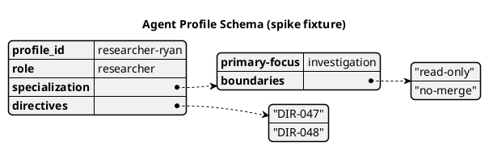

# Egress-spike fixture (WP01)

A real `@startyaml` diagram — shaped like the agent-profile schema the mission's
diagrams (WP05/T035) produce (a title, scalars, a nested sub-map, a list) — so the
spike exercises YAML parsing and font-based text metrics, not a trivial `hello`.

